# 📝 Case Study: Investigating with ELK 101

## 🔹 Overview
In this case study, I explored the **Elastic Stack (ELK)** and focused on **analyzing VPN logs** for a US-based company to identify anomalies and suspicious activity. The study covers **Kibana Discover tab, KQL queries, visualizations, and dashboards**.

---

## 🔍 Key Tasks & Learnings

### Task 1: Introduction
- Explored **Kibana interface** and Elastic Stack components.
- Learned to perform **searches, apply filters, and create visualizations**.
- Understood **VPN log structure** in the `vpn_connections` index.

---

### Task 2: Incident Handling Scenario
- Investigated **anomalous VPN activity** for January 2022.
- Applied SOC analyst techniques to detect:
  - Unauthorized access attempts
  - Suspicious user activity (e.g., terminated user **Johny Brown** still connecting)
  - Patterns in failed connections

---

### Task 3: ElasticStack Overview
The Elastic Stack (ELK Stack) is a collection of open-source components used to gather, search, analyze, and visualize data in real-time.

**Components:**
- **Elasticsearch:** Full-text search and analytics engine storing JSON-formatted documents. Provides a RESTful API for queries and data interaction.  
- **Logstash:** Data processing engine that ingests data from multiple sources, applies filters/normalization, and sends it to Elasticsearch or Kibana.  
  - Input: Source of data (supports multiple plugins)  
  - Filter: Normalizes/transforms data  
  - Output: Sends data to destinations like Elasticsearch or Kibana  
- **Beats:** Lightweight agents that collect and send specific data (e.g., Winlogbeat for Windows logs, Packetbeat for network traffic).  
- **Kibana:** Web-based visualization tool for analyzing and visualizing data stored in Elasticsearch. Enables dashboards and visualizations.
  
---

### Task 4: Kibana Overview
Kibana is a core component of the Elastic Stack used to display, visualize, and search logs.  
Important tabs include: **Discover**, **Visualization**, and **Dashboard**.

---

### Task 5: Discover Tab
The Discover tab is a central workspace for searching, filtering, and investigating ingested logs.

**Key Features:**  
- Logs/Documents: Each event stored as a document with multiple fields.  
- Search Bar: Run queries and filters.  
- Time Filter: Filter logs based on time range.  
- Timeline Chart: Spot anomalies or spikes.  
- Index Pattern: Select which indices to explore. Example: `vpn_connections`.  
- Fields Pane: Filter logs by field values.  
- Create Table: Customize and save tables from log fields.

**Questions & Answers:**  
1. Select the index vpn_connections and filter from 31st December 2021 to 2nd Feb 2022. How many hits are returned?
   
   I used the Time Filter in the top right corner to set the date range from 31st December 2021 to 2nd February 2022 and then pressed refresh.
   
   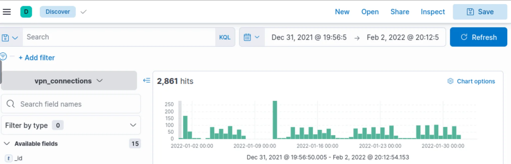
   
   **Answer:** 2861
   
2. Which IP address has the max number of connections?
   
   I looked at the **Fields Pane** and found the `Source_Ip` field. After selecting it, I could see the top 5 values, and the first one had the highest number of connections.  

   
   
   **Answer:** 238.163.231.224
   
3. Which user is responsible for max traffic?
   
   I checked the **Fields Pane** for the `UserName` field, selected it, and observed the top value.  

   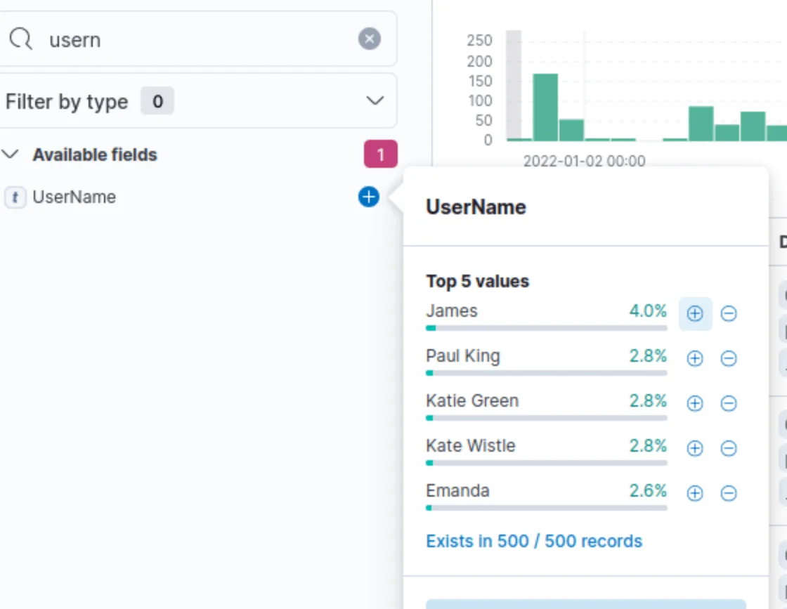 
   
   **Answer:** James
   
4. Create a table with the fields IP, UserName, Source_Country and save.
   
   I selected all the required columns using the **“toggle column in table”** button.  

   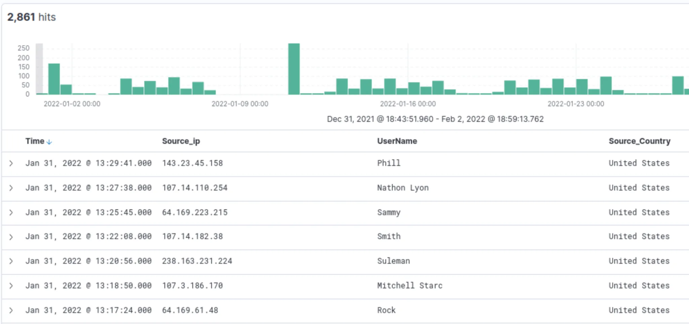
   
   **Answer:** No answer needed
   
5. Apply Filter on UserName Emanda; which SourceIP has max hits?
    
   I selected the **UserName** field in the Fields Pane, found **Emanda**, and clicked the little **+ icon** to filter only her documents.  
   
   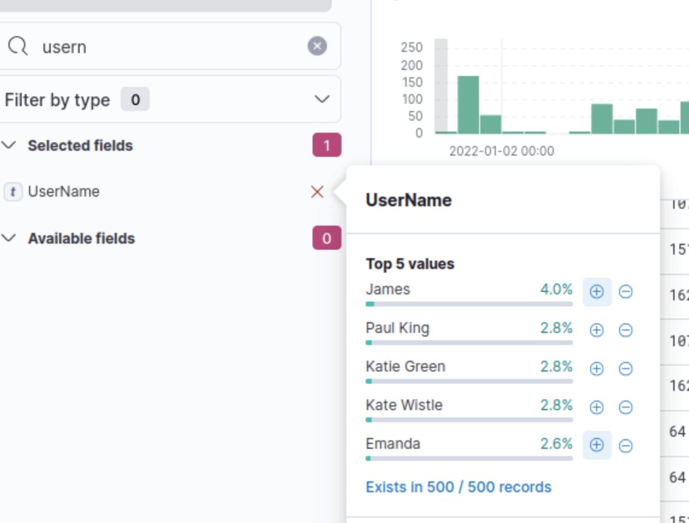  

   Then, I selected the **SourceIP** field under Selected fields to see the top value.  

   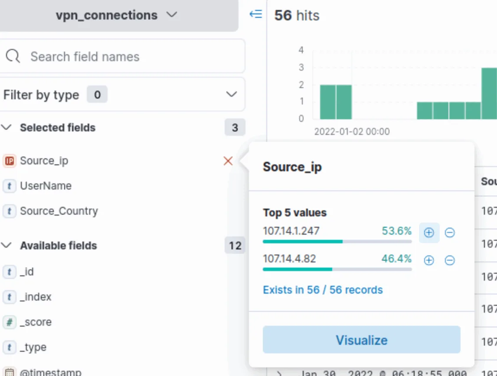 
    
   **Answer:** 107.14.1.247
   
6. On 11th Jan, which IP caused the spike observed in the time chart?
    
    I removed the filter on **Emanda**. On the timeline, I selected the bar for **11th January**.  

    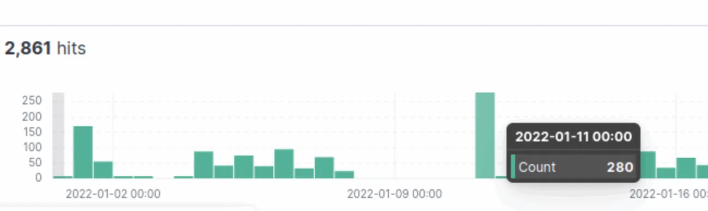  

    The data was then filtered for that specific date. I checked the **Source_IP** field under Selected fields to see the top 5 values:  

    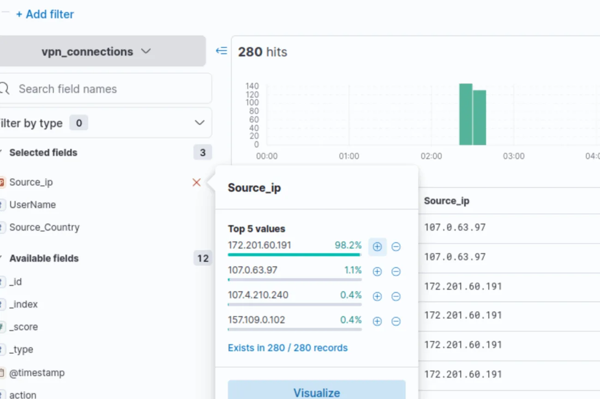
    
    **Answer:** 172.201.60.191
    
7. How many connections were observed from IP 238.163.231.224, excluding the New York state?
    I removed the **timeline filter**. Then I selected the **SourceIP** field, found the value `238.163.231.224`, and pressed the **+** icon to filter it.  
    Next, I selected the **Source_State** field, found **New York State**, and pressed the **–** icon to exclude all documents from New York.  

    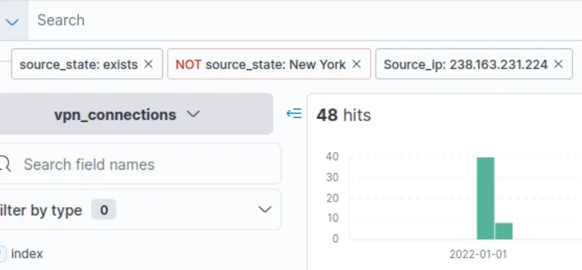

    **Answer:** 48 
    
---

### Task 6: KQL Overview
Kibana Query Language (KQL) allows flexible field-specific or free-text searches.

**Questions & Answers:**  
1. Create a search query to filter out the logs from Source_Country as the United States and show logs from User James or Albert. How many records were returned?

   I used the following KQL query to filter logs:

     

   **Answer:** 161

---

### Task 7: Creating Visualizations
Visualizations transform log data into clear insights using tables, pie charts, or bar charts.  

**Questions & Answers:** 
1. Which user was observed with the greatest number of failed attempts?  

   I clicked on the **UserName** field and pressed **Visualize**.  

   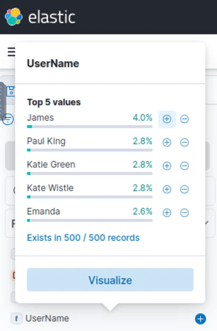  

   Then, I dragged the **action** field (which includes the failed action) into the graph and changed the type to **table**.  
   I set **UserName** on the Rows and **action** on the Columns, then sorted by the "failed" column.  

   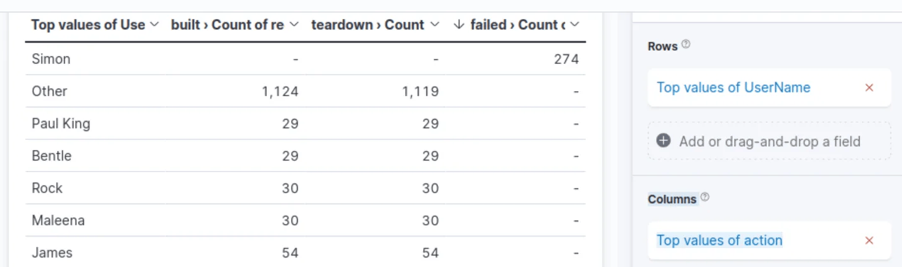  

   **Answer:** Simon
2. How many wrong VPN connection attempts were observed in January?  

   I added **action** on the horizontal axis and broke it down by **@timestamp**.  
   On the vertical axis, I used the **count()** function.

   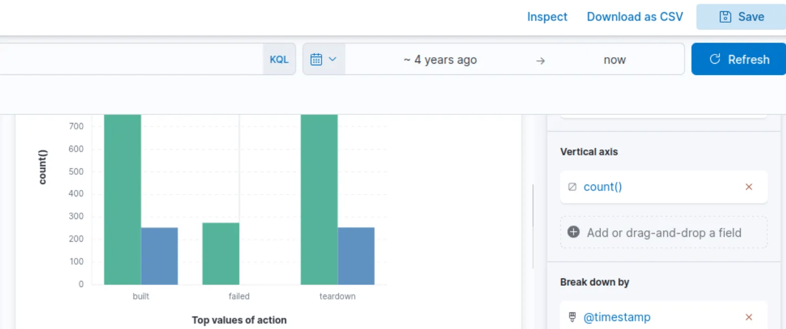  

   Looking at the chart, the failed connections appear on the left bar (green), which corresponds to December.  
   However, based on the room’s reference, the correct answer is **274**.  

   **Answer:** 274

---

### Task 8: Creating Dashboards
Dashboards combine multiple visualizations and searches for an overview of VPN activity.  

---

### Task 9: Conclusion
- Learned how to search logs and create queries.  
- Applied filters to narrow results.  
- Created visualizations and dashboards.  
- Investigated VPN logs effectively.

---
    
