# Architecture Cloud Sécurisée & Gouvernance des Identités

## Présentation

Dans le cadre de ce projet, j'ai conçu, déployé et sécurisé une infrastructure cloud multi-tiers reproduisant un environnement d'entreprise.

L'objectif était de mettre en œuvre une architecture intégrant plusieurs mécanismes de sécurité permettant de protéger les ressources, les données, les identités et les services, tout en améliorant la résilience de l'infrastructure.

Au cours de ce projet, j'ai travaillé sur différentes dimensions de la sécurité cloud : segmentation réseau, contrôle des flux, protection des applications, sécurité des machines virtuelles, gestion des identités, Zero Trust, contrôle d'accès, analyse des risques et protection contre les attaques DDoS.

Ce projet m'a également permis de développer une première sensibilisation aux enjeux de souveraineté numérique et de gouvernance des données. Bien que l'environnement ait été déployé sur Microsoft Azure, les principes de sécurité étudiés sont transposables à des environnements proposés par des acteurs du cloud souverain tels qu'OVHcloud, Scaleway ou 3DS OUTSCALE.

---

## Architecture de l'infrastructure 

J'ai commencé par concevoir une architecture cloud structurée autour de plusieurs composants réseau et services applicatifs.

L'objectif était de reproduire une infrastructure d'entreprise dans laquelle les différents services sont protégés et contrôlés selon leur rôle.

J'ai notamment travaillé sur :

- La création et la configuration de réseaux virtuels
- La segmentation des ressources réseau
- La mise en place de règles de sécurité réseau
- La protection des flux entrants
- Le déploiement d'une Application Gateway
- L'intégration d'un serveur Web IIS
- La surveillance des flux réseau

Cette approche permet de limiter la surface d'attaque et de contrôler les communications entre les différentes ressources de l'infrastructure.

 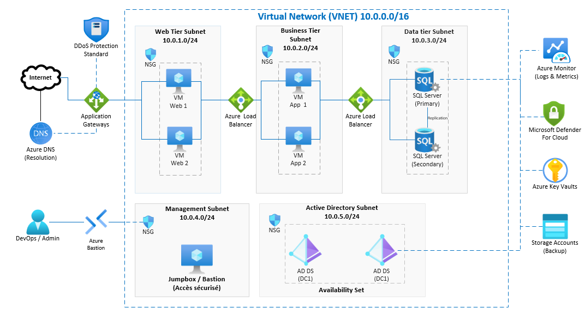 

*Figure 1 — Architecture globale de l'infrastructure cloud conçue avec Microsoft Visio.*

 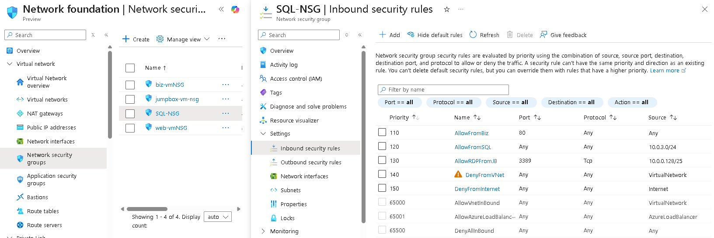 

*Figure 2 — Configuration des règles de sécurité entrantes du Network Security Group associé à la ressource SQL.*

 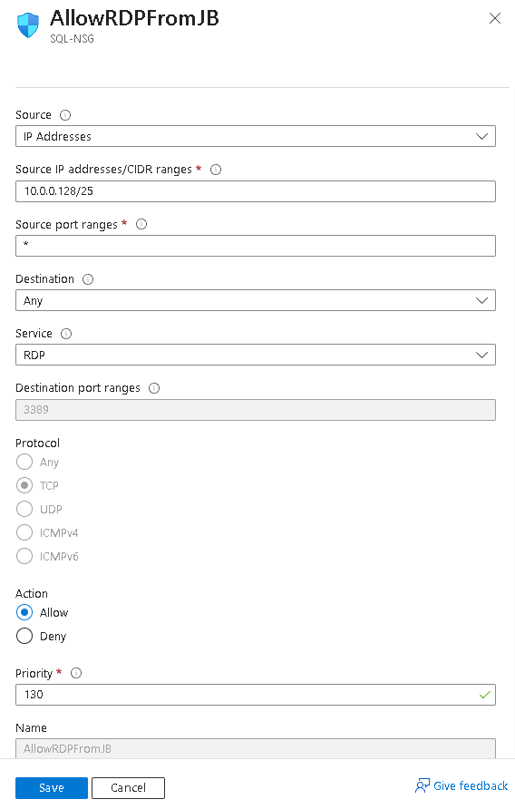 

*Figure 3 — Règle de sécurité permettant l'accès RDP depuis la JumpBox.*

### Résultat
L'infrastructure dispose d'une première couche de segmentation et de filtrage permettant de contrôler les accès réseau et de limiter les flux entrants aux communications nécessaires.

---

## Surveillance et analyse des flux réseau

J'ai utilisé les fonctionnalités de surveillance réseau afin d'analyser les flux circulant dans l'environnement cloud.

L'objectif était de mieux comprendre les communications entre les différentes ressources et de disposer d'une visibilité sur les flux réseau autorisés ou bloqués.

J'ai notamment utilisé Network Watcher pour consulter les informations relatives aux flux réseau.

Cette approche permet d'améliorer la visibilité sur le comportement du réseau et facilite l'identification d'éventuels problèmes de connectivité ou de configurations réseau incorrectes.

 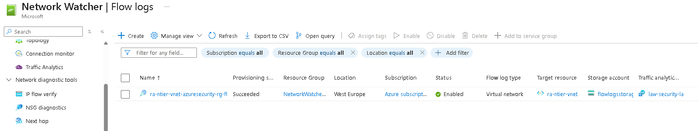 

*Figure 4 — Analyse des flux réseau à l'aide de Network Watcher Flow Logs.*

### Résultat
La surveillance des flux permet d'obtenir une meilleure visibilité sur les communications réseau et de faciliter l'analyse des événements liés à la connectivité.

---

## Publication et sécurisation d'une application Web

J'ai déployé une architecture permettant d'exposer une application Web tout en contrôlant l'accès au serveur backend.

J'ai mis en place une Application Gateway afin de gérer le trafic entrant vers l'application et de vérifier l'état de santé du backend.

Cette architecture permet de séparer le point d'accès public du serveur Web et d'améliorer la disponibilité et la supervision du service applicatif.

J'ai également vérifié le bon fonctionnement du serveur Web IIS hébergé sur une machine virtuelle Windows Server.

 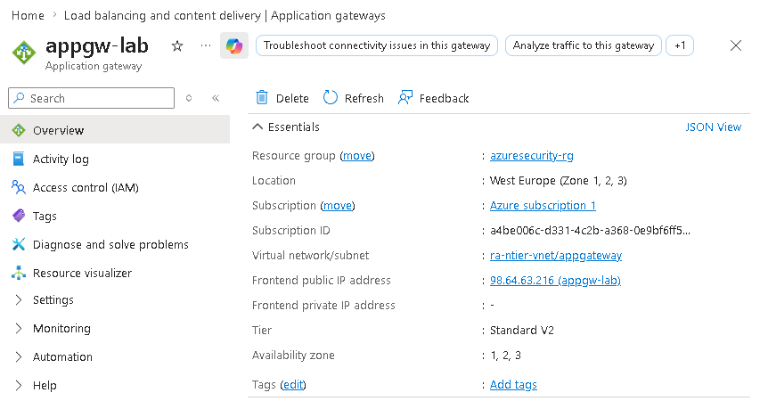 

*Figure 5 — Vue d'ensemble de l'Application Gateway utilisée comme point d'entrée de l'application.*

 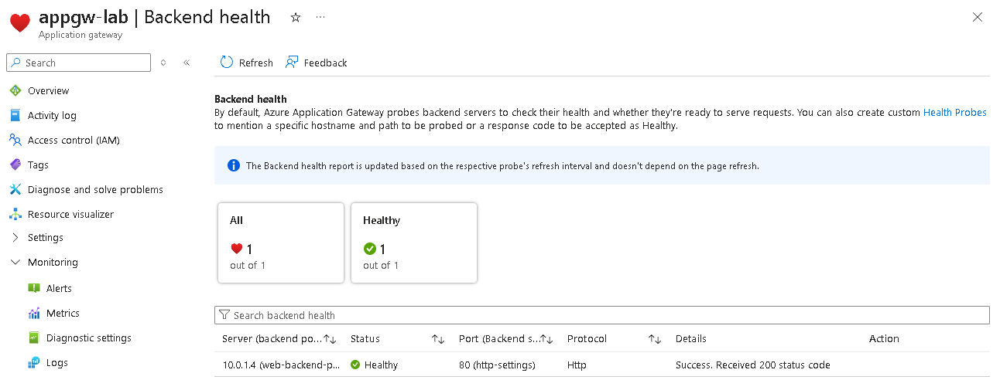 

*Figure 6 — Vérification de l'état de santé du backend associé à l'Application Gateway.*

 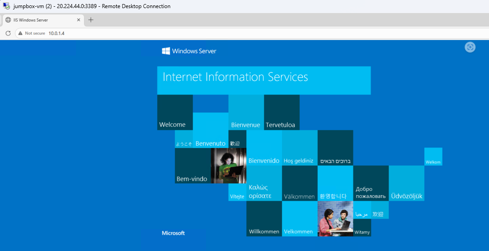 

*Figure 7 — Page Web IIS accessible depuis le serveur Windows Server après déploiement de l'application.*

### Résultat
L'application Web est accessible via l'Application Gateway et le backend IIS est identifié comme opérationnel, permettant de valider le bon fonctionnement de l'architecture applicative.

---

## Renforcement de la posture de sécurité

J'ai utilisé Microsoft Defender for Cloud afin d'améliorer la visibilité sur la posture de sécurité de l'environnement.

L'objectif était d'évaluer les capacités de protection disponibles et d'obtenir une vision centralisée de la sécurité des ressources cloud.

J'ai notamment travaillé sur :

- La configuration des plans de sécurité
- L'accès à Microsoft Defender for Cloud
- L'analyse de la posture de sécurité
- L'identification des recommandations de sécurité

Cette approche permet de suivre la posture globale de l'environnement et d'identifier les domaines nécessitant une amélioration.

 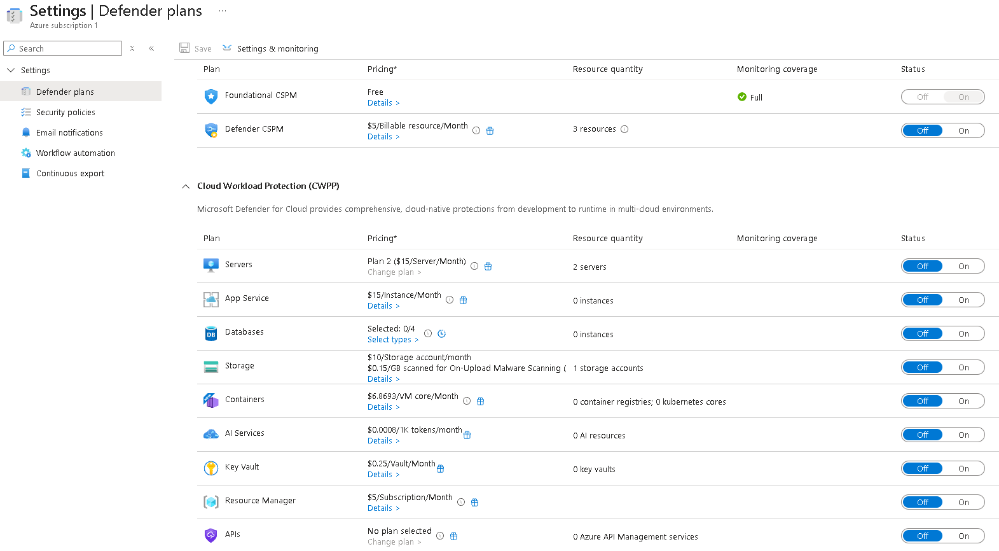 

*Figure 8 — Configuration des plans de protection disponibles dans Microsoft Defender for Cloud.*

 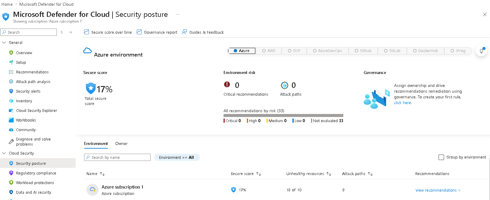 

*Figure 9 — Évaluation de la posture de sécurité de l'environnement avec Microsoft Defender for Cloud.*

### Résultat
L'environnement bénéficie d'une meilleure visibilité sur sa posture de sécurité, permettant d'identifier les axes d'amélioration et de renforcer progressivement les contrôles de sécurité.

---

## Protection des données et chiffrement

J'ai mis en œuvre des mécanismes de protection des données afin de sécuriser les ressources sensibles de l'environnement.

J'ai utilisé Azure Key Vault pour centraliser la gestion des clés et des secrets.

J'ai également vérifié le chiffrement d'une machine virtuelle à l'aide d'Azure CLI afin de contrôler l'état de protection des disques.

Cette approche permet de renforcer la confidentialité des données au repos et d'améliorer la gestion sécurisée des éléments cryptographiques.

 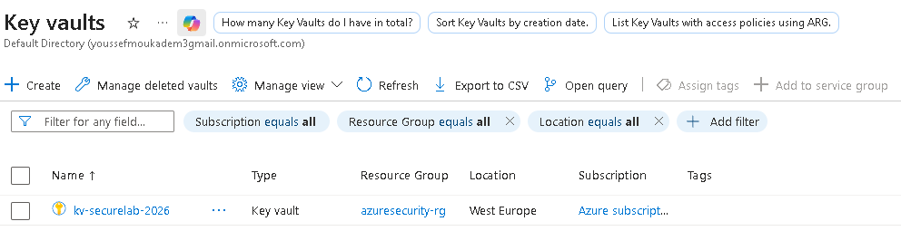 

*Figure 10 — Azure Key Vault kv-securelab-2026 utilisé pour la gestion sécurisée des clés et secrets.*

 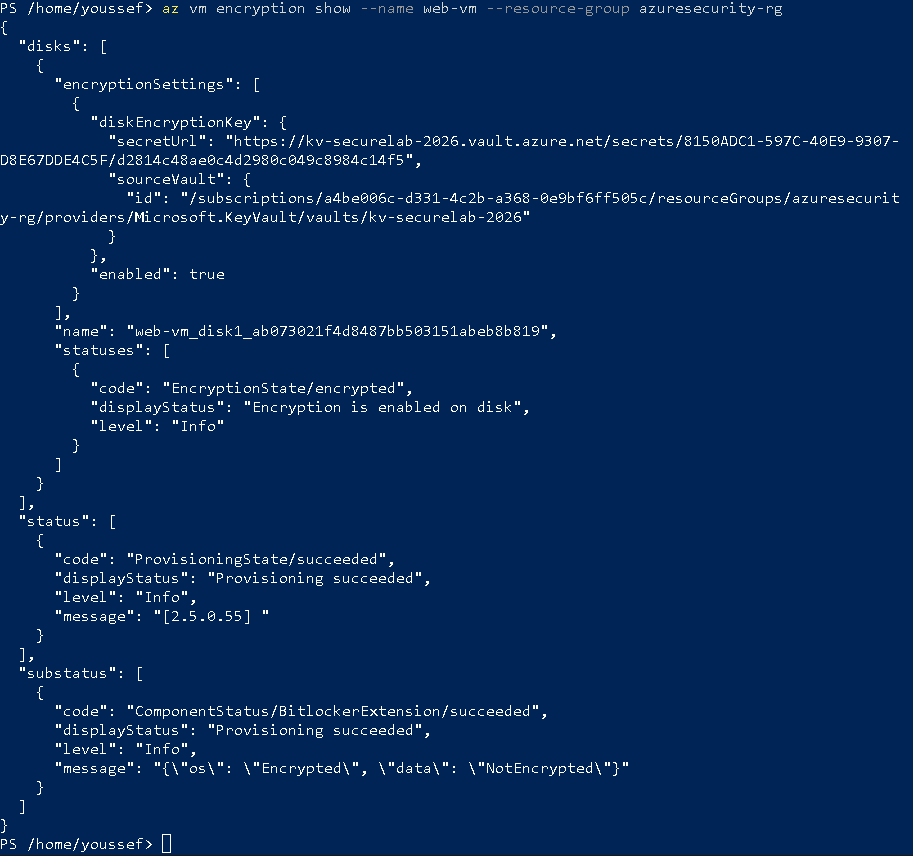 

*Figure 11 — Vérification de l'état du chiffrement de la machine virtuelle web-vm à l'aide de la commande az vm encryption show.*

### Résultat
La mise en place de Key Vault et la vérification du chiffrement permettent de renforcer la protection des données et la gestion sécurisée des éléments cryptographiques.

---

## Réseau virtuel et infrastructure réseau

J'ai également travaillé sur la configuration d'un réseau virtuel dédié à l'environnement afin de structurer les ressources réseau et de préparer leur intégration dans l'architecture cloud.

La configuration d'un réseau virtuel constitue une base essentielle pour contrôler les communications entre les différentes ressources et appliquer des mécanismes de sécurité adaptés.

 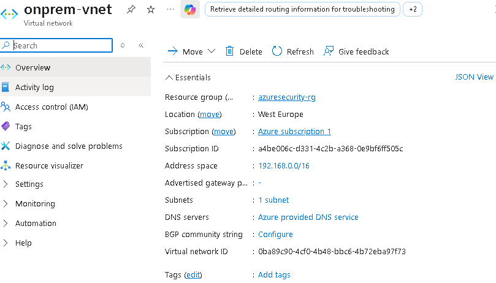 

*Figure 12 — Vue d'ensemble du réseau virtuel onprem0vnet utilisé dans l'environnement.*

### Résultat
Le réseau virtuel fournit une base réseau structurée permettant d'organiser les ressources et de mettre en œuvre des contrôles de sécurité adaptés à l'infrastructure.

---

## Gestion des identités et gouvernance des accès

La sécurité des identités constitue un élément central de ce projet.

J'ai utilisé Microsoft Entra ID afin de centraliser la gestion des identités et de mettre en place des mécanismes de protection adaptés aux risques liés aux comptes utilisateurs.

J'ai créé et utilisé un groupe dédié à la protection des identités afin de cibler les utilisateurs concernés par les politiques de sécurité.

Cette approche permet d'appliquer les contrôles de sécurité de manière ciblée et de renforcer progressivement la gouvernance des identités.

 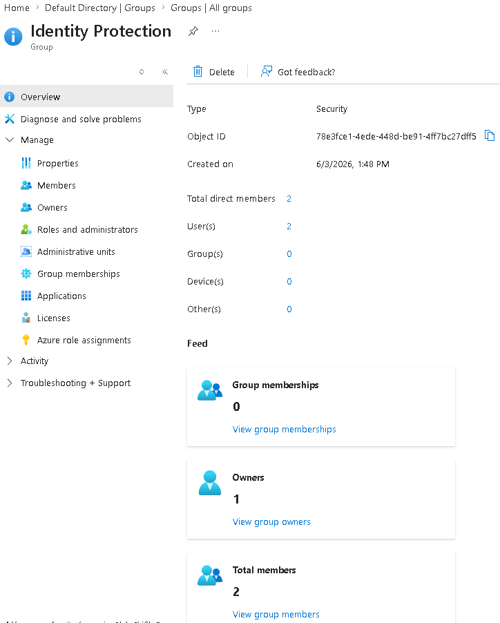 

*Figure 13 — Groupe Identity Protection utilisé pour cibler les utilisateurs concernés par les politiques de protection des identités.*

### Résultat
Les utilisateurs peuvent être regroupés et ciblés par des politiques de sécurité adaptées, facilitant la gouvernance des identités dans l'environnement cloud.

---

## Protection des identités et accès conditionnel

J'ai mis en place des politiques d'accès conditionnel afin d'appliquer des contrôles supplémentaires lorsque le niveau de risque associé à une connexion ou à une identité est considéré comme élevé.

J'ai notamment configuré :

- Une politique basée sur le risque de connexion (Sign-in Risk)
- Une politique basée sur le risque utilisateur (User Risk)
- Des contrôles d'accès conditionnel associés à ces niveaux de risque

Cette approche s'inscrit dans une logique Zero Trust, où les accès ne sont pas considérés comme fiables par défaut et doivent être évalués selon le contexte et le niveau de risque.

 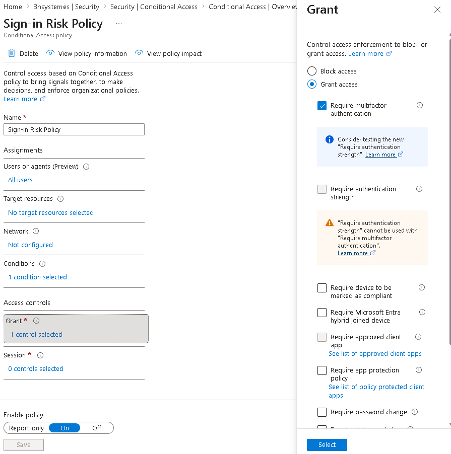 

*Figure 14 — Politique Conditional Access basée sur le risque de connexion (Sign-in Risk).*

 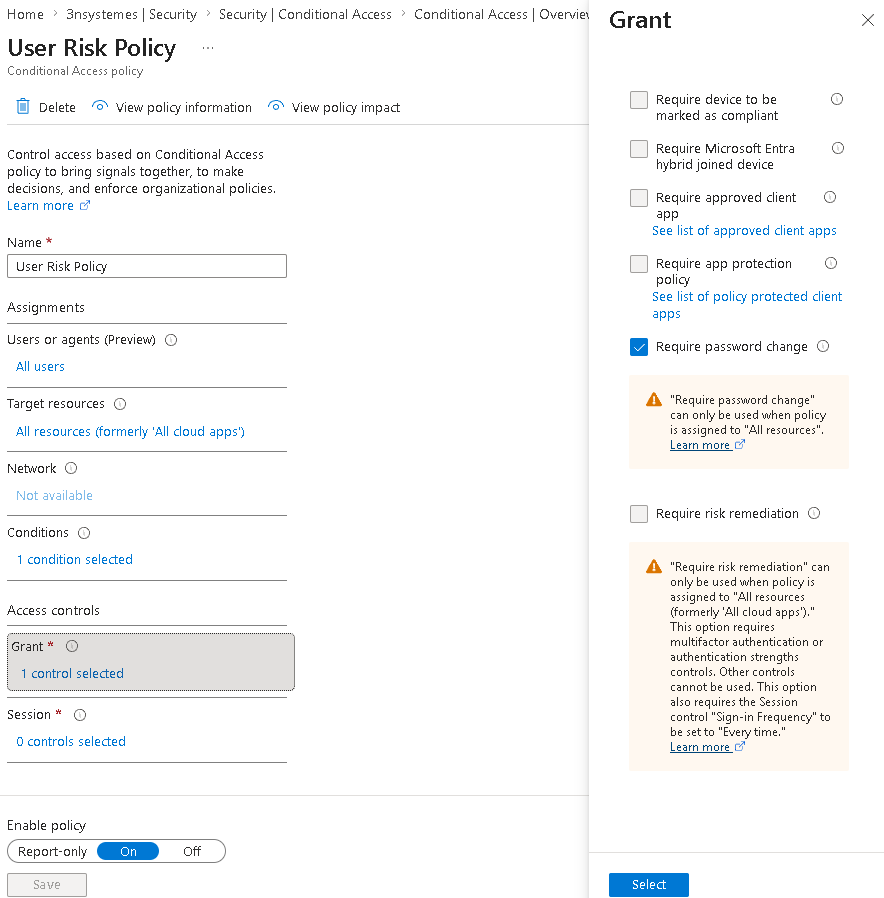 

*Figure 15 — Politique Conditional Access basée sur le risque utilisateur (User Risk).*

### Résultat
Les politiques d'accès conditionnel permettent d'adapter les contrôles de sécurité au niveau de risque détecté et de renforcer la protection des identités.

---

## Analyse des risques d'identité avec Microsoft Graph API

J'ai exploré l'utilisation de Microsoft Graph API afin d'automatiser l'accès aux informations relatives aux risques d'identité.

Pour cela, j'ai créé une application dédiée dans Microsoft Entra ID et configuré les éléments nécessaires à son authentification.

J'ai ensuite configuré les permissions API permettant à l'application d'accéder aux informations relatives aux événements de risque d'identité.

Cette mise en œuvre m'a permis de travailler sur :

- La création d'une App Registration
- La gestion des certificats et secrets
- La configuration des permissions Microsoft Graph
- L'authentification d'une application
- L'utilisation de PowerShell
-  L'interrogation des API Microsoft Graph
- L'analyse des données de risque disponibles

 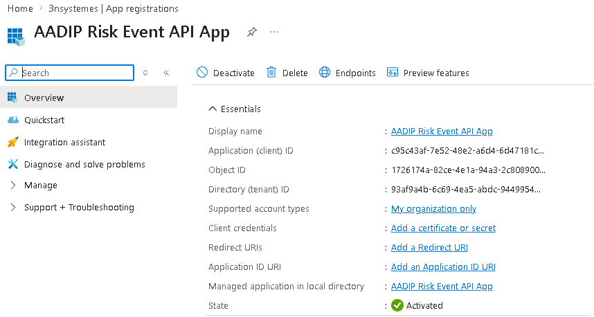 

*Figure 16 — Vue d'ensemble de l'application AADIP Risk Event API enregistrée dans Microsoft Entra ID.*

 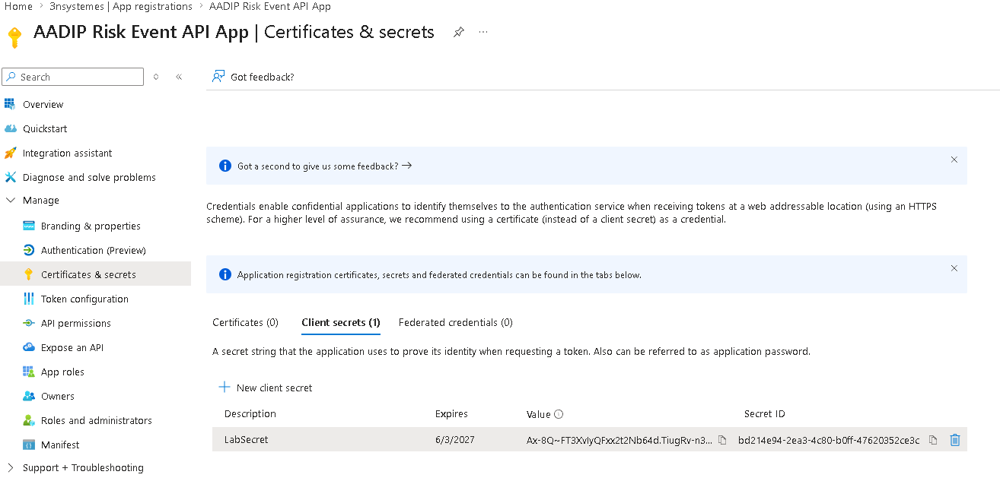 

*Figure 17 — Configuration des certificats et secrets utilisés pour l'authentification de l'application.*

  

*Figure 18 — Permission Microsoft Graph IdentityRiskEvent.Read.All accordée à l'application pour accéder aux informations relatives aux événements de risque d'identité.*

 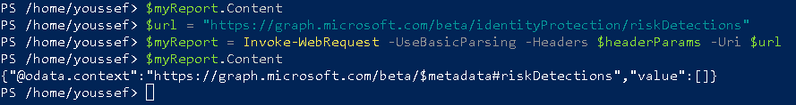 

*Figure 19 — Requête PowerShell vers l'API Microsoft Graph riskDetections pour interroger les événements de risque d'identité disponibles.*

### Résultat
L'intégration avec Microsoft Graph API m'a permis de découvrir l'utilisation d'API pour automatiser l'accès aux informations de sécurité et d'explorer l'analyse programmatique des événements de risque d'identité.

Dans cet environnement de test, la requête retourne actuellement une liste vide d'événements de risque (value: []), ce qui signifie qu'aucun événement correspondant n'était disponible au moment de l'interrogation.

---

## Contrôle d'accès basé sur les rôles (RBAC)

Afin d'appliquer le principe du moindre privilège, j'ai utilisé Azure RBAC pour attribuer des permissions spécifiques à un utilisateur au niveau des ressources.

J'ai attribué le rôle Virtual Machine Contributor à l'utilisateur Evan Green.

Ce rôle permet de gérer les machines virtuelles tout en limitant les permissions par rapport à un rôle administrateur plus élevé.

Cette approche permet d'appliquer une séparation des responsabilités et de limiter les privilèges accordés aux utilisateurs selon leurs besoins opérationnels.

 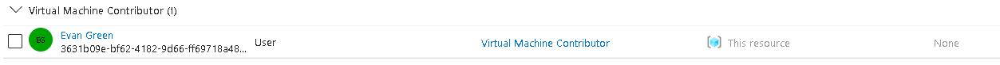 

*Figure 20 — Attribution du rôle Virtual Machine Contributor à l'utilisateur Evan Green au niveau de la ressource.*

### Résultat
L'utilisateur dispose des permissions nécessaires à la gestion des machines virtuelles sans recevoir automatiquement des privilèges d'administration globaux sur l'environnement.

---

## Protection réseau et résilience contre les attaques DDoS

J'ai renforcé la résilience de l'infrastructure en mettant en place Azure DDoS Protection.

L'objectif était d'ajouter une couche de protection dédiée contre les attaques par déni de service distribué et de protéger le réseau virtuel associé aux ressources de l'environnement.

J'ai notamment réalisé :

- La création d'un plan DDoS Protection
- La configuration du plan
- L'association du plan au réseau virtuel
- La vérification de la configuration DDoS appliquée

Cette protection complète les mécanismes de sécurité réseau déjà mis en place dans l'infrastructure.

 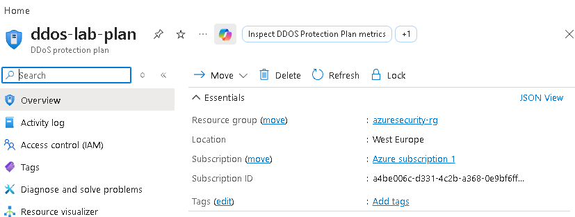 

*Figure 21 — Vue d'ensemble du plan DDoS Protection ddos-lab-plan.*

 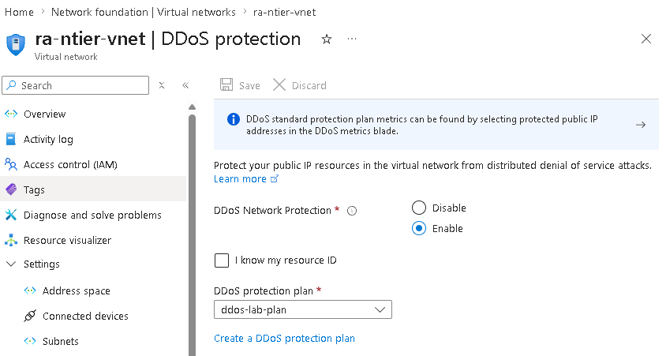 

*Figure 22 — Configuration de la protection DDoS appliquée au réseau virtuel ra-tier-vnet.*

### Résultat
Le réseau virtuel bénéficie d'une couche supplémentaire de protection contre les attaques DDoS, renforçant ainsi la résilience globale de l'infrastructure.

---

## Sensibilisation au cloud souverain

La réalisation de ce projet m'a également permis de développer une première compréhension des enjeux liés à la souveraineté numérique et à la gouvernance des données dans les environnements cloud.

Même si l'implémentation technique a été réalisée sur Microsoft Azure, j'ai pris en compte plusieurs problématiques importantes pour les organisations françaises et européennes :

- La localisation et la maîtrise des données
- La gouvernance des identités et des accès
- La protection des informations sensibles
- Le contrôle des privilèges
- La gestion des risques de sécurité
- La résilience des infrastructures
- La dépendance vis-à-vis des fournisseurs cloud

Ces problématiques sont particulièrement importantes pour les organisations manipulant des données sensibles ou soumises à des exigences réglementaires.

Les principes de sécurité étudiés dans ce projet peuvent être appliqués dans des architectures utilisant des solutions de cloud souverain proposées par des acteurs tels qu'OVHcloud, Scaleway ou 3DS OUTSCALE.

Cette réflexion m'a permis de mieux comprendre que la sécurité cloud ne repose pas uniquement sur les technologies utilisées, mais également sur la gouvernance des données, la maîtrise des identités, la localisation des ressources et le contrôle des accès.

--- 

## Compétences démontrées
Cloud Security • Network Security • Identity & Access Management (IAM) • Microsoft Entra ID • Zero Trust • Conditional Access • Identity Protection • RBAC • MFA • Microsoft Defender for Cloud • Microsoft Graph API • Azure Key Vault • Chiffrement des données • Network Watcher • Application Gateway • IIS • NSG • DDoS Protection • Security Monitoring • Risk Analysis • Least Privilege • Cloud Governance • Cloud Sovereignty Awareness

--- 

## Conclusion

Ce projet m'a permis d'acquérir une expérience pratique dans la conception, le déploiement et la sécurisation d'une infrastructure cloud complète.

J'ai travaillé sur plusieurs dimensions de la sécurité, depuis la segmentation et la surveillance du réseau jusqu'à la protection des applications, au chiffrement des données, à la gestion des identités, au contrôle des accès, à l'analyse des risques et à la protection contre les attaques DDoS.

Cette expérience m'a permis de développer une vision globale de la sécurité cloud en combinant plusieurs principes fondamentaux :

- Zero Trust
- Identity & Access Management
- Principe du moindre privilège
- Défense en profondeur
- Segmentation réseau
- Protection des données
- Supervision de la sécurité
- Résilience de l'infrastructure

Enfin, ce projet m'a permis de développer une première sensibilisation aux enjeux de souveraineté numérique et de gouvernance des données, ainsi qu'aux problématiques à prendre en compte lors de la conception d'architectures destinées à des environnements cloud et cloud souverain.
