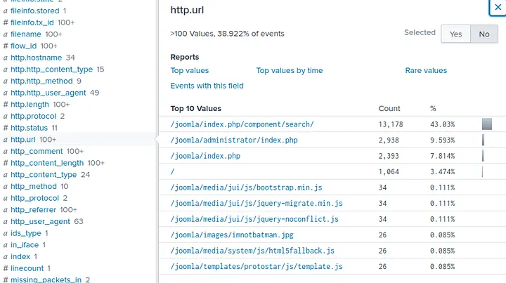
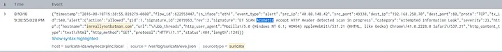
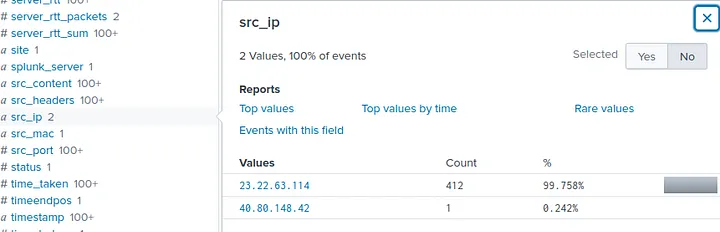
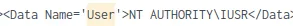
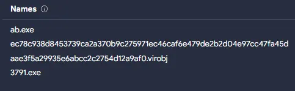
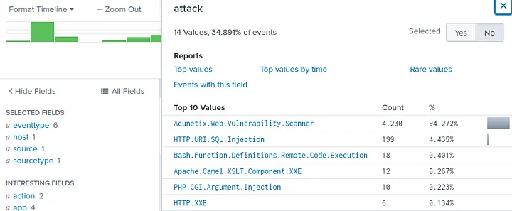
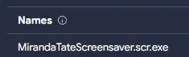

# 📝 Case Study: Incident Handling with Splunk

## 🔹 Overview
In this case study, I revisited the **Introductory Splunk SOC Room** on TryHackMe. The exercise focused on **analyzing server logs** to investigate attacks on `imreallynotbatman.com`.  

**Skills demonstrated:**
- Log analysis in **Splunk Search & Reporting**
- Creating **filters and queries**
- Investigating attacker behavior
- Mapping **attack phases** (Reconnaissance → Delivery)
- Identifying **malware, IPs, and CVEs**

---

## 🔍 Key Activities & Highlights

### 1. Reconnaissance Phase
- Analyzed **Suricata alerts** for signs of exploitation attempts  
- Identified a reference to **CVE-2014-6271 (Shellshock vulnerability)**  
- Determined the **web server CMS** being targeted was **Joomla**  
- Detected the use of the **Acunetix vulnerability scanner** by the attacker  

**Other findings:**
- Server IP: 192.168.250.70  

---

### 2. Exploitation Phase
- Observed **multiple brute force attempts** against the Joomla admin panel  
- Targeted username: **admin**  
- Correct password identified: **batman**  
- Logged **412 unique password attempts**  
- Attacker source IP responsible for brute force: **23.22.63.114** 

---

### 3. Installation Phase
- Found suspicious executable: **3791.exe**  
- Extracted its **MD5 hash** from logs: `AAE3F5A29935E6ABCC2C2754D12A9AF0`  
- Mapped execution to the **user NT AUTHORITY\IUSR**  
- VirusTotal search revealed alias: **ab.exe** 

---

### 4. Action on Objectives
- Website defaced with file: **poisonivy-is-coming-for-you-batman.jpeg**  
- Fortigate Firewall triggered detection: **HTTP.URI.SQL.Injection** from attacker IP **40.80.148.42**  
- Dynamic DNS domain linked to attack: **prankglassinebracket.jumpingcrab.com** 

---

### 5. Command & Control Phase
- Identified attacker group: **P01s0n1vy**  
- IP associated with pre-staged domains: **23.22.63.114**  
- Email linked to attacker infrastructure: **lillian.rose@po1s0n1vy.com**  
- Malware hash tied to Poison Ivy APT: `c99131e0169171935c5ac32615ed6261`  
- Malware sample name: **MirandaTateScreensaver.scr.exe** 

---

### 6. Weaponization Phase
- APT-related IP: 23.22.63.114
- Likely attacker email: lillian.rose@po1s0n1vy.com

---

### 7. Delivery Phase
- Malware hash: c99131e0169171935c5ac32615ed6261
- Malware name: `MirandaTateScreensaver.scr.exe`

---

### 8. Conclusion
Through this hands-on case study, I practiced:
- Identifying **exploits and CVEs** in logs  
- Tracing **brute force login attempts**  
- Detecting **malware installation and execution**  
- Mapping attacker infrastructure to **IP, domains, and email IOCs**  
- Following the **Incident Handling lifecycle** from detection to remediation

This exercise reinforced my ability to work with **Splunk and Suricata alerts** to investigate real-world security incidents.  

---

## 🔗 Navigation
- Back to [SIEM Home](../SIEM/README.md)
