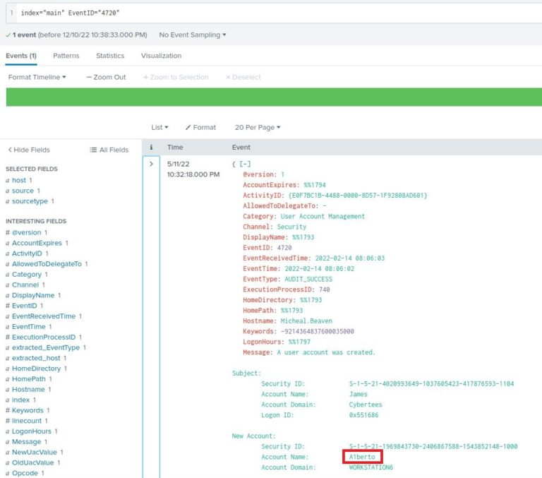
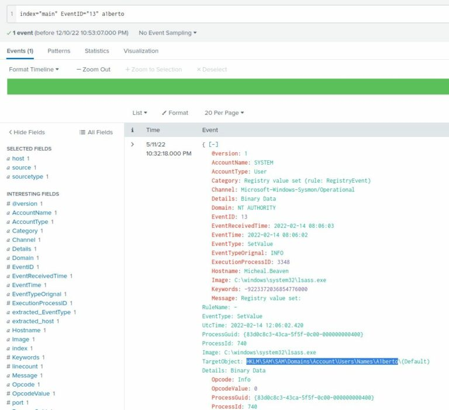
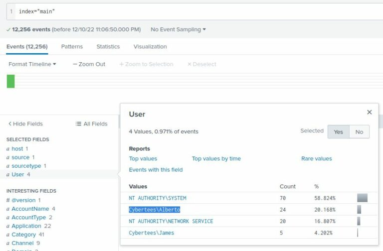
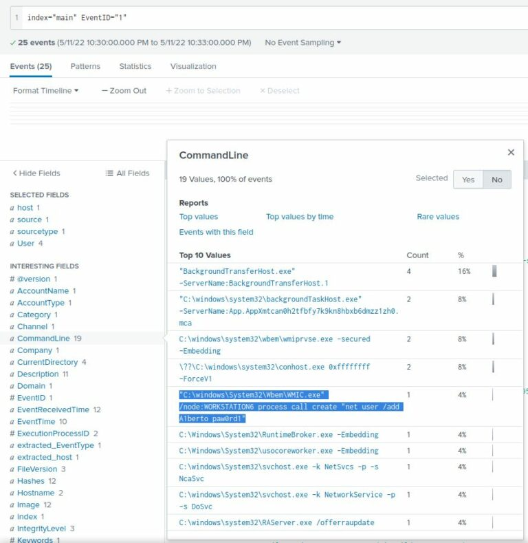
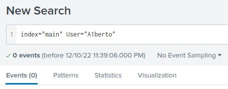
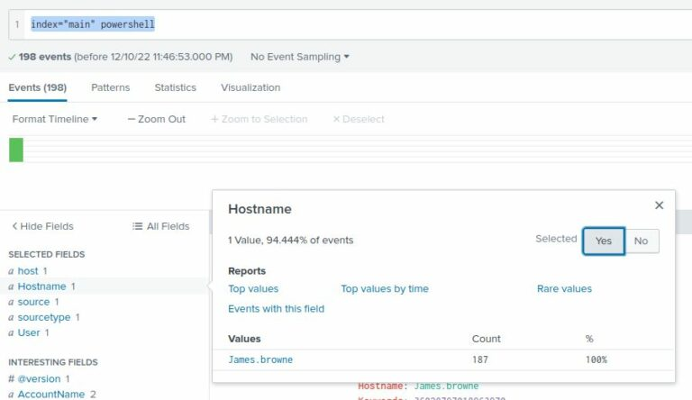
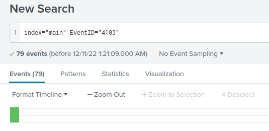
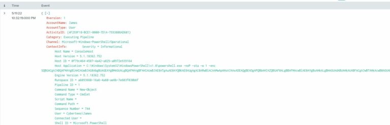
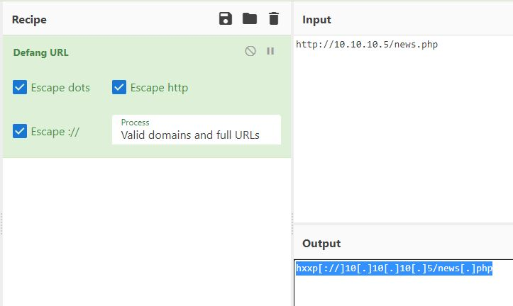

# 📝 Case Study: Investigating with Splunk

## 🔹 Overview
In this case study, I analyzed **Windows + Sysmon logs** in Splunk to uncover adversary techniques such as backdoor account creation, registry persistence, process execution, and obfuscated PowerShell activity.  

**Skills demonstrated:**
- Querying logs with **index searches & Event IDs**  
- Identifying **backdoor accounts and persistence mechanisms**  
- Detecting **malicious PowerShell and C2 callbacks**  
- Investigating anomalous **user behavior and impersonation**  
- Decoding **Base64-encoded payloads**  

---

## 🔍 Key Activities & Findings

### 1. Total Events in Index
- Queried logs with: `index="main"`  
- Adjusted time range → **All Time**  
- Found **12,256 total events** ingested.  

---

### 2. Backdoor User Creation
- Event ID **4720** → new user account creation.  
- Search: `index="main" EventID=4720`  
- Found attacker-created account: **A1berto**  
  - Substitution trick: “L” replaced with “1” to mimic **Alberto**.  

---

### 3. Registry Key Modification
- Event ID **13** → registry modification.  
- Refined with username: `index="main" EventID=13 A1berto`  
- Persistence established at:  
  **HKLM\SAM\SAM\Domains\Account\Users\Names\A1berto**  

---

### 4. Impersonated User
- Analyzed user activity across logs.  
- Adversary attempted to impersonate legitimate user: **Alberto**.  

---

### 5. Remote Command Execution
- Event ID **1** → process creation events.  
- Identified WMIC command used for remote user creation:  
  “C:\windows\System32\Wbem\WMIC.exe” /node:WORKSTATION6 process call create “net user /add A1berto paw0rd1”

---

### 6. Backdoor Logons
- Event ID **3** → network connections.  
- Filter: `User="A1berto"`  
- Result: **0 successful logons** by the backdoor account.  

---

### 7. Infected Host with PowerShell
- Search: `index="main" powershell`  
- Identified compromised host: **James.browne**  

---

### 8. Malicious PowerShell Execution
- Event ID **4103** → PowerShell command logging.  
- Found **79 malicious PowerShell execution events**.  

---

### 9. Web Request from Encoded Script
- Extracted encoded **Base64 PowerShell** payload.  
- Decoded to reveal attacker C2 infrastructure:  
**hxxp[://]10[.]10[.]10[.]5/news[.]php**  

  

---

## ✅ Conclusion
This case study simulated a **real-world intrusion chain**, including:  
- **Persistence** (backdoor account + registry key modification)  
- **Evasion** (username masquerading)  
- **Execution** (remote WMIC + PowerShell abuse)  
- **Command & Control** (Base64-obfuscated HTTP request to attacker server)  

By correlating **Splunk searches, Event IDs, and log fields**, I was able to reconstruct the adversary’s actions step by step.  

This strengthened my skills in:  
- **SIEM-driven investigations**  
- **Adversary emulation & detection engineering**  
- **Practical log forensics in Windows environments**  

---

## 🔗 Navigation
- Back to [SIEM Home](../SIEM/README.md)
