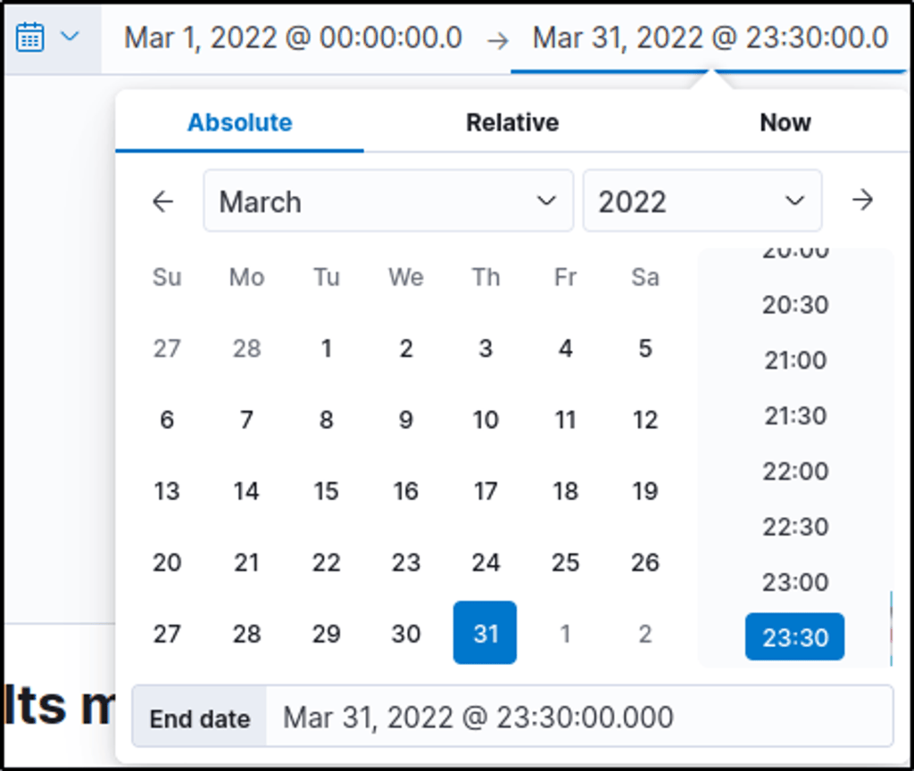
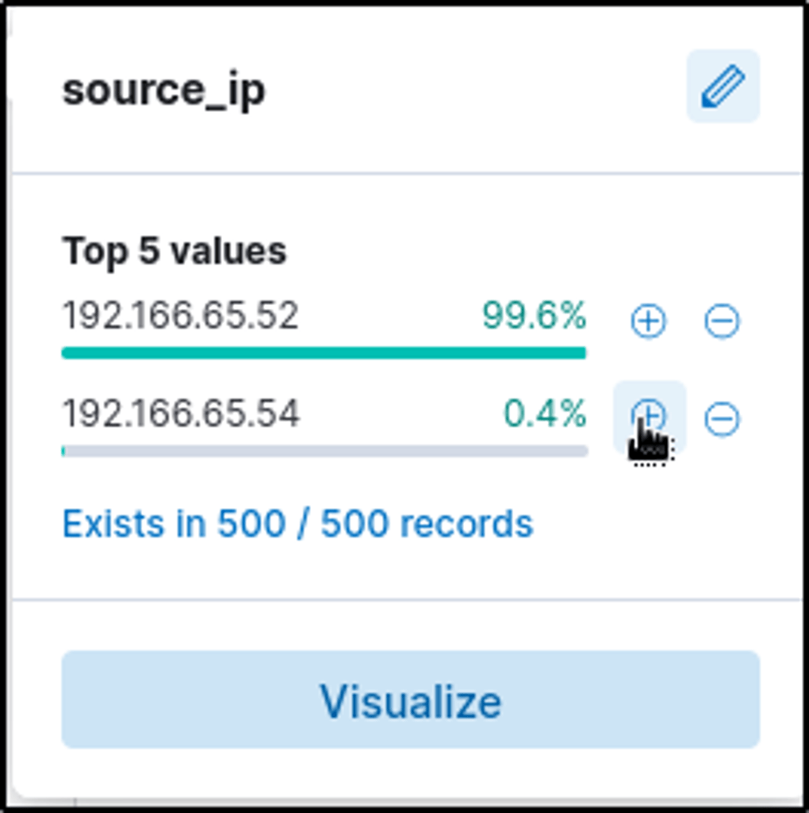
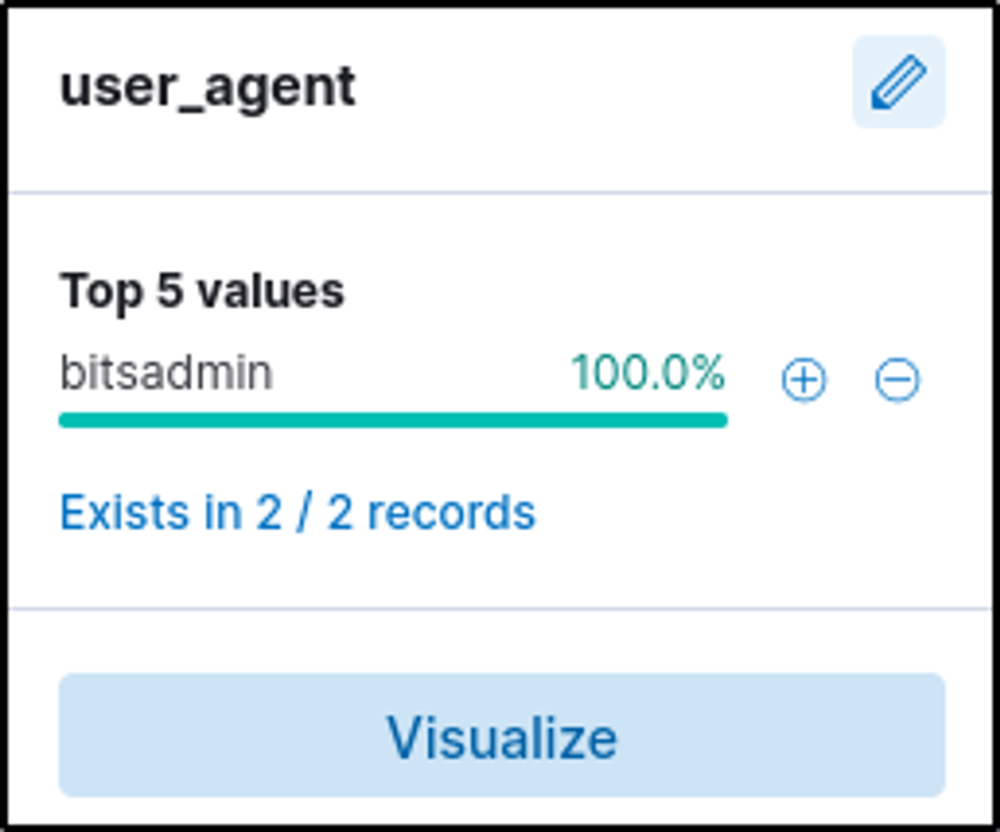
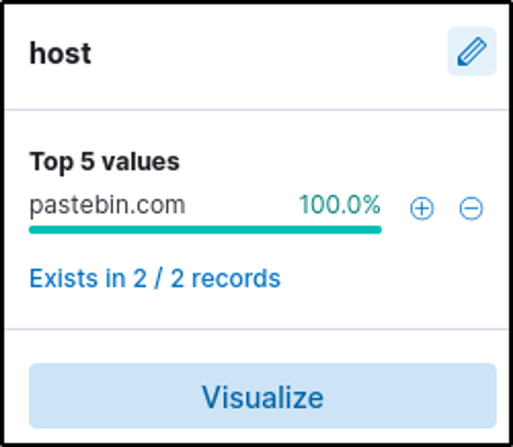
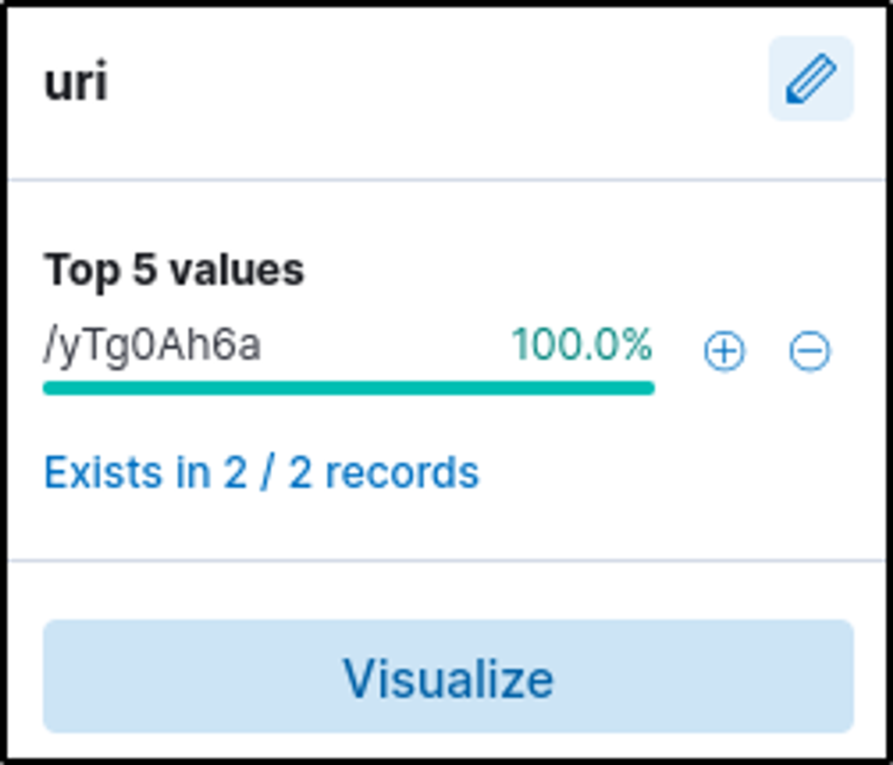
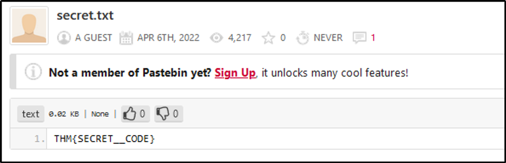

# 📝 Case Study: ItsyBitsy Malware Investigation

## 🔹 Overview
During SOC monitoring, an IDS alert indicated potential C2 communication from **Browne** (HR). A suspicious file contained a malicious pattern `THM:{ ________ }`. A week of HTTP connection logs were ingested into the **connection_logs** index in Kibana.  

**Skills demonstrated:**
- Investigating network logs for anomalies
- Identifying suspicious C2 activity
- Extracting file and URL information
- Threat hunting in Kibana

---

## 🔍 Key Findings

### 1. Events Overview
- Filtered events for March 2022 → **1482 events**  

### 2. Suspected User IP
- Investigated user Browne → **192.166.65.54**  

### 3. Download Tool
- Identified the binary used from the `user_agent` field → **bitsadmin**  

> BITSAdmin is a command-line tool for download/upload tasks.

### 4. C2 Server
- Determined the filesharing site acting as C2 → **pastebin.com**  

### 5. Full C2 URL
- Combined `host` and `URI` fields → **pastebin.com/yTg0Ah6a**  

### 6. Accessed File
- File accessed on the site → **secret.txt**  

### 7. Secret Code
- Extracted from the file → **THM{SECRET__CODE}**

---

### Reflection
I gained hands-on experience in threat hunting through this Kibana-based exercise. By analyzing logs and investigating security incidents, I developed skills in examining data points and proxy logs, directly applicable to real-world SOC operations.

---

## 🔗 Navigation
- Back to [SIEM Home](../SIEM/README.md)
