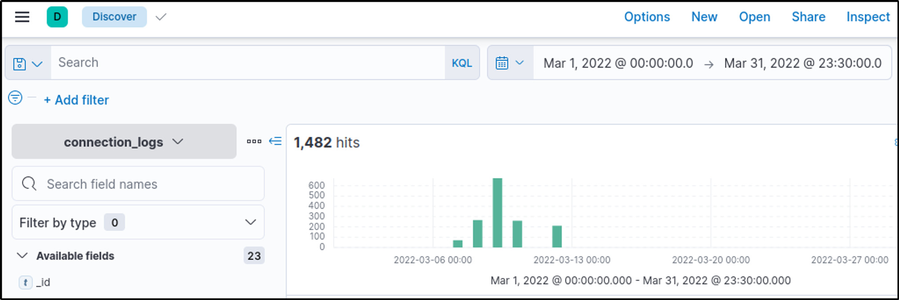

# Case Study: ItsyBitsy Malware Investigation

## Task: Scenario – Investigate a potential C2 communication alert

### Scenario
During normal SOC monitoring, Analyst John observed an alert on an IDS solution indicating a potential C2 communication from a user **Browne** from the HR department. A suspicious file was accessed containing a malicious pattern `THM:{ ________ }`. A week-long HTTP connection logs have been pulled to investigate. Due to limited resources, only the connection logs could be pulled out and are ingested into the **connection_logs** index in Kibana.

Our task in this room is to examine the network connection logs of this user, find the link and the content of the file, and answer the questions.

---

### Questions & Answers

**1. How many events were returned for the month of March 2022?**  

  I filtered events only for the month of March.  
  
    
  
    
  
  **Answer:** 1482

**2. What is the IP associated with the suspected user in the logs?**  

  I checked the filtered events for the suspected user Browne.  
  
    
  
  **Answer:** 192.166.65.54  

**3. The user’s machine used a legit Windows binary to download a file from the C2 server. What is the name of the binary?**  

  I identified the download tool from the `user_agent` field in the filtered events.  
  
    
  
  **Answer:** bitsadmin  

> BITSAdmin is a command-line tool to create download/upload jobs and monitor progress.

**4. The infected machine connected with a famous filesharing site, which also acts as a C2 server. What is the name of the filesharing site?**  

  I inspected the `host` field in the filtered events to find the C2 server.  
  
    
  
  **Answer:** pastebin.com

**5. What is the full URL of the C2 to which the infected host is connected?**  

  I combined the `host` and `URI` fields from the filtered events to get the full URL.  
  
    
  
  **Answer:** pastebin.com/yTg0Ah6a

**6. A file was accessed on the filesharing site. What is the name of the file accessed?**  

  I checked the URL in the filtered events to determine the accessed file.  
  
    
  
  **Answer:** secret.txt

**7. The file contains a secret code with the format `THM{_____}`. What is the code?**  

  I examined the content of the accessed file from the filtered events.  
  
  **Answer:** THM{SECRET__CODE}

---

### Reflection
I acquired practical experience in threat hunting through this authentic exercise conducted in Kibana. This exercise involved utilizing log analysis to detect and investigate security incidents. The skills I honed, such as examining data points and proxy logs, are directly applicable to real-life threat hunting scenarios.

---

## 🔗 Navigation
- Back to [SIEM Home](../SIEM/README.md)
