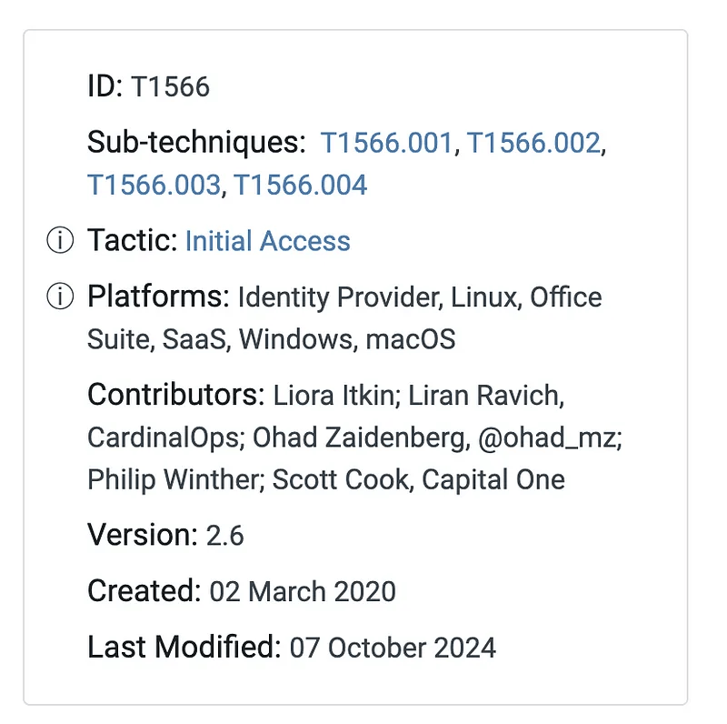
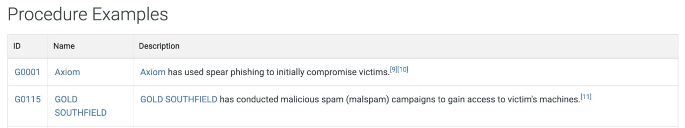
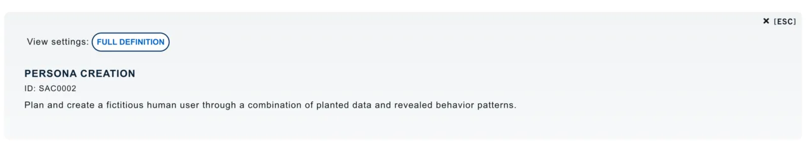
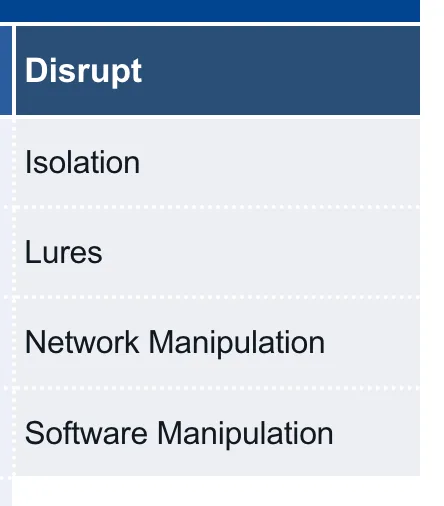
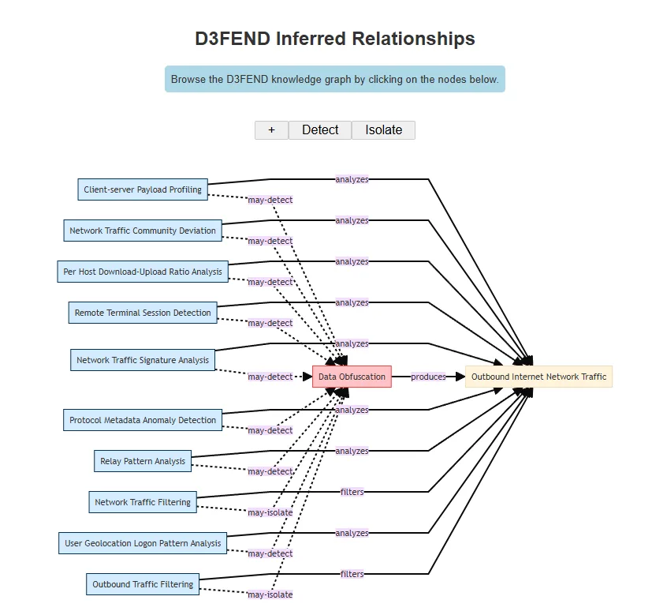
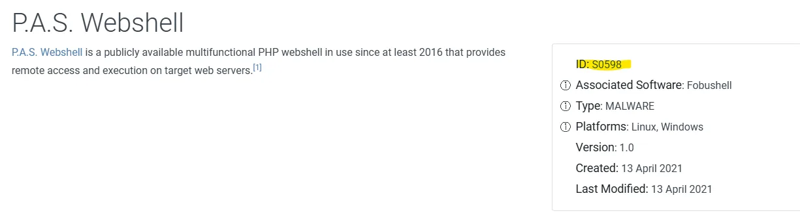
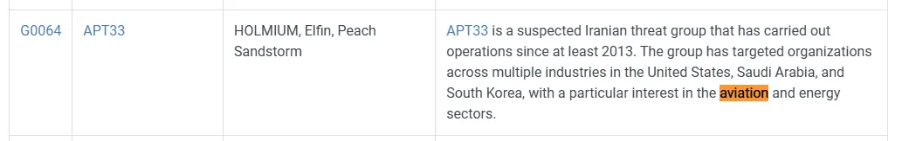
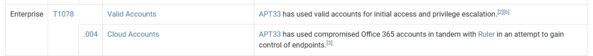
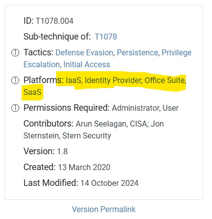

# Étude de Cas : Frameworks MITRE — ATT&CK, CAR, ENGAGE & D3FEND

Dans cette étude de cas, j’ai exploré en profondeur **l’écosystème MITRE**, un ensemble de frameworks qui constituent la base de la défense moderne et de l’analyse des menaces.  
J’ai étudié **ATT&CK**, **CAR**, **ENGAGE** et **D3FEND**, afin de comprendre comment chacun contribue à **identifier, détecter et se défendre** contre les comportements adverses.  
Ce projet incluait également l’étude de **plans d’émulation** et la cartographie de **groupes de menaces réels** dans des environnements cloud.

---

## Introduction et Préparation

J’ai commencé par créer un espace de travail local pour les captures d’écran et les notes, puis j’ai consulté les sites officiels MITRE pour **ATT&CK, CAR, ENGAGE et D3FEND**.  
L’objectif était de comprendre comment chaque framework s’intègre dans le cycle de vie des menaces — depuis l’identification des **tactiques, techniques et procédures (TTPs)** jusqu’à la mise en place de **contre-mesures défensives**.

---

## Exploration d’ATT&CK — Cartographier le comportement des attaquants

J’ai ouvert le site **MITRE ATT&CK** :  
https://attack.mitre.org/

J’ai recherché la technique **Phishing**, l’une des méthodes d’accès initial les plus courantes.

**Réponse :** Technique ID – `T1566`

MITRE classe cette technique dans la **tactique Initial Access** et liste des sous-techniques comme :
- Spearphishing Attachment  
- Spearphishing Link  
- Spearphishing via Service  

Chaque entrée fournit également des **mitigations** et des **idées de détection**.  
Pour Phishing (T1566), mitigation recommandée : **Formation des utilisateurs (M1017)**.  
Sources de données pour la détection : **logs applicatifs**, **trafic réseau** et **inspection des fichiers**.

Pour visualiser les relations, j’ai utilisé le **ATT&CK Navigator** :  
https://mitre-attack.github.io/attack-navigator/

J’ai chargé une couche publique pour voir comment les techniques sont cartographiées selon la couverture et la détection.  
Puis, j’ai étudié un groupe de menace réel : **Axiom (G0001)**.

Cela montre les techniques associées, les familles de malware et les recouvrements avec le **Winnti Group** — illustrant comment ATT&CK révèle les relations au niveau des campagnes.

---

## Investigation CAR — Transformer les techniques en détections

Ensuite, j’ai exploré **MITRE CAR (Cyber Analytics Repository)** :  
https://car.mitre.org/analytics

Ce référentiel fait le lien entre la théorie ATT&CK et la **détection pratique**.  
J’ai ouvert l’exemple analytique : CAR-2013-05-004

La page inclut :
- **Pseudo-code** pour la logique de détection  
- **Requêtes spécifiques aux plateformes** (Splunk, EQL, Zeek…)  
- **Tests unitaires** pour validation  

Cet exemple décrit comment détecter des **modèles d’exécution de processus suspects**, directement liés aux techniques ATT&CK.

J’ai aussi découvert **BZAR**, une collection de scripts Zeek pour l’analyse réseau, permettant de détecter des anomalies SMB/RPC.  
CAR fournit donc des **blocs de détection réutilisables**, adaptables à différents SIEM.

---

## Comprendre ENGAGE — Tromper et interagir avec l’adversaire

J’ai ensuite exploré **MITRE ENGAGE**, axé sur les **opérations de tromperie et d’engagement des adversaires**.  
https://engage.mitre.org/

La matrice ENGAGE comporte cinq catégories principales :
- **Prepare** (Préparer)  
- **Expose** (Exposer)  
- **Affect** (Affecter)  
- **Elicit** (Provoquer)  
- **Understand** (Comprendre)

J’ai ouvert **Persona Creation (SAC0002)** dans *Prepare*, qui fournit une **fiche de profil Persona** pour créer des leurres crédibles.  

J’ai aussi consulté **Lures (EAC0005)** dans *Expose*, décrivant des techniques pour inciter les adversaires à interagir avec des leurres.  
Ces fiches peuvent être utilisées pour concevoir des expériences de tromperie contrôlées.

Cette section montre comment la tromperie permet de **collecter activement des données sur l’adversaire**, un moyen précieux pour tester les défenses dans des conditions réalistes.

---

## Analyse D3FEND — Cartographier les contre-mesures

Après avoir étudié l’attaque et la détection, j’ai exploré **MITRE D3FEND** :  
https://d3fend.mitre.org/

J’ai recherché **Data Obfuscation**, un des premiers exemples de la liste.  
Le framework présente **les techniques défensives**, **leurs relations** et **les artefacts observables**.

**Réponse :** Artefact observable – `Outbound Internet Network Traffic`

D3FEND montre comment cartographier les contre-mesures directement sur les tactiques ATT&CK, offrant une **vision bidirectionnelle attaque/défense**.  
Il fournit un plan pratique pour atténuer les techniques ATT&CK.

---

## Revue des plans d’émulation MITRE — De la théorie à la pratique

Pour rendre l’étude pratique, j’ai consulté la bibliothèque **Adversary Emulation Plans** de MITRE :  
https://attack.mitre.org/resources/adversary-emulation-plans/

J’ai ouvert le plan **APT3** et examiné la **Phase 1** sur la mise en place du C2.  
Le plan utilise également la technique de persistance **Sticky Keys** (sethc.exe → cmd.exe).

J’ai ensuite examiné les plans **APT29** et **Sandworm** pour identifier outils et web shells :  
- APT29 : **Pupy**, **Metasploit**, **PoshC2**  
- Sandworm : web shell **P.A.S. (S0598)**

Cela m’a permis de voir concrètement comment les **plans d’émulation** servent à tester la couverture défensive face aux TTP réels.

---

## Contexte Cloud — Cartographier ATT&CK pour APT33

Enfin, j’ai mené une investigation sur **APT33**, connu pour cibler le secteur aéronautique et les environnements cloud.

Page ATT&CK du groupe :  
https://attack.mitre.org/groups/G0064/

**Constatations :**
- Actif depuis : `2013`

- Technique cloud : `T1078.004 (Comptes valides : comptes cloud)`

- Outil associé : `Ruler`  
- Mitigation : `Authentification multi-facteur (M1032)`  
- Plateformes impactées : `IaaS`, `SaaS`, `Office Suite`, `Identity Providers`  

Cette section montre comment **ATT&CK peut guider la priorisation de la sécurité cloud**, en identifiant les points critiques pour la détection et le durcissement.

---

## Leçons Apprises et Réflexions

Ce projet a couvert **l’écosystème MITRE complet**, de l’analyse du comportement des attaquants à la mise en œuvre défensive.  
J’ai appris à :

- Cartographier les **techniques ATT&CK** vers des **analyses CAR** pour obtenir des détections exploitables.  
- Utiliser **ENGAGE** pour concevoir des **stratégies de tromperie** et générer des données sur les menaces.  
- Appliquer **D3FEND** pour choisir des **contre-mesures concrètes** face à des techniques ATT&CK spécifiques.  
- Se référer aux **plans d’émulation** pour valider les détections et former les équipes SOC.  
- Analyser des **groupes de menaces réels (APT33, APT3, APT29)** et les relier aux risques sur les infrastructures modernes.

Le plus frappant est que les frameworks MITRE fonctionnent **comme une boucle de rétroaction continue** :

> ATT&CK montre *comment les attaques se produisent*,  
> CAR montre *comment les détecter*,  
> D3FEND montre *comment les arrêter*,  
> ENGAGE montre *comment apprendre du comportement des adversaires*.

À la fin de cette exploration, je me sens capable d’appliquer les frameworks MITRE comme **méthodologie unifiée pour le threat modeling, la détection et la collaboration Red-Blue**.

---

**Outils et Références :**
- OSINT Framework  
- theHarvester  
- Hunter.io  
- MITRE ATT&CK Framework  
- TryHackMe : MITRE Room
