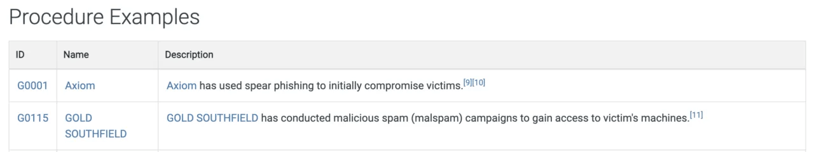

# Case Study: MITRE Frameworks — ATT&CK, CAR, ENGAGE & D3FEND

In this case study, I wanted to dive deeper into the **MITRE ecosystem** — a suite of frameworks that form the backbone of modern cybersecurity defense and threat analysis.  
I explored **ATT&CK**, **CAR**, **ENGAGE**, and **D3FEND**, learning how each contributes to understanding, detecting, and defending against adversarial behaviors.  
This project also involved reviewing **emulation plans** and mapping **real-world threat groups** to cloud-based environments.

---

## Introduction and Learning Setup

I began by setting up a local workspace for screenshots and notes, then visited the official MITRE sites for ATT&CK, CAR, ENGAGE, and D3FEND.  
The goal was to understand how each framework fits into the threat lifecycle — from identifying **tactics, techniques, and procedures (TTPs)** to implementing **defensive countermeasures**.

---

## Exploring ATT&CK — Mapping Adversarial Behavior

To start, I opened the **MITRE ATT&CK** website:

https://attack.mitre.org/

I searched for the **Phishing** technique, which is one of the most common initial access methods used by attackers.

**Answer:** Technique ID – `T1566`

From the details, I learned that MITRE categorizes this under the **Initial Access** tactic and lists subtechniques such as:
- Spearphishing Attachment
- Spearphishing Link
- Spearphishing via Service

Each entry also includes **mitigations** and **detection ideas**.  
For Phishing (T1566), recommended mitigation: **User Training (M1017)**.  
Detection data sources: **Application logs**, **network traffic**, and **file content inspection**.

To visualize relationships, I launched the **ATT&CK Navigator**:
https://mitre-attack.github.io/attack-navigator/

I loaded a public layer to see how techniques are mapped against coverage and detections.  
Then, I browsed a real threat group: **Axiom (G0001)**. 

It showed associated techniques, malware families, and even overlaps with **Winnti Group** — demonstrating how ATT&CK can reveal campaign-level relationships.

---

## Investigating CAR — Turning Techniques into Detections

After mapping techniques, I moved on to **MITRE CAR (Cyber Analytics Repository)** at:
https://car.mitre.org/analytics 

This repository bridges the gap between ATT&CK theory and practical detection.  
I opened an analytic example: CAR-2013-05-004

The page included:
- **Pseudocode** for detection logic  
- **Platform-specific queries** (Splunk, EQL, Zeek, etc.)  
- **Unit tests** for validation  

This analytic described how to detect suspicious **process execution patterns** — mapping directly to ATT&CK techniques.

I also discovered **BZAR**, a collection of Zeek scripts for network-level analytics, which helps analysts detect SMB/RPC anomalies.  

This made it clear that **CAR provides reusable detection building blocks** that can be adapted across different SIEMs.

---

## Understanding ENGAGE — Deception and Adversary Interaction

Next, I explored **MITRE ENGAGE**, which focuses on **adversary engagement and deception operations**.
https://engage.mitre.org/

The ENGAGE matrix includes five main categories:
- **Prepare**
- **Expose**
- **Affect**
- **Elicit**
- **Understand**

I opened **Persona Creation (SAC0002)** under *Prepare*, which provides a **Persona Profile Worksheet** to help create believable decoys.

I also reviewed **Lures (EAC0005)** under *Expose*, which describes techniques for baiting adversaries to interact with deception assets.  
These worksheets can be downloaded and used to design controlled engagement experiments.

This section showed how deception can **actively collect adversary telemetry** — a valuable method to test defenses in realistic ways.

---

## Analyzing D3FEND — Mapping Countermeasures

After studying how attacks and detections are structured, I explored the defensive counterpart: **MITRE D3FEND**.
https://d3fend.mitre.org/

I searched for **Data Obfuscation**, one of the first examples in the lookup list.  
The framework displayed **defensive techniques**, **relationships**, and **observable artifacts**.

**Answer:** Observable Artifact – `Outbound Internet Network Traffic`

This helped me see how D3FEND maps directly to ATT&CK tactics — forming a **bidirectional view** of offense and defense.  
It essentially provides defenders with a blueprint for mitigating ATT&CK techniques in practice.

---

## Reviewing MITRE Emulation Plans — From Theory to Testing

To make the study practical, I accessed **MITRE’s Adversary Emulation Plans** library:
https://attack.mitre.org/resources/adversary-emulation-plans/

I opened the **APT3** emulation plan and reviewed **Phase 1**, which focuses on **C2 setup**.  
I also noticed that the plan used the **Sticky Keys** persistence trick by replacing:
sethc.exe → cmd.exe

Then, I reviewed **APT29** and **Sandworm** plans to identify tools and web shells:
- APT29 used **Pupy**, **Metasploit**, and **PoshC2**
- Sandworm referenced **P.A.S. (S0598)** web shell

This gave me hands-on exposure to **how threat emulation plans** can be used to test defensive coverage against real TTPs.

---

## Cloud Context — Mapping ATT&CK to APT33

Finally, I conducted a focused investigation on **APT33**, a group known to target the aviation sector and cloud environments.

Using the ATT&CK group page:
https://attack.mitre.org/groups/G0064/

**Findings:**
- Operational since: `2013`

- Cloud-related technique: `T1078.004 (Valid Accounts: Cloud Accounts)`

- Associated tool: `Ruler`
- Mitigation: `Multi-Factor Authentication (M1032)`
- Affected platforms: `IaaS`, `SaaS`, `Office Suite`, `Identity Providers`

This section helped me understand how **ATT&CK can guide cloud security prioritization** — by showing where to focus detection and hardening efforts.

---

## Lessons Learned and Reflections

This project tied together the full MITRE ecosystem — from adversary behaviors to defensive implementation.  
Through this, I learned how to:

- Map **ATT&CK techniques** to **CAR analytics** for actionable detections.  
- Use **ENGAGE** to design **deception strategies** that generate threat telemetry.  
- Apply **D3FEND** to select **practical countermeasures** against specific ATT&CK techniques.  
- Reference **emulation plans** to validate detections and train SOC teams.  
- Analyze **real threat groups (APT33, APT3, APT29)** and connect them to modern infrastructure risks.

What stood out most was how MITRE frameworks work **as a continuous feedback loop**:

> ATT&CK shows *how attacks happen*,  
> CAR shows *how to detect them*,  
> D3FEND shows *how to stop them*, and  
> ENGAGE shows *how to learn from adversary behavior*.

By the end of this exploration, I felt confident applying MITRE frameworks as a unified methodology for **threat modeling, detection engineering, and red-blue collaboration**.

