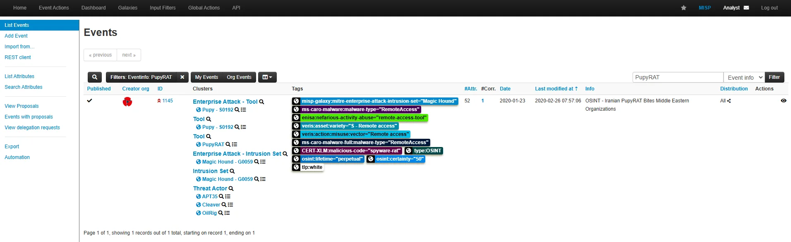
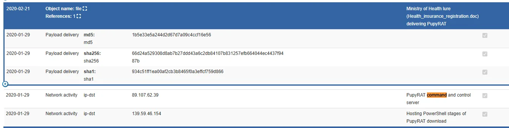
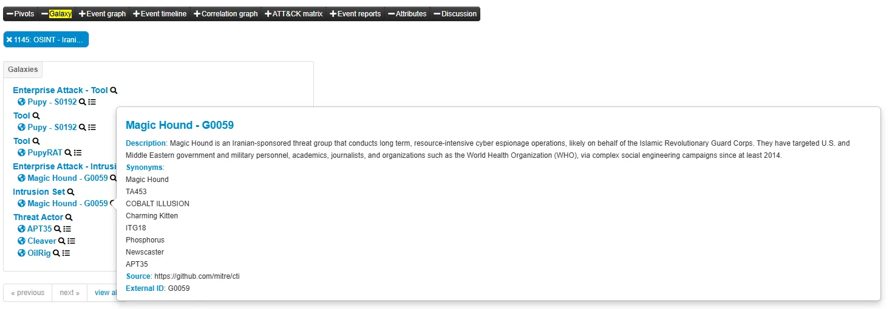
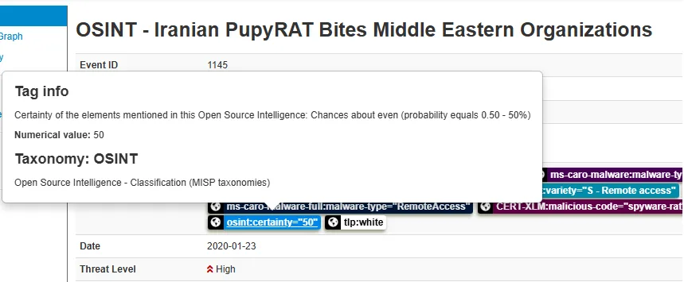

# Case Study: MISP – Malware Information Sharing Platform

## Introduction  
In this case study, I explored **MISP (Malware Information Sharing Platform)** — an open-source platform designed for collecting, storing, and sharing **cyber threat intelligence** (CTI) and **Indicators of Compromise (IOCs)**.  
The purpose of this exercise was to understand how security analysts collaborate through structured threat data sharing, correlate events, and detect potential cyber threats across organizations.  

MISP is widely used by **SOC teams, CERTs, and threat intelligence analysts** because it bridges the gap between malware analysis, incident response, and intelligence distribution.  
Throughout this lab, I worked through real-world scenarios to create, manage, and analyze MISP events while learning about taxonomies, feeds, and correlation workflows.

---

## Understanding MISP: Features & Core Concepts  

Before diving into the hands-on tasks, I reviewed how MISP structures and organizes information.  

I learned that MISP’s data revolves around **Events** — containers that hold all related indicators and context for a specific incident or threat campaign. Each event contains **Attributes** (such as IP addresses, hashes, domains, and emails) and may also use **Objects** and **Object References** to structure the data relationships.  

I found it particularly interesting that MISP supports **Sightings**, which are detections of IOCs in the wild — giving a level of credibility to shared indicators.  
Other core features include:  

- **Automatic correlation** between related indicators.  
- **Sharing and synchronization** between multiple MISP instances.  
- **Integration** with tools like NIDS, HIDS, and SIEMs.  
- **Event Graphs** for visualizing relationships.  
- **APIs** for automation and external analysis.  

The most useful concept I learned was **taxonomy and tagging**, which allow classification of data with standardized labels such as *TLP (Traffic Light Protocol)* or *confidence level*. These play a key role in structured intelligence sharing.

---

## Getting Hands-On with MISP  

Once I understood the theoretical background, I launched the attached virtual machine and logged into MISP using the provided **Analyst credentials**.  
After a short wait for initialization, I accessed the platform via the browser.  

### Exploring the Dashboard  
I began by navigating through the **Dashboard**, where I discovered that the interface is divided into logical areas:  

- **Home button**: returns to the main view.  
- **Event Actions**: where events can be created, modified, or published.  
- **Galaxies and Taxonomies**: lists of pre-defined knowledge structures and labeling systems.  
- **Global Actions**: profile, organizations, and news feed.  

This first interaction gave me a clear understanding of MISP’s workflow — it’s very structured but flexible for collaboration.

---

## Event Management Workflow  

To understand how threat data flows inside MISP, I explored the process of **event creation, population, and publishing**.

- **Creating an Event:**  
  I simulated the creation of a new event by entering details such as title, threat level, and distribution type. I learned that MISP provides **four distribution options**:
  1. Organization only  
  2. Community only  
  3. Connected communities  
  4. All communities  

  This allows organizations to control how widely their intelligence is shared.

- **Populating Events:**  
  I practiced adding attributes manually (like IP addresses or hashes) and also noticed the option to use templates for specific use cases such as phishing or ransomware incidents.  
  MISP also supports importing lists or attachments, which can later be flagged for **Intrusion Detection Systems (IDS)** signatures.

- **Publishing Events:**  
  Once an event is created, only the **organisation admin** can review and publish it to the chosen distribution channels.  
  This ensures quality control and prevents unverified data from being shared publicly.

---

## Feeds, Taxonomies & Tagging  

After understanding events, I focused on **Feeds and Taxonomies** — two of MISP’s most powerful classification tools.  

### Feeds  
Feeds are external data sources that provide **updated threat intelligence**.  
I learned how analysts can **preview events**, **import relevant indicators**, and **correlate attributes** automatically.  
In MISP, feed management is typically handled by the **site administrator**.  

### Taxonomies  
Taxonomies are structured systems for labeling and classifying data.  
For example, using the **TLP (Traffic Light Protocol)** taxonomy, I can tag events as *TLP:RED*, *TLP:AMBER*, etc., depending on how confidential they are.  
They also support *confidence levels*, *source types*, and *threat categories*.

### Tagging  
Tags are simpler identifiers that can be applied at the **event level** or **attribute level**.  
I learned that it’s best practice to use tags primarily at the event level and limit the number of tags to key elements like:
- **TLP level**
- **Confidence**
- **Origin**
- **PAP (Permissible Actions Protocol)**  

This tagging system ensures that intelligence shared across organizations remains organized, contextual, and trustworthy.

---

## Scenario: Investigating a PupyRAT Event  

Once I was comfortable with navigation and data classification, I moved on to a practical investigation involving a **real-world scenario**.  

The challenge involved a **PupyRAT infection** (a Remote Access Trojan known for stealthy command-and-control activity).  

1. I started by searching for **“PupyRAT”** in the global search bar.  
   MISP quickly retrieved an existing event titled “PupyRAT event.”  
   I identified its **Event ID** as **1145**.
   

2. Opening the event, I explored its **attributes** — the list contained various network and file indicators.  
   Among them, I found the **C2 (Command and Control) Server IP** listed as **89.107.62.39**.
   

3. Looking at the event’s tags, I noticed several that referenced *RemoteAccess*, indicating the **type of access** the adversary aimed to gain.  
   Thus, I concluded the event was associated with *Remote Access* into organizations.

4. Under the **Galaxy view**, I checked the related **Intrusion Set** and discovered that the campaign was linked to the **Magic Hound** group — a known threat actor.
   

5. Finally, under the taxonomy section, I spotted a tag named **osint:certainty="50"**, meaning this information had a 50% confidence level based on open-source intelligence.
 
This exercise demonstrated how **MISP allows analysts to connect threat attributes to adversary groups** and better understand attack patterns.

---

## What I Learned  

Through this lab, I gained a deep appreciation for how structured threat intelligence is shared and managed in real environments.  
Here are my main takeaways:  

- **MISP fosters collaboration** among analysts by allowing organizations to exchange verified, structured intelligence securely.  
- **Events and attributes** form the backbone of threat reporting, and **tags, taxonomies, and galaxies** enrich the data with context.  
- **Feeds automate intelligence gathering**, ensuring that analysts stay updated with current IOCs.  
- Investigating a real case (like PupyRAT) showed me how MISP can connect technical indicators (IPs, hashes) to higher-level intelligence (threat actors, campaigns, or confidence ratings).  
- The **publishing process** ensures data credibility, with strict role-based control for what gets shared externally.

---

## Conclusion  

This room provided an excellent hands-on introduction to **MISP** and its critical role in **Cyber Threat Intelligence (CTI)** operations.  
By the end of the session, I was comfortable navigating the platform, creating and managing events, applying taxonomy-based tagging, and analyzing real-world threats like **PupyRAT**.  

Overall, I learned how MISP acts as the bridge between incident detection and intelligence sharing — a vital skill for any **SOC Analyst or Threat Researcher**.

---

