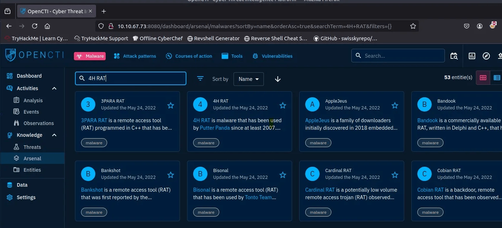
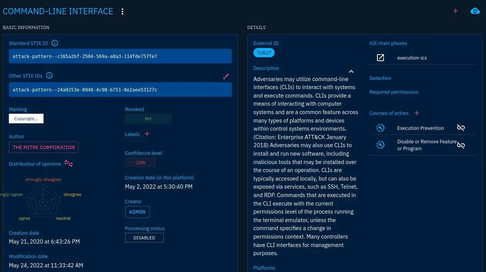
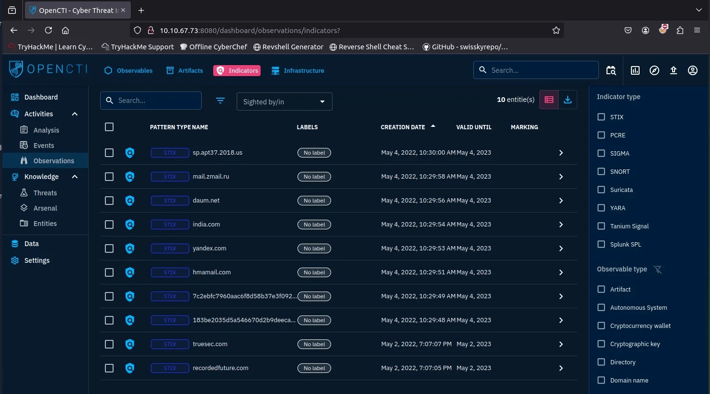
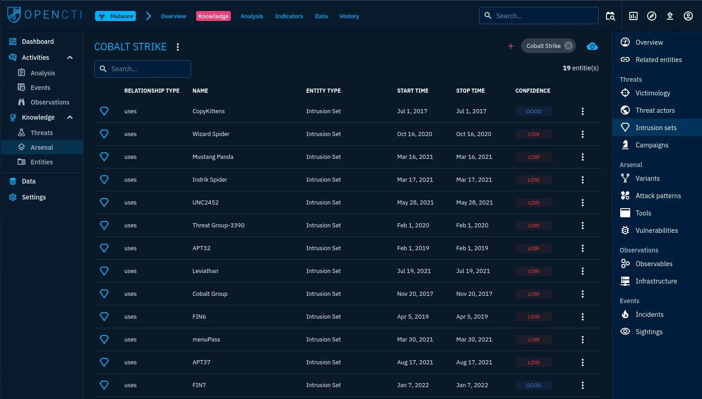
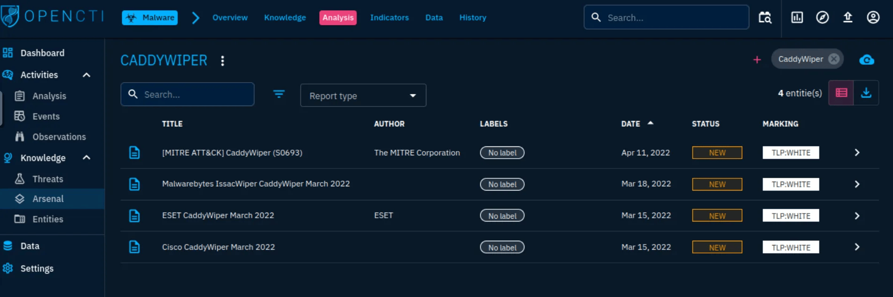
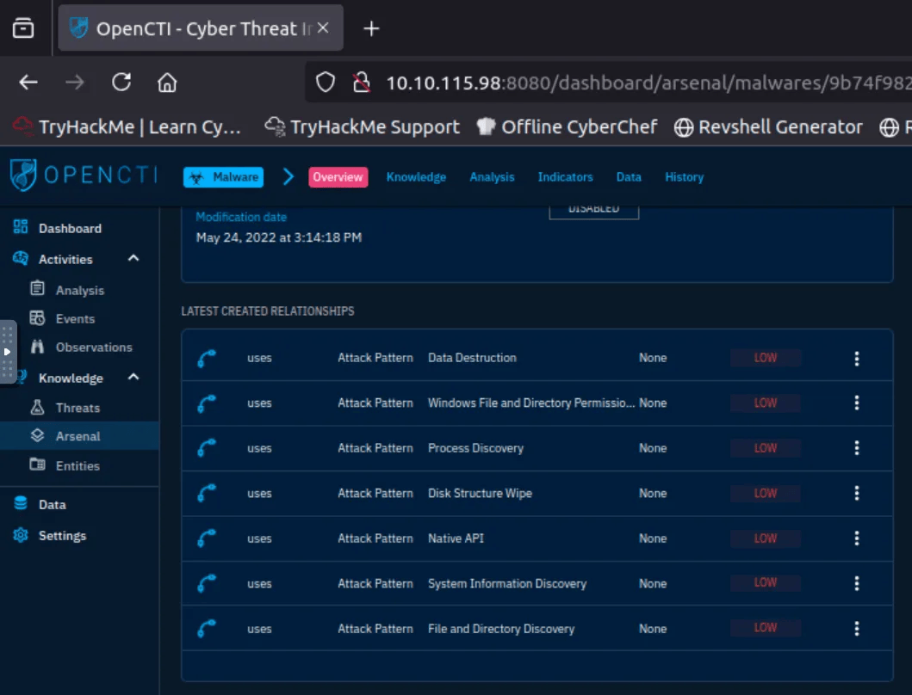
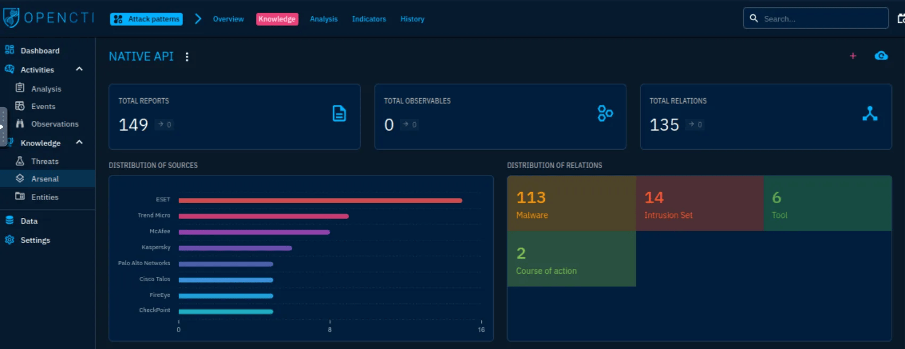
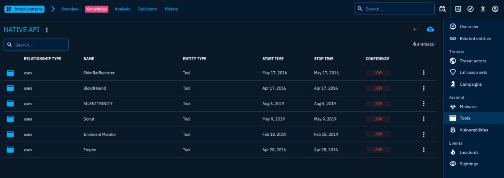
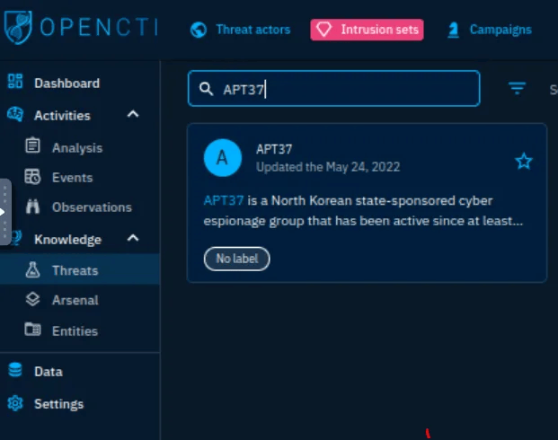
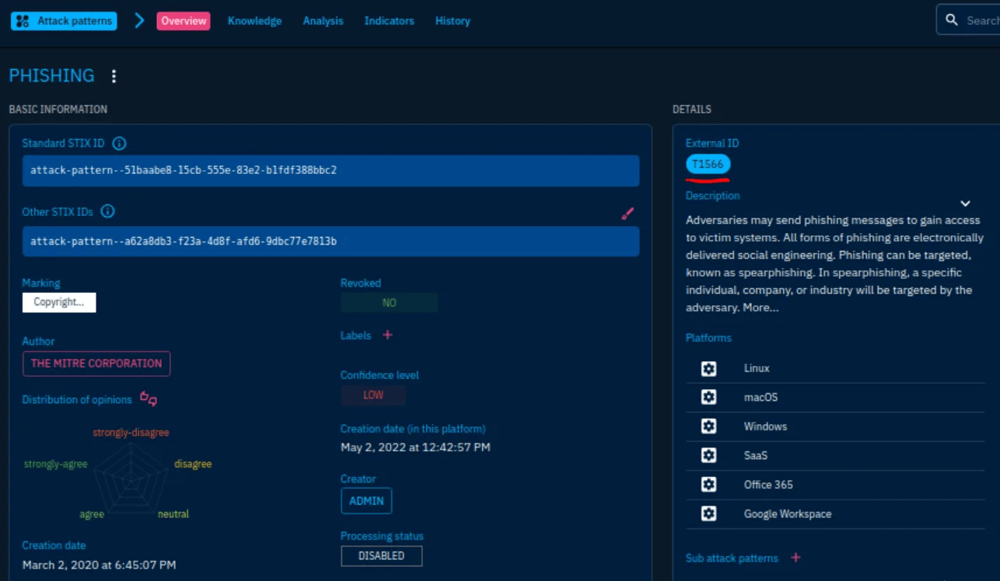

# Étude de Cas : OpenCTI

## Introduction

Après avoir terminé plusieurs rooms sur le renseignement sur les menaces et les workflows SOC, j’ai exploré **OpenCTI**, une plateforme open-source conçue pour centraliser, corréler et analyser le **CTI (Cyber Threat Intelligence)**.  

Cette room m’a permis d’apprendre à naviguer et analyser des données réelles dans OpenCTI — en me concentrant particulièrement sur le mappage des malwares, campagnes et groupes APT aux techniques et indicateurs en utilisant des frameworks comme **MITRE ATT&CK**.

---

## Tâche 1 : Présentation de la Room

J’ai appris qu’OpenCTI permet aux organisations de **stocker, analyser et visualiser le renseignement sur les menaces**.  

Aucune réponse n’était nécessaire ici, mais cela m’a donné les bases pour ce sur quoi je travaillerais.

---

## Tâche 2 : Introduction à OpenCTI

OpenCTI a été développé par **l’Agence Nationale de la Sécurité des Systèmes d’Information (ANSSI)**. J’ai appris qu’il :
- Intègre plusieurs outils pour connecter les données techniques et non techniques.  
- Suit le **framework MITRE ATT&CK** pour structurer les données.  
- Se connecte à **MISP** (flux de menaces) et **TheHive** (gestion de cas).  
- Aide les analystes à visualiser et relier l’intelligence depuis les campagnes jusqu’aux observables.

Aucune réponse n’était nécessaire pour cette section.

---

## Tâche 3 : Comprendre le Modèle de Données OpenCTI

OpenCTI utilise le **standard STIX2** pour structurer les entités et leurs relations, ce qui facilite le suivi des renseignements.  

Composants clés explorés :
- **GraphQL API :** point d’accès principal pour les requêtes.  
- **Write Workers :** gèrent les écritures de données asynchrones.  
- **Connecteurs :** importent, enrichissent et exportent des données depuis des systèmes externes comme CVE, MISP et TheHive.

J’ai compris la modularité du système et comment il supporte l’intégration de sources externes pour un renseignement enrichi.

Aucune réponse n’était nécessaire ici.

---

## Tâche 4 : Exploration du Tableau de Bord OpenCTI

J’ai lancé l’instance OpenCTI avec les identifiants fournis :

**Nom d’utilisateur :** info@tryhack.io  
**Mot de passe :** TryHackMe1234

Le tableau de bord affiche :
- Le nombre d’entités, relations, rapports et observables.  
- Les changements d’activité sur 24 heures.

J’ai exploré les sections principales :

- **Activities :** incidents et rapports pour le triage.  
- **Knowledge :** cartographie des adversaires, outils, campagnes.  
- **Analysis :** liste des rapports et connexion des entités liées.  
- **Observations :** IOCs et données techniques.  
- **Threats :** acteurs de menace, intrusion sets, campagnes.  
- **Arsenal :** malwares, outils, vulnérabilités et patterns d’attaque.  
- **Entities :** organisations, personnes et secteurs ciblés.

### Mes Investigations

**Q1 :** *Groupe utilisant le malware 4H RAT*  
- Knowledge → Arsenal → Malware → Rechercher “4H RAT”  
- **Réponse :** `Putter Panda`  

**Q2 :** *Phase de kill-chain liée au pattern d’attaque Command-Line Interface*  
- Arsenal → Attack Patterns → Rechercher “Command-Line Interface”  
- **Réponse :** `execution-ics`  

**Q3 :** *Onglet contenant les indicateurs*  
- Activities → Observations → Indicators  
- **Réponse :** `Observations`  

---

## Tâche 5 : Navigation dans les Onglets Généraux

Chaque page d’entité a six onglets principaux :

1. **Overview :** informations de base, rapports, niveau de confiance.  
2. **Knowledge :** relations avec indicateurs, campagnes, menaces.  
3. **Analysis :** liste les rapports mentionnant l’entité.  
4. **Indicators :** affiche les IOCs.  
5. **Data :** fichiers de support.  
6. **History :** suivi des modifications.

### Résultats

**Q1 :** *Intrusion sets associés au malware Cobalt Strike avec un niveau de confiance élevé*  
- Knowledge → Arsenal → Rechercher “Cobalt Strike” → Knowledge → Intrusion Sets  
- **Réponse :** `CopyKittens, FIN7`  

**Q2 :** *Auteur de l’entité*  
- Onglet Overview : **The MITRE Corporation**  
- **Réponse :** `The MITRE Corporation`

---

## Tâche 6 : Scénario d’Investigation

Investigation sur le malware **CaddyWiper** et le groupe APT **APT37**.

### CaddyWiper

**Q1 :** *Date la plus ancienne enregistrée*  
- Knowledge → Arsenal → Rechercher “CaddyWiper” → Analysis  
- **Réponse :** `2022/03/15`  

**Q2 :** *Technique d’attaque pour l’exécution*  
- Overview → Attack Patterns  
- **Réponse :** `Native API`  

**Q3 :** *Nombre de relations malware liées à cette technique d’attaque*  
- Native API → Knowledge → Relations Malware  
- **Réponse :** `113`  

**Q4 :** *Outils utilisés par la technique d’attaque en 2016*  
- Native API → Tools → Filtrer par 2016  
- **Réponse :** `BloodHound, Empire, ShimRatReporter`  

### APT37

**Q5 :** *Pays associé à APT37*  
- Threats → Intrusion Sets → Rechercher “APT37”  
- **Réponse :** `North Korea`  

**Q6 :** *Techniques d’attaque pour l’accès initial*  
- APT37 → Attack Patterns → Initial Access  
- **Réponse :** `T1189, T1566`  

---

## Tâche 7 : Conclusion

En complétant cette room, j’ai appris à :

- Explorer et relier **entités, campagnes, malwares et indicateurs**.  
- Interpréter les relations et les phases de kill-chain avec **MITRE ATT&CK**.  
- Utiliser les sections **Arsenal, Knowledge et Threats** pour la recherche.  
- Effectuer des investigations liant malwares et APT via les TTP partagés.

OpenCTI est un outil puissant pour les analystes SOC, intégrant un renseignement structuré avec des insights exploitables pour des investigations réelles.
