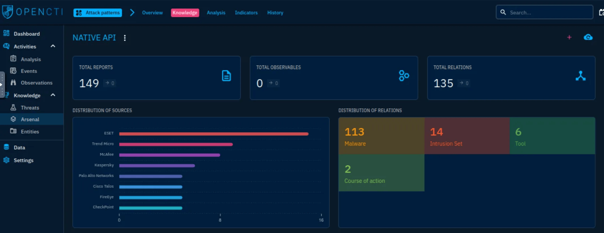

# Case Study: OpenCTI

## Introduction

After completing several rooms about threat intelligence and SOC workflows, I explored **OpenCTI**, an open-source platform designed to centralize, correlate, and analyze CTI (Cyber Threat Intelligence).  

This room helped me learn how to navigate and analyze real-world data in OpenCTI — especially focusing on mapping malware, campaigns, and APT groups to techniques and indicators using frameworks like MITRE ATT&CK.

---

## Task 1: Room Overview

I learned that OpenCTI allows organizations to **store, analyze, and visualize threat intelligence**.  

No answer was needed here, but it gave me a foundation for what I’d be working with.

---

## Task 2: Introduction to OpenCTI

OpenCTI was developed by the **French National Cybersecurity Agency (ANSSI)**. I learned that it:
- Integrates multiple tools to connect technical and non-technical data.
- Follows the **MITRE ATT&CK framework** for structuring data.
- Connects with **MISP** (threat feeds) and **TheHive** (case management).
- Helps analysts visualize and connect intelligence from campaigns to observables.

No answer was needed for this section.

---

## Task 3: Understanding the OpenCTI Data Model

OpenCTI uses the **STIX2 standard** to structure entities and relationships, making it easier to trace intelligence.  

Key architecture components I explored:
- **GraphQL API:** Main access point for queries.
- **Write Workers:** Handle asynchronous data writes.
- **Connectors:** Import, enrich, and export data from external systems like CVE, MISP, and TheHive.

I learned how modular the system is and how it supports integration with external sources for enriched threat intelligence.

No answer was needed here.

---

## Task 4: OpenCTI Dashboard Exploration

I launched the OpenCTI instance using the provided credentials:

**Username:** info@tryhack.io  
**Password:** TryHackMe1234

The dashboard displays:
- Number of entities, relationships, reports, and observables.
- 24-hour changes in activity.

I explored the main sections:

- **Activities:** Incidents and reports for triage.
- **Knowledge:** Maps adversaries, tools, campaigns.
- **Analysis:** Lists reports and connects related entities.
- **Observations:** Houses IOCs and technical data.
- **Threats:** Shows threat actors, intrusion sets, and campaigns.
- **Arsenal:** Malware, tools, vulnerabilities, and attack patterns.
- **Entities:** Organizations, people, and sectors under attack.

### My Investigations

**Q1:** *Group using 4H RAT malware*  
- Knowledge → Arsenal → Malware → Search “4H RAT”  
- **Answer:** `Putter Panda`

**Q2:** *Kill-chain phase linked with Command-Line Interface Attack Pattern*  
- Arsenal → Attack Patterns → Search “Command-Line Interface”  
- **Answer:** `execution-ics`

**Q3:** *Tab housing Indicators*  
- Activities → Observations → Indicators  
- **Answer:** `Observations`

---

## Task 5: Navigating General Tabs

Each entity page has six main tabs:

1. **Overview:** Basic info, reports, and confidence level.  
2. **Knowledge:** Relationships to indicators, campaigns, threats.  
3. **Analysis:** Lists reports mentioning the entity.  
4. **Indicators:** Displays IOCs.  
5. **Data:** Stores supporting files.  
6. **History:** Tracks modifications.

### Findings

**Q1:** *Intrusion sets associated with Cobalt Strike malware with Good confidence level*  
- Knowledge → Arsenal → Search “Cobalt Strike” → Knowledge → Intrusion Sets  
- **Answer:** `CopyKittens, FIN7`

**Q2:** *Author of the entity*  
- Overview tab shows **The MITRE Corporation**  
- **Answer:** `The MITRE Corporation`

---

## Task 6: Investigative Scenario

Investigating **CaddyWiper** malware and **APT37** threat group.

### CaddyWiper

**Q1:** *Earliest date recorded*  
- Knowledge → Arsenal → Search “CaddyWiper” → Analysis  
- **Answer:** `2022/03/15`

**Q2:** *Attack technique for execution*  
- Overview → Attack Patterns  
- **Answer:** `Native API`

**Q3:** *Number of malware relations linked to this attack technique*  
- Native API → Knowledge → Malware relations  
- **Answer:** `113`

**Q4:** *Tools used by the Attack Technique in 2016*  
- Native API → Tools → Filter by 2016  
- **Answer:** `BloodHound, Empire, ShimRatReporter`

### APT37

**Q5:** *Country associated with APT37*  
- Threats → Intrusion Sets → Search “APT37”  
- **Answer:** `North Korea`

**Q6:** *Attack techniques for initial access*  
- APT37 → Attack Patterns → Initial Access  
- **Answer:** `T1189, T1566`

---

## Task 7: Conclusion

By completing this room, I learned how to:

- Explore and connect **entities, campaigns, malware, and indicators**.  
- Interpret relationships and kill-chain phases using **MITRE ATT&CK**.  
- Use **Arsenal, Knowledge, and Threats** sections for research.  
- Perform investigations linking malware and APTs through shared TTPs.

OpenCTI is a powerful tool for SOC analysts, integrating structured threat intelligence with actionable insights for real-world investigations.

---
