# Étude de Cas : Détection de Malware avec YARA, Loki et Valhalla

Après avoir réalisé plusieurs exercices de détection de malware, j’ai exploré **YARA** — un outil puissant basé sur des règles qui permet aux analystes d’identifier et de classifier des malwares selon des motifs textuels ou binaires.  
Dans cette étude de cas, j’ai appris à créer et utiliser des règles YARA, les intégrer à **Loki** pour un scan en temps réel, et analyser les détections via **Valhalla** et **VirusTotal**, afin de comprendre comment ces outils fonctionnent ensemble dans un workflow SOC réel.

---

## Introduction et Préparation

J’ai commencé par déployer l’environnement TryHackMe et vérifier que la machine fonctionnait correctement. Une fois active, je me suis connecté via l’interface web et exploré la structure des fichiers pour localiser les échantillons suspects et les outils fournis.

J’ai appris que YARA peut identifier des motifs hexadécimaux (`hex`), du texte brut et des expressions régulières.  
Par exemple, les phrases `"Enter your Name"` dans le code d’une application sont reconnues comme des **chaînes de caractères**, détectables lors des scans.

**Réponses :**  
- Système base-16 : `hex`  
- Chaîne “Enter your Name” : `Yay`

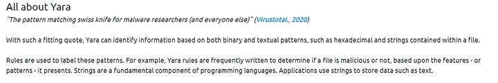
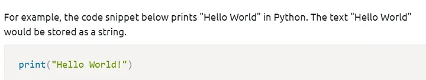

---

## Premiers Pas avec les Règles YARA

Pour m’entraîner, j’ai créé une petite règle de test.  
J’ai d’abord créé un fichier `somefile`, puis un autre fichier `myfirstrule.yar` :

bash
touch somefile
nano myfirstrule.yar 

Dans le fichier YARA, j’ai écrit la règle minimale suivante :

rule myfirstrule {
    condition: true
}

Cette règle simple retourne toujours true, ce qui signifie qu’elle correspond à tout — utile pour tester que YARA fonctionne correctement.
Après sauvegarde, j’ai exécuté YARA sur un fichier test pour vérifier son chargement.
Cela m’a permis de comprendre la structure des règles YARA : chaque règle contient un nom, une section de chaînes, des métadonnées et des conditions.

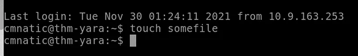 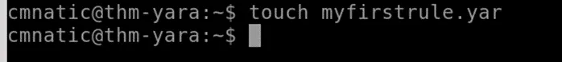

---

## Compréhension et Extension des Règles YARA

Une fois les bases assimilées, j’ai appris à inclure plusieurs chaînes et conditions dans les règles.
Par exemple, YARA peut scanner des fragments de texte, des URLs, des mots-clés ou des payloads encodés, ce qui le rend très flexible pour identifier des malwares.

J’ai également découvert que les modules YARA permettent d’analyser des types de fichiers spécifiques (PE, ELF), en extrayant leurs propriétés internes. Ces modules renforcent considérablement la puissance des règles de détection.

---

## Utilisation de YARA avec Loki

Ensuite, je suis passé à la phase pratique avec Loki, qui utilise les règles YARA pour scanner des fichiers.

cd /suspicious-files/file1/
python ../../tools/Loki/loki.py -p .

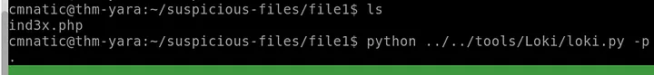

Les résultats du scan sont apparus dans le terminal, et Loki a détecté le fichier comme suspect.

Réponse : Suspect

À partir de la sortie, j’ai remarqué que la règle YARA qui avait été déclenchée était :

Réponse : webshell_metaslsoft

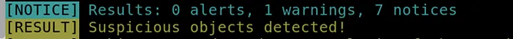 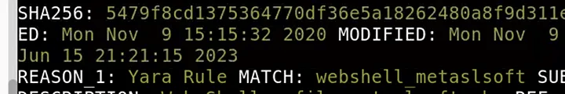

Loki a également classé le fichier comme un Web Shell, confirmant qu’il correspondait au comportement de portes dérobées pour administration à distance souvent utilisées par les attaquants.

Réponse : Web Shell

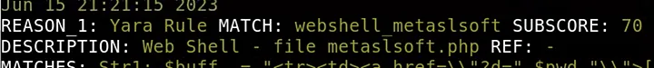

La règle s’est déclenchée sur une chaîne spécifique nommée :

Réponse : Str1

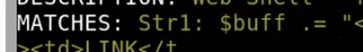

Après avoir examiné plus en détail, j’ai appris que ce Web Shell était identifié comme :

Réponse : b374k 2.2

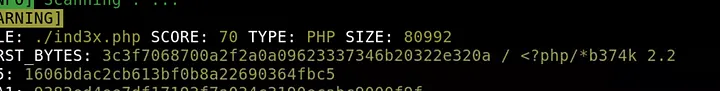

Pour confirmer les détails de la règle, j’ai ouvert le fichier YARA responsable de la détection et j’ai constaté qu’il ne contenait qu’une seule condition sur une chaîne, démontrant que même des motifs minimaux peuvent être puissants lorsqu’ils sont correctement choisis.

Réponse : 1

---

## Analyse du deuxième fichier suspect

Ensuite, je me suis rendu dans le deuxième dossier :

cd /suspicious-files/file2/
python ../../tools/Loki/loki.py -p .

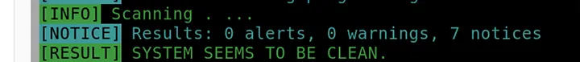

Cette fois, Loki a classé le fichier comme bénin, ce qui signifie qu’aucune règle YARA existante n’a été déclenchée.
Pour approfondir l’analyse, j’ai ouvert le fichier manuellement :

nano 1ndex.php

À l’intérieur, j’ai trouvé des informations sur la version faisant référence à b374k 3.2.3, indiquant qu’il s’agissait d’une variante plus récente du Web Shell précédent.

Réponse : b374k 3.2.3

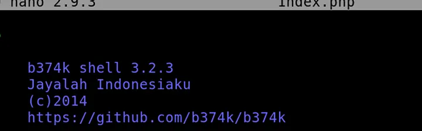

---

## Génération d’une règle YARA personnalisée avec yarGen

Pour améliorer la couverture de détection, j’ai décidé de générer une règle personnalisée à l’aide de **yarGen**.  
J’ai exécuté l’outil sur **file2** pour extraire automatiquement les chaînes et caractéristiques uniques.

Après la génération, j’ai testé la règle manuellement avec :

yara file2.yar file2/1ndex.php

Answer: yara file2.yar file2/1ndex.php

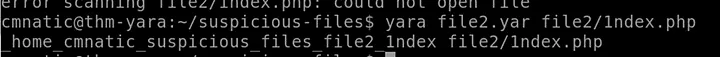

Yara a correctement identifié le fichier — Réponse : Yay
J’ai ensuite déplacé la règle dans le répertoire de signatures de Loki pour l’inclure dans les scans futurs.

Lorsque j’ai relancé Loki, il a détecté le fichier comme malveillant grâce à la nouvelle règle.

Réponse : Yay

À partir de la sortie, le nom de la variable de la chaîne correspondante était :

Réponse : Zepto

En ouvrant le fichier de règle généré avec nano, j’ai compté toutes les chaînes et il y en avait 20 au total.

Réponse : 20

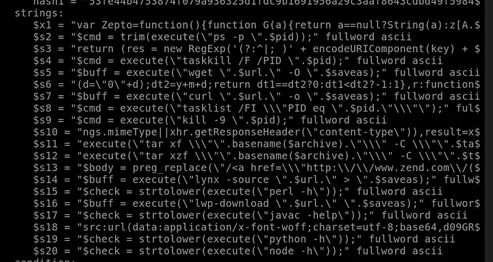

De plus, la règle comportait une condition sur la taille du fichier indiquant que celui-ci devait être inférieur à :

Réponse : 700KB

Cela a du sens, car les règles Yara incluent souvent une limite de taille pour optimiser les performances de scan.

---

## Corrélation des résultats avec Valhalla et VirusTotal

Pour vérifier mes résultats, j’ai pris les hash SHA256 des deux échantillons et je les ai téléversés sur Valhalla, une plateforme de renseignement sur les menaces qui associe les règles Yara aux campagnes connues.

Hash de file1 : 5479f8cd1375364770df36e5a18262480a8f9d311e8eedb2c2390ecb233852ad

Hash de file2 : 53fe44b4753874f079a936325d1fdc9b1691956a29c3aaf8643cdbd49f5984bf

Le premier fichier a été attribué à un groupe APT.
Réponse : Yay

Pour le deuxième fichier, Valhalla a affiché la première règle correspondante :

Réponse : Webshell_b374k_rule1

J’ai ensuite examiné son enregistrement sur VirusTotal, qui indiquait que le THOR APT Scanner avait été le premier à détecter la correspondance Yara.

Réponse : THOR APT Scanner

Tous les moteurs antivirus n’ont pas signalé le fichier comme malveillant —
Réponse : Nay

En vérifiant l’onglet « Détails », j’ai remarqué une autre extension de fichier associée au même échantillon :

Réponse : EXE

À partir du contenu de la règle, j’ai appris que ce Web Shell utilisait également la bibliothèque Zepto.js, confirmant ce que ma règle générée avait déjà détecté.

Enfin, j’ai vérifié si cette règle Yara spécifique existait dans l’ensemble de signatures par défaut de Loki en utilisant :

ls /home/cmnatic/tools/Loki/signature-base/yara/ | grep "Webshell_b374k_rule1"

Aucun résultat n’est apparu, confirmant qu’elle ne faisait pas partie du jeu de règles par défaut.
Réponse : Nay

---

## Leçons apprises et réflexions

Cette étude de cas m’a permis de comprendre en profondeur comment les règles Yara peuvent être écrites, personnalisées et appliquées dans des opérations SOC réelles.

J’ai appris à :

Écrire et tester mes propres règles Yara avec des conditions de base.
Intégrer Yara avec Loki pour un scan automatique des fichiers.
Utiliser yarGen pour créer de nouvelles signatures Yara à partir de logiciels malveillants inconnus.
Vérifier les détections via Valhalla et VirusTotal.
Comprendre comment les changements de version ou l’obfuscation dans les malwares peuvent contourner des règles statiques.
Analyser des schémas de détection réels comme Zepto.js et les comportements de Web Shells.

Ce que j’ai le plus apprécié dans cet exercice, c’est la façon dont il connecte plusieurs étapes de détection :

de la création de la règle, à l’intégration des outils, jusqu’à la validation via le renseignement sur les menaces — simulant un véritable workflow d’analyste SOC ou de chercheur en malware.
