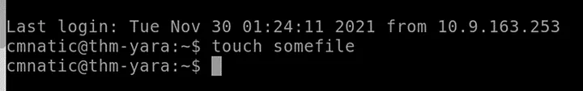

# Case Study: Yara and Malware Detection with Loki & Valhalla

After completing several malware detection exercises, I wanted to explore **Yara** — a powerful rule-based tool that helps analysts identify and classify malware based on textual or binary patterns.  
In this case study, I learned to create and use Yara rules, integrate them with **Loki** for live scanning, and analyze detections through **Valhalla** and **VirusTotal** to understand how these tools work together in a real-world SOC workflow.

---

## Introduction and Learning Setup

I began by deploying the TryHackMe environment and confirming that the machine was running properly. Once it was active, I connected through the browser interface and explored the file structure to locate the suspicious samples and tools provided.

I reviewed the introduction and learned that Yara can identify hexadecimal (`hex`) patterns, plain text, and regular expressions.  
For example, phrases like `"Enter your Name"` in application code are recognized as **strings** that can be matched during scans.

**Answer:**  
- Base-16 system: `hex`  
- “Enter your Name” as string: `Yay`

---

## Getting Started with Yara Rules

To begin practicing, I created a small test rule. I first created a file called `somefile` and then another file named `myfirstrule.yar`:

touch somefile
nano myfirstrule.yar

Inside the Yara file, I wrote the following minimal rule:

rule myfirstrule {
    condition: true
}

This simple rule always returns true, which means it will match anything — useful for testing that Yara is working correctly.
After saving the file, I ran Yara against a test input to make sure it loaded successfully. This helped me understand Yara’s structure: each rule contains a name, strings section, metadata, and conditions.

 

---

## Understanding and Expanding Yara Rules

Once I got the basics working, I read through the explanation of how Yara rules can be expanded to include multiple string matches and conditions.
For example, I learned that Yara can scan for text fragments like URLs, command keywords, or encoded payloads, making it highly flexible for malware identification.

I also discovered that Yara modules let analysts analyze specific file types, such as PE files or ELF executables, by extracting internal properties. These modules make detection rules far more powerful.

---

## Using Yara with Loki

Next, I moved into the practical investigation phase using Loki, which leverages Yara rules for scanning files.
I navigated to the directory of the first suspicious file:

cd /suspicious-files/file1/
python ../../tools/Loki/loki.py -p .

The scan results appeared in the terminal, and Loki detected the file as suspicious.

Answer: Suspicious

From the output, I noticed the Yara rule it matched on was:

Answer: webshell_metaslsoft

 

Loki also classified the file as a Web Shell, confirming that it matched the behavior of remote administration backdoors often deployed by attackers.

Answer: Web Shell

The rule triggered based on a specific string named:

Answer: Str1

After examining more details, I learned that this web shell was identified as:

Answer: b374k 2.2

To confirm the rule details, I opened the Yara file responsible for detection and saw that it contained only one string condition, demonstrating that even minimal patterns can be powerful when chosen correctly.

Answer: 1

---

## Scanning the Second Suspicious File

I then navigated to the second folder:

cd /suspicious-files/file2/
python ../../tools/Loki/loki.py -p .

This time, Loki classified the file as Benign, meaning no existing Yara rule matched.
To dig deeper, I opened the file manually:

nano 1ndex.php

Inside, I found version information referencing b374k 3.2.3, indicating that this was a newer variant of the previous web shell.

Answer: b374k 3.2.3

---

## Generating a Custom Yara Rule with yarGen

To improve detection coverage, I decided to generate a custom rule using yarGen.
I ran the tool against file2 to automatically extract unique strings and characteristics.

After generation, I tested the rule manually using:

yara file2.yar file2/1ndex.php

Answer: yara file2.yar file2/1ndex.php

Yara successfully flagged the file — Answer: Yay
I then moved the rule into Loki’s signature directory to include it in future scans.

When I ran Loki again, it detected the file as malicious based on the new rule.

Answer: Yay

From the output, the variable name of the matched string was:

Answer: Zepto

Upon opening the generated rule file in nano, I counted all the string patterns and found there were 20 in total.

Answer: 20

Additionally, the rule had a file size condition stating that the file must be less than:

Answer: 700KB

This made sense since Yara rules often include file size limits to optimize scanning performance.

---

## Correlating Results with Valhalla and VirusTotal

To verify my findings, I took the SHA256 hashes from both samples and uploaded them to Valhalla, a threat intelligence platform that maps Yara rules to known campaigns.

File1 hash: 5479f8cd1375364770df36e5a18262480a8f9d311e8eedb2c2390ecb233852ad

File2 hash: 53fe44b4753874f079a936325d1fdc9b1691956a29c3aaf8643cdbd49f5984bf

The first file was attributed to an APT group.
Answer: Yay

For the second file, Valhalla displayed the first matching rule as:

Answer: Webshell_b374k_rule1

I then examined its VirusTotal record, which showed that the THOR APT scanner was the first to detect the Yara match.

Answer: THOR APT Scanner

Not all antivirus engines flagged the file as malicious —
Answer: Nay

When I checked the “Details” tab, I noticed another file extension associated with the same sample:

Answer: EXE

From the rule content, I learned that this web shell also used the Zepto JavaScript library, confirming what my generated rule had already detected.

Finally, I verified whether this specific Yara rule existed in Loki’s default signature set using:

ls /home/cmnatic/tools/Loki/signature-base/yara/ | grep "Webshell_b374k_rule1"

No results appeared, confirming it was not part of the default Loki ruleset.

Answer: Nay

---

## Lessons Learned and Reflections

This case study gave me a deep understanding of how Yara rules can be written, customized, and applied in real SOC operations.

I learned how to:

Write and test my own Yara rules using basic conditions.
Integrate Yara with Loki for automated file scanning.
Use yarGen to create new Yara signatures from unknown malware.
Verify detections through Valhalla and VirusTotal.
Understand how version changes or obfuscation in malware can bypass static rules.
Analyze real detection patterns like Zepto.js and web shell behaviors.

What I liked most about this exercise was how it connected multiple stages of detection:

from rule creation, to tool integration, to threat intelligence validation — simulating a real workflow of a SOC analyst or malware researcher.
By the end, I felt confident that I could write and adapt Yara rules for my own investigations and contribute to shared rule repositories effectively.
