# 📝 Case Study: Secret Recipe (DFIR)

## 🔹 Overview
In this case study, I performed **forensics on a Windows workstation** to investigate insider activity and uncover sensitive information.  
The goal was to reconstruct user behavior, identify suspicious accounts, track network and file activity, and locate sensitive files (e.g., the secret coffee recipe).  

**Skills demonstrated:**
- Registry forensics with **Registry Explorer**
- User account and system metadata analysis
- NTUSER.DAT exploration for recent documents and commands
- Network activity analysis (VPN, DHCP)
- Reconstruction of user behavior on Windows

---

## 🔍 Key Activities & Highlights

### 1. Identify Computer Name
- Opened **Registry Explorer** and loaded the **SYSTEM hive**  
- Navigated to `ControlSet001\Control\ComputerName\ComputerName`  
- **Finding:** Retrieved the **computer name** of the machine

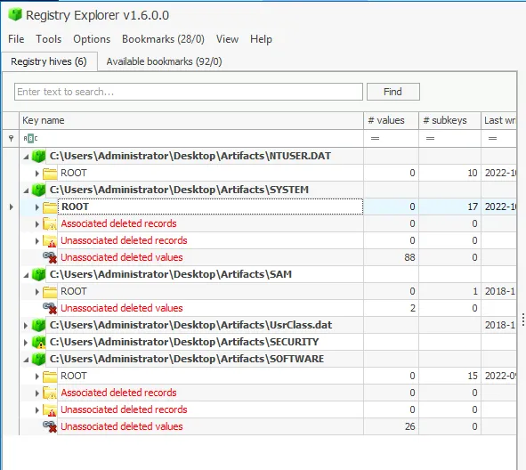
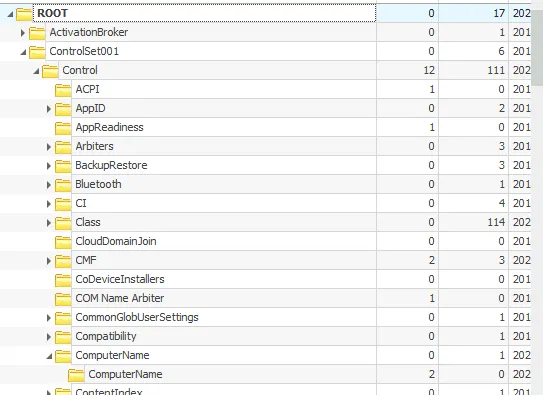

---

### 2. Administrator Account Creation
- Loaded **SAM hive** in Registry Explorer  
- Navigated to `SAM\Domains\Account\Users\Names\Administrator`  
- **Finding:** **Administrator account creation date** identified

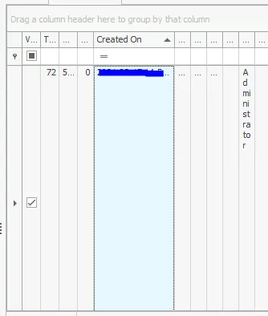

### 3. Administrator RID
- In the same location, expanded the columns to see **RID (Relative Identifier)**  
- **Finding:** RID associated with Administrator retrieved

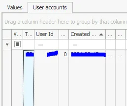

---

### 4. User Accounts & Suspicious Account
- Expanded `SAM\Domains\Account\Users\Names`  
- Counted all **user accounts** on the machine  
- Located suspicious backdoor account with **RID 1013**  
- **Finding:** Account name of backdoor user retrieved

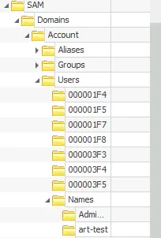

---

### 5. VPN Connections
- Loaded **SOFTWARE hive**  
- Navigated to `Microsoft\Windows\NetworkList\KnownNetworks`  
- Examined **Known Networks tab** to find VPN connections  
- **Finding:** Name of VPN the host connected to

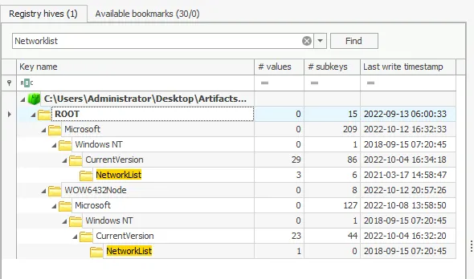

### 6. First VPN Connection Timestamp
- Expanded **First Connect LOCAL column** in Known Networks  
- **Finding:** First VPN connection timestamp (YYYY-MM-DD HH:MM:SS)

---

### 7. Shared Folders
- SYSTEM hive → `LanmanServer\Shares`  
- Identified all shared folders on the machine  
- **Finding:** Path of the **third shared folder**

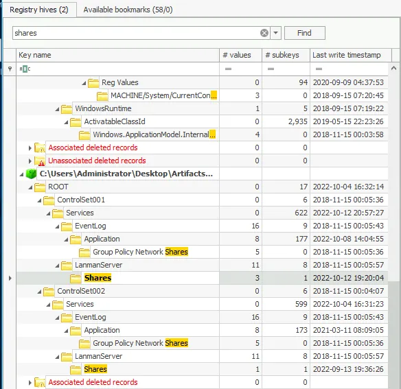
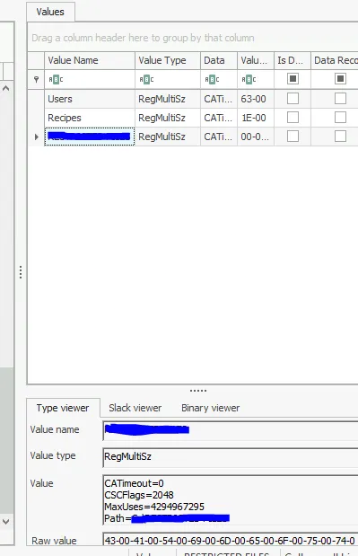

---

### 8. Last DHCP IP
- SYSTEM hive → `Tcpip\Parameters\Interfaces`  
- Reviewed DHCP information in the interface entries  
- **Finding:** Last DHCP IP assigned to the host

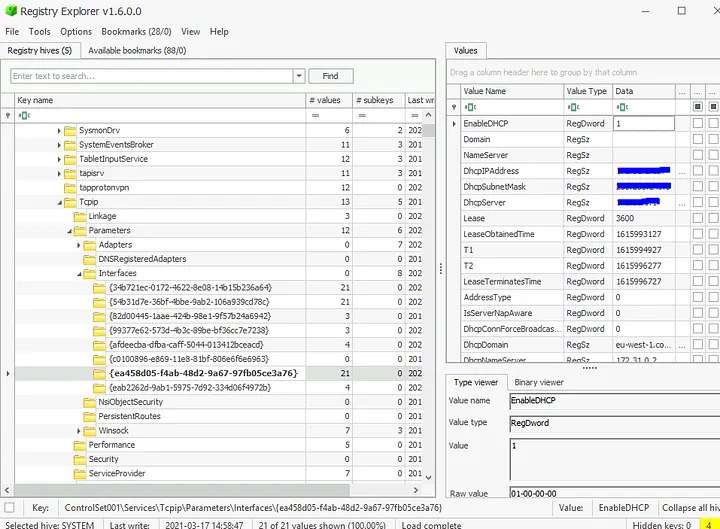

---

### 9. Secret Recipe File Access
- Loaded **NTUSER.DAT hive**  
- Navigated to `Software\Microsoft\Windows\CurrentVersion\Explorer\RecentDocs`  
- Checked `.pdf` entries for recently opened files  
- **Finding:** Name of the secret coffee recipe file

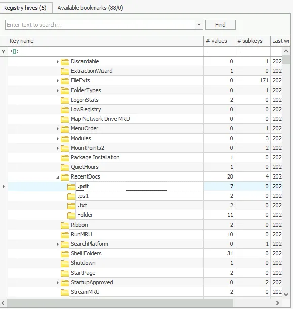

---

### 10. Commands & File Transfer Tool
- NTUSER.DAT → Explorer → WordWheelQuery  
- Inspected search and run commands executed by user  
- **Findings:**  
  - Network enumeration command  
  - File transfer tool searched  
  - Recent text file accessed

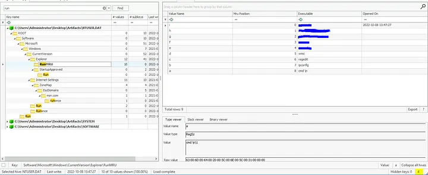

---

### 11. UserAssist Program Execution
- NTUSER.DAT → `Software\Microsoft\Windows\CurrentVersion\Explorer\UserAssist`  
- Expanded UserAssist keys to count program executions  
- **Findings:**  
  - Powershell execution count  
  - Network monitoring tool executed  
  - ProtonVPN focus time (minutes converted to seconds)  
  - Full path of `everything.exe`

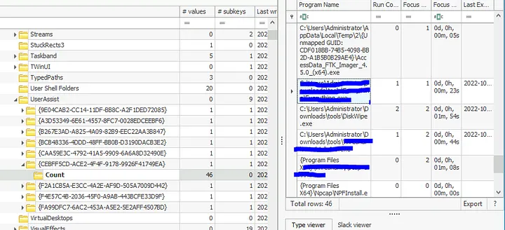

---

## ✅ Conclusion
- Verified computer name and administrator account metadata  
- Identified all user accounts and detected a suspicious backdoor (RID 1013)  
- Determined VPN connections, first connect timestamp, shared folders, and last DHCP IP  
- Tracked user activity via RecentDocs and WordWheelQuery in NTUSER.DAT  
- Monitored executed programs and focus times via UserAssist  
- Located secret coffee recipe file and reconstructed user behavior  

**Lessons learned:**
- Registry hives (SYSTEM, SAM, SOFTWARE, NTUSER) are critical for Windows forensic analysis  
- Correlating multiple sources gives a complete picture of user activity  
- Monitoring suspicious accounts, VPN activity, and executed commands is key in DFIR  
- NTUSER.DAT provides insight into both file access and user interaction

---

## 🔗 Navigation
- Back to [DFIR Home](../DFIR/README.md)

