# 📝 Étude de cas : Secret Recipe (DFIR)

## 🔹 Aperçu
Dans cette étude de cas, j’ai réalisé une **analyse forensique sur un poste Windows** pour enquêter sur une activité interne et découvrir des informations sensibles.  
L’objectif était de reconstruire le comportement des utilisateurs, identifier les comptes suspects, suivre l’activité réseau et fichier, et localiser les fichiers sensibles (par ex. la recette secrète de café).  

**Compétences démontrées :**
- Analyse du registre avec **Registry Explorer**  
- Analyse des comptes utilisateurs et des métadonnées système  
- Exploration de **NTUSER.DAT** pour les documents récents et commandes exécutées  
- Analyse de l’activité réseau (VPN, DHCP)  
- Reconstruction du comportement utilisateur sous Windows  

---

## 🔍 Activités clés & points forts

### 1. Identifier le nom de l’ordinateur
- Ouvert **Registry Explorer** et chargé la **ruche SYSTEM**  
- Navigué vers `ControlSet001\Control\ComputerName\ComputerName`  
- **Résultat :** récupération du **nom de l’ordinateur**

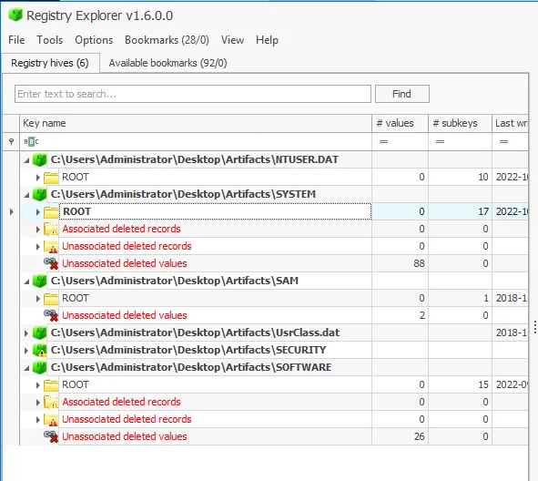
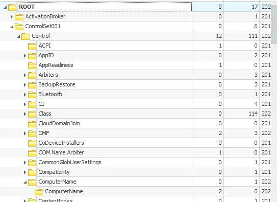

---

### 2. Création du compte Administrateur
- Chargé la **ruche SAM** dans Registry Explorer  
- Navigué vers `SAM\Domains\Account\Users\Names\Administrator`  
- **Résultat :** date de création du compte **Administrator**

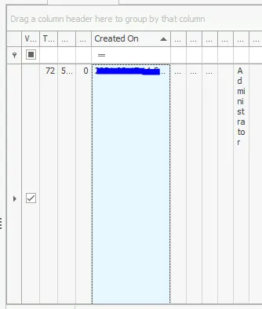

### 3. RID Administrateur
- Même emplacement, colonnes étendues pour voir **RID (Relative Identifier)**  
- **Résultat :** RID associé à Administrator récupéré

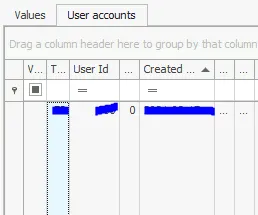

---

### 4. Comptes utilisateurs & compte suspect
- Étendu `SAM\Domains\Account\Users\Names`  
- Compté tous les **comptes utilisateurs** sur la machine  
- Localisé un compte backdoor suspect avec **RID 1013**  
- **Résultat :** nom du compte backdoor récupéré

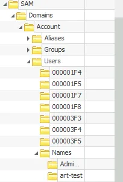

---

### 5. Connexions VPN
- Chargé la **ruche SOFTWARE**  
- Navigué vers `Microsoft\Windows\NetworkList\KnownNetworks`  
- Vérifié l’onglet **Known Networks** pour les VPN  
- **Résultat :** nom du VPN utilisé par l’hôte

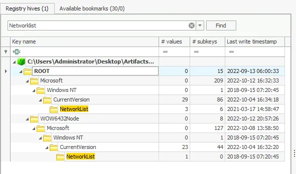

### 6. Horodatage de la première connexion VPN
- Étendu **First Connect LOCAL column** dans Known Networks  
- **Résultat :** horodatage de la première connexion VPN (AAAA-MM-JJ HH:MM:SS)

---

### 7. Dossiers partagés
- SYSTEM hive → `LanmanServer\Shares`  
- Identification de tous les dossiers partagés sur la machine  
- **Résultat :** chemin du **troisième dossier partagé**

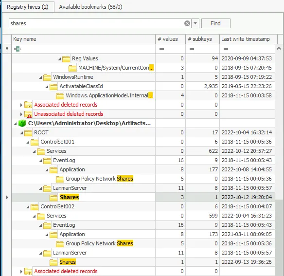
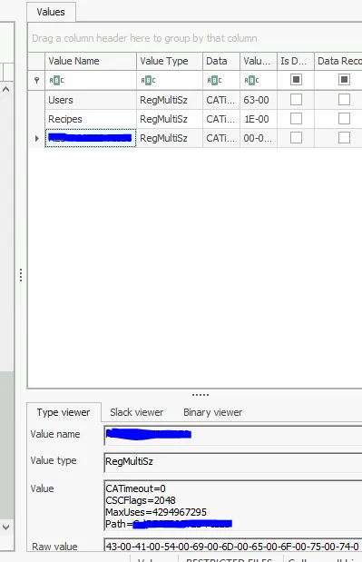

---

### 8. Dernière IP DHCP
- SYSTEM hive → `Tcpip\Parameters\Interfaces`  
- Vérification des informations DHCP dans les interfaces  
- **Résultat :** dernière IP DHCP assignée à l’hôte

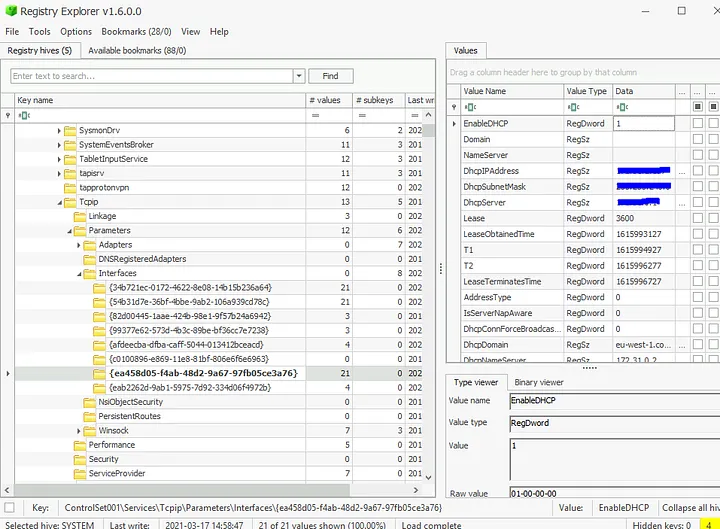

---

### 9. Accès au fichier Secret Recipe
- Chargé **NTUSER.DAT hive**  
- Navigué vers `Software\Microsoft\Windows\CurrentVersion\Explorer\RecentDocs`  
- Vérification des entrées `.pdf` pour fichiers récemment ouverts  
- **Résultat :** nom du fichier contenant la recette secrète de café

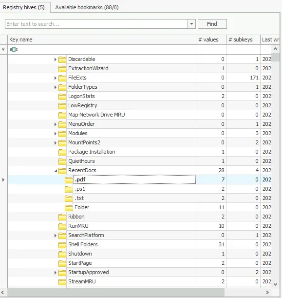

---

### 10. Commandes & outil de transfert de fichiers
- NTUSER.DAT → Explorer → WordWheelQuery  
- Inspection des commandes exécutées et recherches de l’utilisateur  
- **Résultats :**  
  - Commande d’énumération réseau  
  - Outil de transfert de fichiers recherché  
  - Fichier texte récent consulté

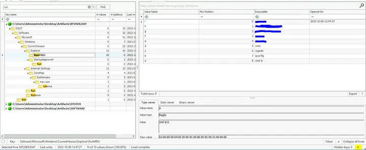

---

### 11. Exécution des programmes via UserAssist
- NTUSER.DAT → `Software\Microsoft\Windows\CurrentVersion\Explorer\UserAssist`  
- Étendu les clés UserAssist pour compter les exécutions de programmes  
- **Résultats :**  
  - Nombre d’exécutions de Powershell  
  - Outil de surveillance réseau exécuté  
  - Temps d’utilisation de ProtonVPN (minutes converties en secondes)  
  - Chemin complet de `everything.exe`

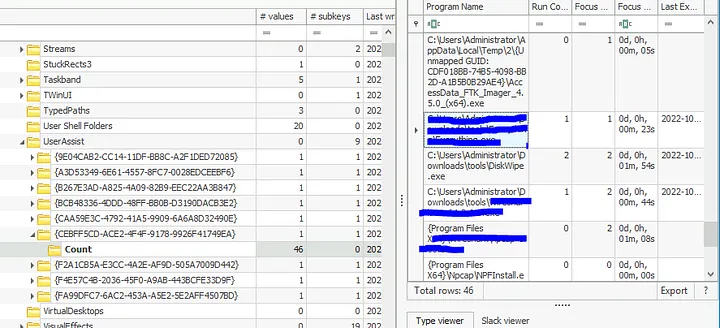

---

## ✅ Conclusion
- Vérification du nom de l’ordinateur et des métadonnées du compte administrateur  
- Identification de tous les comptes utilisateurs et détection d’un backdoor suspect (RID 1013)  
- Détermination des connexions VPN, horodatage de la première connexion, dossiers partagés et dernière IP DHCP  
- Suivi de l’activité utilisateur via RecentDocs et WordWheelQuery dans NTUSER.DAT  
- Surveillance des programmes exécutés et temps de focus via UserAssist  
- Localisation du fichier secret de la recette de café et reconstruction du comportement utilisateur  

**Leçons apprises :**
- Les ruches du registre (SYSTEM, SAM, SOFTWARE, NTUSER) sont cruciales pour l’analyse forensic Windows  
- Corréler plusieurs sources permet d’obtenir une vue complète de l’activité utilisateur  
- La surveillance des comptes suspects, de l’activité VPN et des commandes exécutées est essentielle en DFIR  
- NTUSER.DAT fournit un aperçu des accès aux fichiers et des interactions utilisateur

---

## 🔗 Navigation
- Retour à [Accueil DFIR](../DFIR/README.md)
