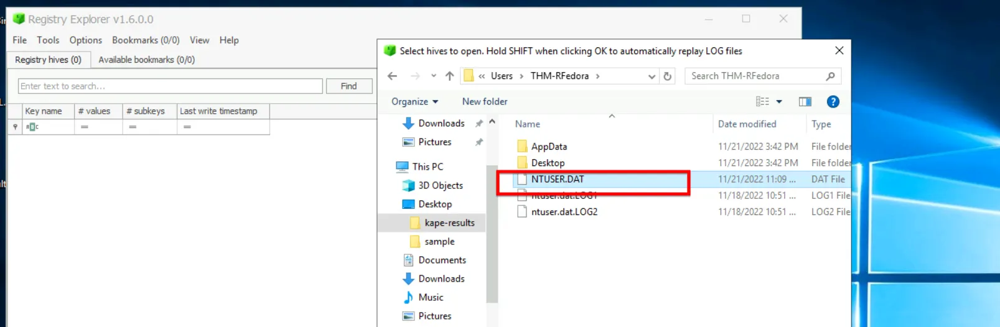
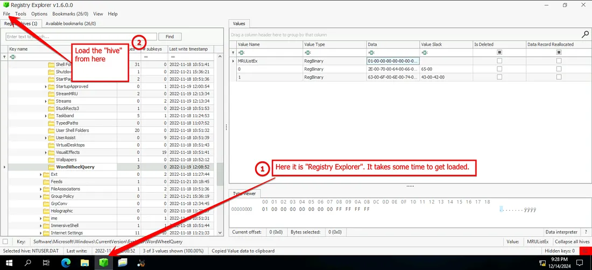
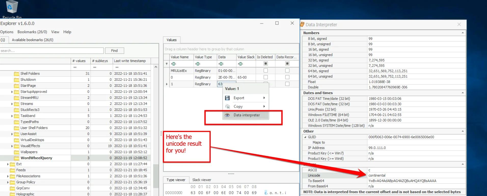
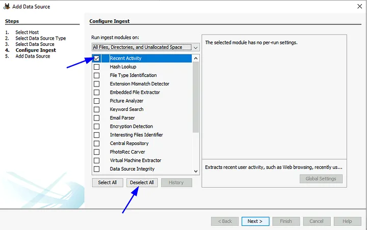
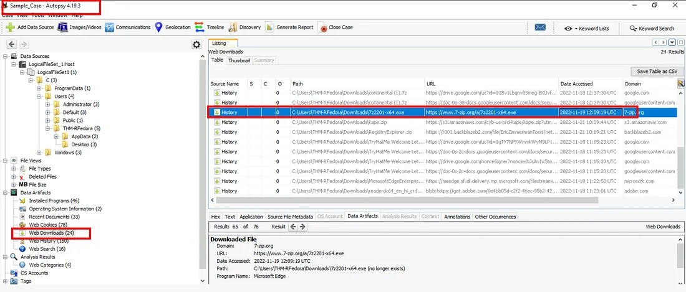
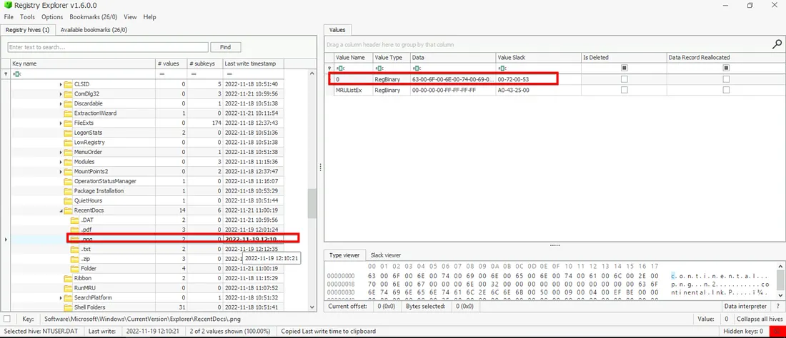
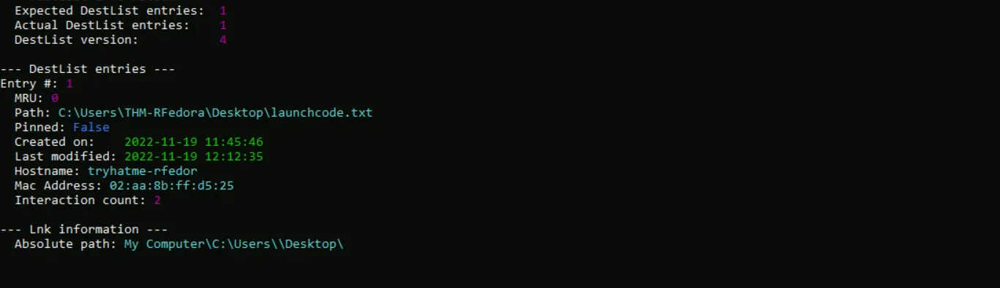
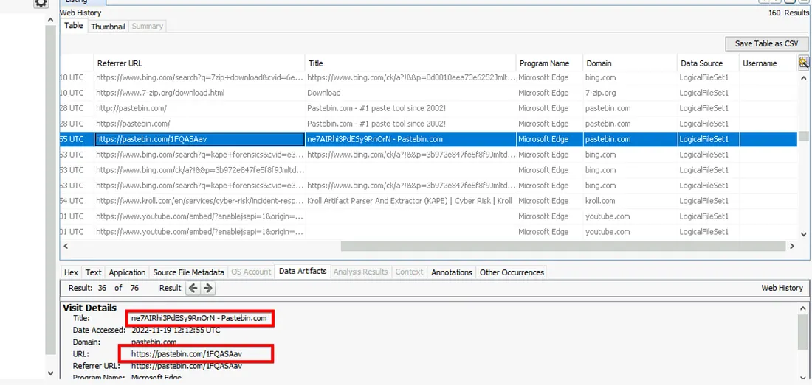

# 📝 Case Study: Unattended (DFIR)

## 🔹 Overview
In this case study, I investigated an incident where a workstation was left **unattended and unlocked**.  
A suspicious janitor was observed leaving the office, raising concerns of **unauthorized access and data exfiltration**.  

**Skills demonstrated:**
- Registry forensics with **Registry Explorer**
- File access analysis with **RecentDocs & Prefetch**
- Jumplist analysis using **JLECmd**
- Artifact correlation with **Autopsy**
- Identifying data exfiltration via **browser history & Pastebin**

---

## 🔍 Key Activities & Highlights

### 1. TypedPaths Registry Analysis
- Opened **Registry Explorer** and loaded hive:  
  `C:\Users\THM-RFedora\Desktop\kape-results\C\Users\THM-RFedora\NTUSER.DAT`  
- Navigated to:  
  `NTUSER.DAT\Software\Microsoft\Windows\CurrentVersion\Explorer\TypedPaths`  
- Right-clicked `MRULISTex` → selected **Analyze** to decode Unicode values.

**Findings:**
- File type searched: **.pdf**  
- Keyword searched: **continental**  





---

### 2. Web Downloads (Autopsy)
- Opened **Autopsy**, added source directory:  
  `C:\Users\THM-RFedora\Desktop\kape-results\C\`  
  → chose **Logical Drive** and limited ingest to Recent Activity.  
- Navigated to **Data Artifacts → Web Downloads**.

**Findings:**
- File downloaded: **7z2201-x64.exe**  
- Timestamp: **2022-11-19 12:09:19 UTC**  




---

### 3. File Access – RecentDocs
- Opened `RecentDocs` registry path:  
  `NTUSER.DAT\Software\Microsoft\Windows\CurrentVersion\Explorer\RecentDocs\.png`  
- Copied **Last Write Time** of `continental.png`.

**Findings:**
- File opened: **continental.png**  
- Opened at: **2022-11-19 12:10:21**  



---

### 4. Jumplist Analysis
- Ran **JLECmd.exe** on the system directory:  
  ```bash
  JLECmd.exe -d C:\Users\THM-RFedora\Desktop\kape-results\C
- Checked Desktop Jumplist artifacts.

**Findings:**
- Text file accessed **2 times**  
- Last modified: **11/19/2022 12:12**



---

### 5. Data Exfiltration – Pastebin
- Opened **Autopsy → Data Artifacts → Web History**  
- Identified access to **pastebin.com** and retrieved the uploaded data.

**Findings:**
- Exfiltrated to: **https://pastebin.com/1FQASAav**  
- Copied string: **ne7AIRhi3PdESy9RnOrN**



---

## ✅ Conclusion
- Attacker searched for files containing “continental”  
- Downloaded a tool (**7-Zip**) to handle files  
- Opened **continental.png**  
- Created and modified a text file  
- Exfiltrated data to **Pastebin**

**Lessons learned:**
- Always lock workstations  
- Endpoint monitoring (Sysmon + SIEM) can detect suspicious activity  
- Registry & Jumplists are key in insider threat investigations

---

## 🔗 Navigation
- Back to [DFIR Home](../DFIR/README.md)
