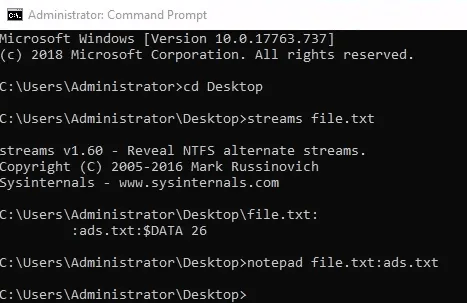
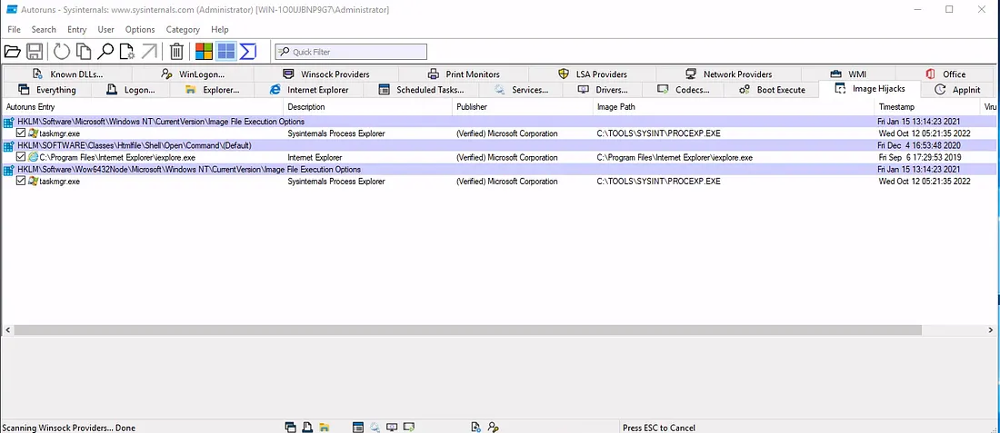
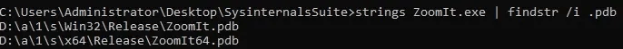

# 📝 Case Study: Sysinternals for Threat Hunting

## 🔹 Overview
In this case study, I explored **Sysinternals Suite**, a collection of tools used by IT administrators for Windows troubleshooting and security analysis.  
The goal was to analyze files, processes, and system artifacts to detect anomalies and hidden data streams.

**Skills demonstrated:**
- Using Sysinternals Suite for system and process analysis
- File and disk forensics (ADS)
- Networking utilities (WHOIS lookup)
- Process monitoring and autoruns analysis
- String extraction from binaries

---

## 🔍 Key Activities & Highlights

### 1. Install the Sysinternals Suite
- Opened the provided Sysinternals Suite link.
- Checked the list of included tools.

**Findings:**  
- Last tool listed: `Zoomit`

---

### 2. Using Sysinternals Live
- Enabled the **Webclient service** on Windows to interact with live.sysinternals.com:
  - Ran `get-service webclient` to check status.
  - Started the service using `start-service webclient`.
- Enabled Network Discovery via `control.exe /name Microsoft.NetworkAndSharingCenter`.
- Installed WebDAV Redirector feature using `Install-WindowsFeature WebDAV-Redirector -Restart`.

**Findings:**  
- Required service: `Webclient`

---

### 3. File and Disk Utilities
- Extracted `SysinternalSuite.zip` to Desktop.
- Used `streams file.txt` to identify Alternate Data Streams (ADS).
- Opened hidden text with `notepad file.txt:ads.txt`.

**Findings:**  
- Hidden text in ADS: `I am hiding in the stream.`

---

### 4. Networking Utilities
- Investigated remote IP addresses from screenshots using WHOIS lookup.

**Findings:**  
- ISP/Organization: `Microsoft Corporation`

---

### 5. Process Utilities
- Launched **Autoruns** and checked the **Image Hijacks** tab.

**Findings:**  
- Entry updated: `taskmgr.exe`  
- Updated value: `C:\TOOLS\SYSINT\PROCEXP.EXE`

---

### 6. Miscellaneous
- Ran **Strings** on `ZoomIt.exe` to locate the `.pdb` path:
  - Command: `strings ZoomIt.exe | findstr /i .pdb`

**Findings:**  
- Full path to PDB file: `C:\agent\_work\112\s\Win32\Release\ZoomIt.pdb`

---

## ✅ Conclusion
- Successfully navigated Sysinternals Suite, identifying tools and hidden streams in files.  
- Learned to extract ADS, perform process and autorun analysis, and gather file metadata.  
- Gained hands-on experience with Windows service configuration and troubleshooting.  
- Prepared for more advanced endpoint monitoring using **Sysmon** and SIEM integration.

---

## 🔗 Navigation
- Back to [Endpoint Security Monitoring Home](../README.md)

