# 📝 Case Study: Sysmon Event Analysis

## 🔹 Overview
This case study explores **Sysmon**, a Windows system monitoring tool that logs detailed events for endpoint and network activity.  
The objective was to investigate Sysmon logs for USB devices, payloads, scheduled tasks, and network connections to identify suspicious activity and potential compromises.

**Skills demonstrated:**
- Sysmon log analysis using PowerShell and Event Viewer
- USB and process monitoring
- Payload and scheduled task reconstruction
- Network traffic and adversary IP identification
- Windows registry and PowerShell script examination

---

## 🔍 Key Activities & Highlights

### 1. Cutting Out the Noise
- I examined the event log `Filtering.evtx` for Event ID 3 (network connections) using PowerShell:  
  `Get-WinEvent -Path Filtering.evtx -FilterXPath '*/System/EventID=3' | Measure-Object -Line`

**Findings:**  
- Number of Event ID 3 logs: `73,591`  
- First network event (UTC): `2021-01-06 01:35:50.464`  
I used the Event Viewer to confirm the first network event when PowerShell queries felt complex.

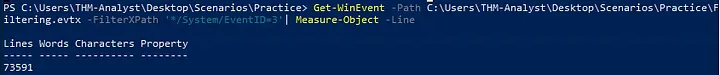
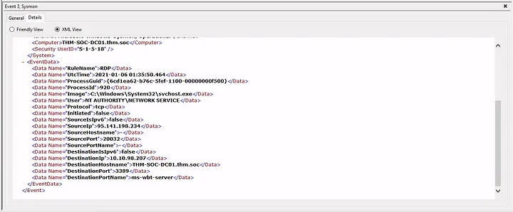

---

### 2. Practical Investigations

#### Investigation 1: USB Device
- I tracked the USB device calling `svchost.exe` and found the registry key:  
  `HKLM\System\CurrentControlSet\Enum\WpdBusEnumRoot\UMB\2&37c186b&0&STORAGE#VOLUME#_??_USBSTOR#DISK&VEN_SANDISK&PROD_U3_CRUZER_MICRO&REV_8.01#4054910EF19005B3&0#\FriendlyName`
  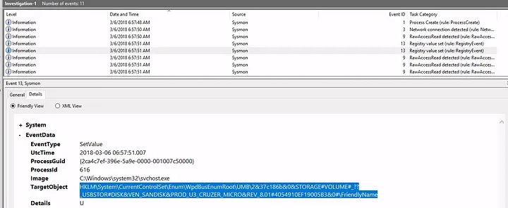
- The device name was: `\Device\HarddiskVolume3`
  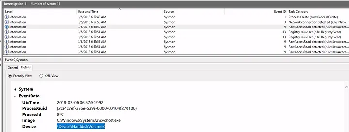
- The first process executed was: `rundll32.exe`  
I worked chronologically through the logs to identify these events.

#### Investigation 2: Payload Analysis
- I located the full path of the payload:  
  `C:\Users\IEUser\AppData\Local\Microsoft\Windows\Temporary Internet Files\Content.IE5\S97WTYG7\update.hta`
  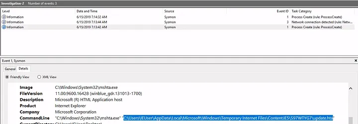
- The payload masked itself as:  
  `C:\Users\IEUser\Downloads\update.html`
  
- The signed binary executing the payload was:  
  `C:\Windows\System32\mshta.exe`
  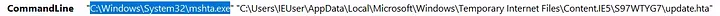
- I identified the adversary IP as: `10.0.2.18`
  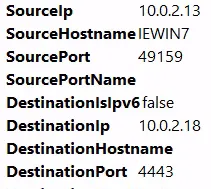
- The back connect port was: `4443`

#### Investigation 3.1: Endpoint Connection
- I found the adversary IP: `172.30.1.253`
  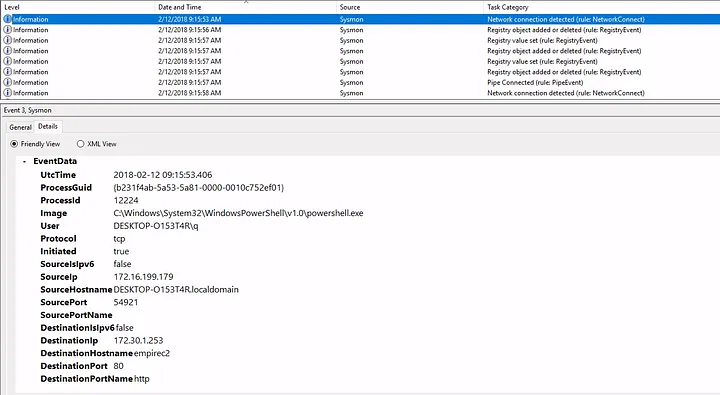
- Hostname of affected endpoint: `DESKTOP-O153T4R`
- Hostname of C2 server: `empirec2`
- Registry location used by PowerShell payload:  
  `HKLM\SOFTWARE\Microsoft\Network\debug`
  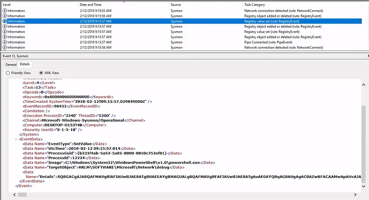
- The PowerShell launch code used was:  
  `"C:\Windows\System32\WindowsPowerShell\v1.0\powershell.exe -c \"$x=$((gp HKLM:Software\Microsoft\Network debug).debug);start -Win Hidden -A \\\"-enc $x\\\" powershell\";exit;"`  
I followed the logs sequentially to find the PowerShell command.

#### Investigation 3.2: Scheduled Task
- I identified the adversary IP: `172.168.103.188`
  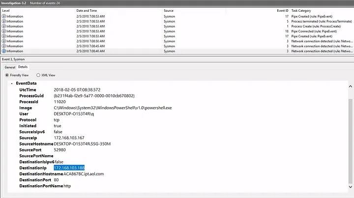
- Payload location: `c:\users\q\AppData:blah.txt`
  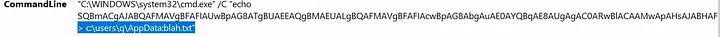
- The full command to create the scheduled task was:  
  `"C:\WINDOWS\system32\schtasks.exe" /Create /F /SC DAILY /ST 09:00 /TN Updater /TR "C:\Windows\System32\WindowsPowerShell\v1.0\powershell.exe -NonI -W hidden -c \"IEX ([Text.Encoding]::UNICODE.GetString([Convert]::FromBase64String($(cmd /c ''more < c:\users\q\AppData:blah.txt''))))\""`
- I determined that the suspicious process accessed by schtasks.exe was: `lsass.exe`

#### Investigation 4: Network Connections
- I identified the adversary IP: `172.30.1.253`
  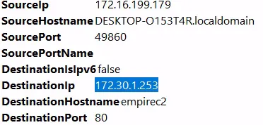
- The adversary port was: `80`
- The C2 infrastructure used by the adversary was: `Empire`

---

## ✅ Conclusion
- I used Sysmon logs to track USB, process, and network activities.  
- I identified suspicious payloads, scheduled tasks, and C2 communications.  
- This exercise helped me correlate Sysmon event logs with registry entries, PowerShell executions, and network indicators.  
- I learned the importance of using Event Viewer and PowerShell for detailed analysis when GUI or XPath queries are preferred.

---

## 🔗 Navigation
- Back to [Endpoint Security Monitoring Home](../README.md)

