# 📝 Étude de cas : Analyse des événements Sysmon

## 🔹 Présentation générale
Cette étude de cas explore **Sysmon**, un outil de surveillance du système Windows qui enregistre des événements détaillés liés à l’activité des endpoints et du réseau.  
L’objectif était d’analyser les journaux Sysmon concernant les périphériques USB, les charges utiles (payloads), les tâches planifiées et les connexions réseau afin d’identifier des activités suspectes et d’éventuelles compromissions.

**Compétences démontrées :**
- Analyse des journaux Sysmon avec PowerShell et l’Observateur d’événements  
- Surveillance des périphériques USB et des processus  
- Reconstruction de payloads et de tâches planifiées  
- Analyse du trafic réseau et identification des IP adverses  
- Examen du registre Windows et de scripts PowerShell  

---

## 🔍 Activités clés & points marquants

### 1. Réduction du bruit
- J’ai examiné le journal d’événements `Filtering.evtx` pour l’Event ID 3 (connexions réseau) à l’aide de PowerShell :  
  `Get-WinEvent -Path Filtering.evtx -FilterXPath '*/System/EventID=3' | Measure-Object -Line`

**Résultats :**  
- Nombre d’événements Event ID 3 : `73,591`  
- Premier événement réseau (UTC) : `2021-01-06 01:35:50.464`  
J’ai utilisé l’Observateur d’événements pour confirmer le premier événement réseau lorsque les requêtes PowerShell devenaient trop complexes.

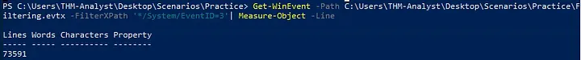
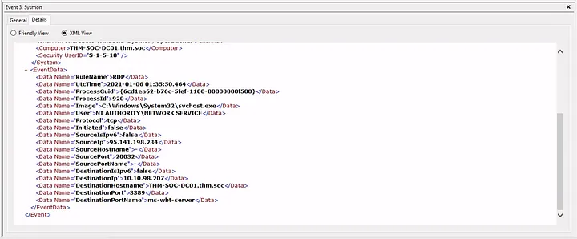

---

### 2. Investigations pratiques

#### Investigation 1 : Périphérique USB
- J’ai suivi le périphérique USB appelant `svchost.exe` et identifié la clé de registre :  
  `HKLM\System\CurrentControlSet\Enum\WpdBusEnumRoot\UMB\2&37c186b&0&STORAGE#VOLUME#_??_USBSTOR#DISK&VEN_SANDISK&PROD_U3_CRUZER_MICRO&REV_8.01#4054910EF19005B3&0#\FriendlyName`
  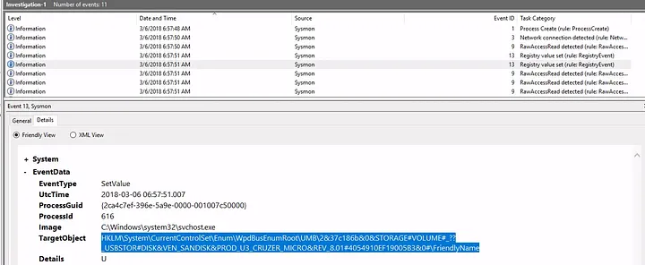
- Le nom du périphérique était : `\Device\HarddiskVolume3`
  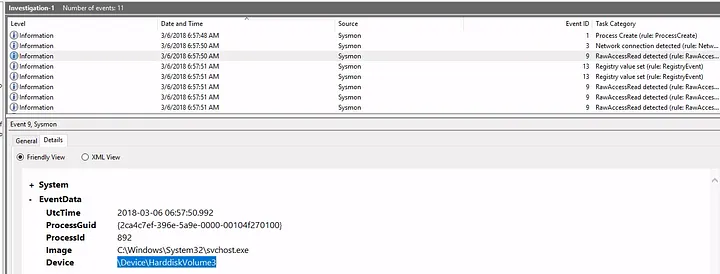
- Le premier processus exécuté était : `rundll32.exe`  
J’ai travaillé de manière chronologique dans les journaux pour identifier ces événements.

---

#### Investigation 2 : Analyse du payload
- J’ai localisé le chemin complet du payload :  
  `C:\Users\IEUser\AppData\Local\Microsoft\Windows\Temporary Internet Files\Content.IE5\S97WTYG7\update.hta`
  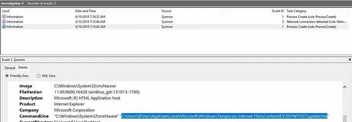
- Le payload se masquait sous :  
  `C:\Users\IEUser\Downloads\update.html`
  
- Le binaire signé exécutant le payload était :  
  `C:\Windows\System32\mshta.exe`
  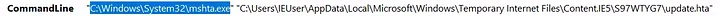
- J’ai identifié l’IP de l’adversaire comme étant : `10.0.2.18`
  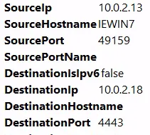
- Le port de connexion retour (back connect) était : `4443`

---

#### Investigation 3.1 : Connexion endpoint
- J’ai identifié l’IP de l’adversaire : `172.30.1.253`
  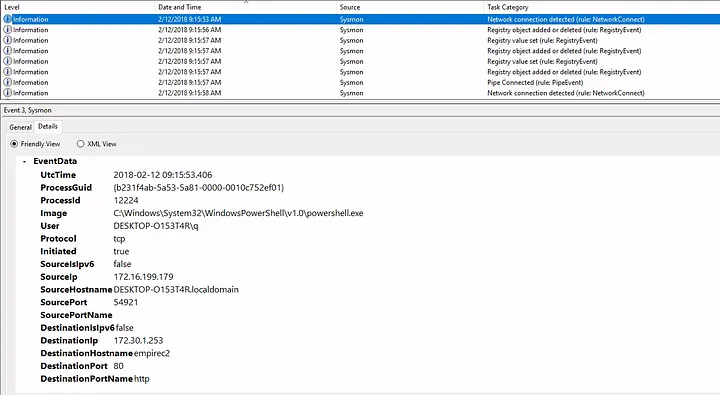
- Nom d’hôte de l’endpoint affecté : `DESKTOP-O153T4R`
- Nom d’hôte du serveur C2 : `empirec2`
- Emplacement du registre utilisé par le payload PowerShell :  
  `HKLM\SOFTWARE\Microsoft\Network\debug`
  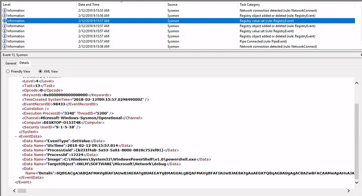
- La commande PowerShell utilisée au lancement était :  
  `"C:\Windows\System32\WindowsPowerShell\v1.0\powershell.exe -c \"$x=$((gp HKLM:Software\Microsoft\Network debug).debug);start -Win Hidden -A \\\"-enc $x\\\" powershell\";exit;"`  
J’ai suivi les journaux séquentiellement pour retrouver cette commande PowerShell.

---

#### Investigation 3.2 : Tâche planifiée
- J’ai identifié l’IP de l’adversaire : `172.168.103.188`
  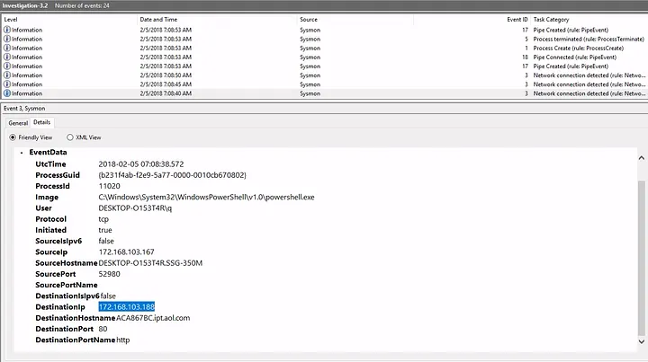
- Emplacement du payload : `c:\users\q\AppData:blah.txt`
  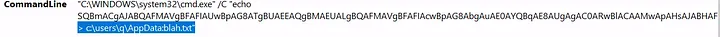
- La commande complète utilisée pour créer la tâche planifiée était :  
  `"C:\WINDOWS\system32\schtasks.exe" /Create /F /SC DAILY /ST 09:00 /TN Updater /TR "C:\Windows\System32\WindowsPowerShell\v1.0\powershell.exe -NonI -W hidden -c \"IEX ([Text.Encoding]::UNICODE.GetString([Convert]::FromBase64String($(cmd /c ''more < c:\users\q\AppData:blah.txt''))))\""`
- J’ai déterminé que le processus suspect accédé par `schtasks.exe` était : `lsass.exe`

---

#### Investigation 4 : Connexions réseau
- J’ai identifié l’IP de l’adversaire : `172.30.1.253`
  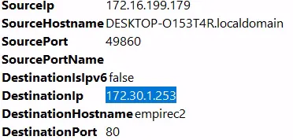
- Le port utilisé par l’adversaire était : `80`
- L’infrastructure C2 utilisée par l’adversaire était : `Empire`

---

## ✅ Conclusion
- J’ai utilisé les journaux Sysmon pour suivre les activités USB, processus et réseau.  
- J’ai identifié des payloads suspects, des tâches planifiées et des communications C2.  
- Cet exercice m’a permis de corréler les événements Sysmon avec des entrées du registre, des exécutions PowerShell et des indicateurs réseau.  
- J’ai compris l’importance d’utiliser l’Observateur d’événements et PowerShell pour des analyses détaillées, notamment lorsque les requêtes GUI ou XPath sont privilégiées.

---

## 🔗 Navigation
- Retour à l’[Accueil de la surveillance de la sécurité des endpoints](../README.md)
