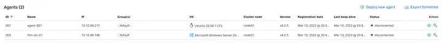

# 📝 Case Study: Wazuh Endpoint Detection & Monitoring

## 🔹 Overview
This case study focuses on **Wazuh**, an endpoint detection and response platform that also acts as a SIEM.  
I deployed a Wazuh management server, connected multiple agents, and investigated collected logs and security events to understand how Wazuh centralizes monitoring and detection.  

**Skills demonstrated:**  
- Deploying Wazuh management and agent nodes  
- Investigating Windows and Linux endpoint activity  
- Auditing commands and monitoring suspicious behavior  
- Using the Wazuh API for system queries  
- Generating reports and analyzing alerts  

---

## 🔍 Key Activities & Highlights

### 1. Introduction
The first task was to familiarize myself with Wazuh terminology and history. I read the introductory notes and understood its architecture.

**Findings:**  
- **Wazuh release year:** `2015` – Knowing the release year helps contextualize its maturity compared to other SIEMs and EDR tools.  
- **Monitored device term:** `Agent` – Each endpoint that reports activity is an agent; understanding this helps identify the scope of monitoring.  
- **Management device term:** `Manager` – The centralized server that collects data from agents and applies analysis rules.  

---

### 2. Deploy Wazuh Server
For this step, I connected to the TryHackMe network using my OpenVPN profile and accessed the Wazuh server via the provided IP.  
Once connected, I logged into the Wazuh GUI with the credentials provided in the task. This step was crucial because without a functioning management server, none of the agents or security events could be monitored.

**Observation:**  
- This reinforced my understanding that a Wazuh manager is necessary to interpret all endpoint data.  

---

### 3. Wazuh Agents
I clicked the Wazuh icon → “Agents” to view all connected agents. Wazuh lists each agent and shows its current connection status.

**Findings:**  
- **Number of agents:** `2` – These represent the devices actively reporting to the manager.  
- **Status:** `disconnected` – This indicates that the agents were not actively reporting at the time, possibly due to network issues or configuration delays.

**Reflection:**  
- Monitoring agent connectivity is vital; disconnected agents can result in blind spots in security monitoring.

---

### 4. Wazuh Vulnerability Assessment & Security Events
Next, I analyzed the agent named `AGENT-001`. I navigated to **Security events** and adjusted the time filter to “Years ago” to ensure I captured all historical alerts.

**Findings:**  
- **Security Event alerts:** `196` – These alerts represent detected anomalies, suspicious activity, or policy violations on the monitored agent.

**Reflection:**  
- This task showed me how Wazuh centralizes alerting and makes it easy to review security events over time.  
- Filtering and adjusting time ranges are critical for full visibility in investigations.

---

### 5. Collecting Windows Logs with Wazuh
Wazuh collects system logs from endpoints to detect suspicious activity. I verified which tools Wazuh uses for Windows:

**Findings:**  
- **Tool:** `Sysmon` – Installed on the agent, it records detailed events like process creation, network connections, and registry changes.  
- **Log repository:** `Event Viewer` – Sysmon writes events here, allowing Wazuh to query and analyze them centrally.

**Reflection:**  
- This highlighted the importance of collecting Windows logs for real-time threat detection and historical investigation.

---

### 6. Collecting Linux Logs with Wazuh
I explored how Linux endpoints are monitored. The readings emphasized monitoring command execution and system activity.

**Findings:**  
- **Rules path:** `/var/ossec/ruleset/rules` – Defines the alerts and policies applied to collected logs.  
- **Monitoring tool:** `Auditd` – Captures commands and actions performed on Linux systems.  
- **Auditd rules path:** `/etc/audit/rules.d/audit.rules` – Where rules for auditing are stored.

**Reflection:**  
- Knowing these paths is critical when tuning Wazuh to ensure all relevant events are captured without generating excessive noise.

---

### 7. Wazuh API
I explored the Wazuh API to interact programmatically with the server. The API allows retrieving information, performing actions, and integrating Wazuh into scripts or external systems.

**Findings:**  
- **Standard tool for API requests:** `curl` – Used on Linux or Windows (via WSL or Git Bash) to make HTTP requests.  
- **HTTP method for retrieval:** `GET`  
- **HTTP method for actions:** `PUT` – Used for configuration changes or triggering tasks.  
- **Wazuh server version:** `v4.2.5` – Confirmed via API console query.

**Reflection:**  
- Learning API access is important for automation and integrating Wazuh into other security workflows.

---

### 8. Generating Reports with Wazuh
I generated a security events report for analysis:

Steps:
1. Navigate: Wazuh logo → Modules → Security Event → Generate report  
2. Download report: Wazuh logo → Management → Reporting → Actions → Download  

**Findings:**  
- **Agent with most alerts:** `agent-001` – This agent generated the majority of security events, indicating higher activity or potential misconfigurations.

**Reflection:**  
- Reports provide a holistic view of endpoint activity and are essential for compliance, audits, and incident investigations.

---

## ✅ Conclusion
- I successfully deployed Wazuh and connected agents for centralized monitoring.  
- I explored Windows and Linux logs, monitored agents’ status, and used the API to retrieve system information.  
- Generating reports demonstrated the aggregation of events and identification of the most active endpoints.  
- This room gave me hands-on experience with **EDR functionality, SIEM integration, and endpoint threat detection**.  

**Takeaways:**  
- Wazuh is a versatile platform for real-time monitoring, alerting, and reporting.  
- Understanding agent-manager relationships is critical for incident response.  
- API and report features allow analysts to automate workflows and produce actionable insights.  

---

## 🔗 Navigation
- Back to [Endpoint Security Monitoring Home](../README.md)

