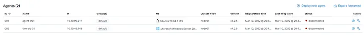
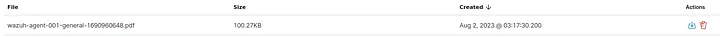

# 📝 Étude de cas : Détection et supervision des endpoints avec Wazuh

## 🔹 Présentation générale
Cette étude de cas se concentre sur **Wazuh**, une plateforme de détection et de réponse sur les endpoints (EDR) qui agit également comme un **SIEM**.  
J’ai déployé un serveur de gestion Wazuh, connecté plusieurs agents et analysé les journaux collectés ainsi que les événements de sécurité afin de comprendre comment Wazuh centralise la supervision et la détection.

**Compétences démontrées :**  
- Déploiement du serveur de gestion Wazuh et des agents  
- Analyse de l’activité des endpoints Windows et Linux  
- Audit des commandes et surveillance des comportements suspects  
- Utilisation de l’API Wazuh pour les requêtes système  
- Génération de rapports et analyse des alertes  

---

## 🔍 Activités clés & points marquants

### 1. Introduction
La première tâche consistait à me familiariser avec la terminologie et l’historique de Wazuh. J’ai étudié les notes d’introduction et compris son architecture.

**Résultats :**  
- **Année de sortie de Wazuh :** `2015` – Connaître l’année de sortie permet de situer sa maturité par rapport à d’autres outils SIEM et EDR.  
- **Terme pour un équipement surveillé :** `Agent` – Chaque endpoint qui remonte des événements est appelé agent.  
- **Terme pour l’équipement de gestion :** `Manager` – Serveur centralisé qui collecte les données des agents et applique les règles d’analyse.  

---

### 2. Déploiement du serveur Wazuh
Pour cette étape, je me suis connecté au réseau TryHackMe via mon profil OpenVPN et j’ai accédé au serveur Wazuh grâce à l’adresse IP fournie.  
Une fois connecté, je me suis authentifié sur l’interface graphique Wazuh avec les identifiants fournis. Cette étape était essentielle, car sans serveur de gestion opérationnel, aucun agent ni événement de sécurité ne peut être supervisé.

**Observation :**  
- Cela a renforcé ma compréhension du rôle central du **Wazuh Manager** dans l’interprétation des données des endpoints.

---

### 3. Agents Wazuh
J’ai cliqué sur l’icône Wazuh → **Agents** afin d’afficher tous les agents connectés. Wazuh liste chaque agent et indique son état de connexion.

**Résultats :**  
- **Nombre d’agents :** `2` – Représentent les endpoints remontant leurs données au manager.  
- **Statut :** `disconnected` – Indique que les agents ne remontaient pas activement leurs journaux à ce moment-là, probablement à cause d’un problème réseau ou de configuration.

**Analyse :**  
- La supervision de la connectivité des agents est cruciale : des agents déconnectés créent des angles morts dans la surveillance de sécurité.

---

### 4. Évaluation des vulnérabilités & événements de sécurité
J’ai ensuite analysé l’agent nommé `AGENT-001`. Je me suis rendu dans **Security events** et j’ai ajusté le filtre temporel sur *“Years ago”* afin d’inclure tous les événements historiques.

**Résultats :**  
- **Alertes d’événements de sécurité :** `196` – Ces alertes représentent des anomalies, des activités suspectes ou des violations de politique détectées sur l’agent.

**Analyse :**  
- Cette étape m’a montré comment Wazuh centralise les alertes et facilite leur analyse dans le temps.  
- Le filtrage et l’ajustement des plages temporelles sont essentiels pour obtenir une visibilité complète lors d’une investigation.

---

### 5. Collecte des journaux Windows avec Wazuh
Wazuh collecte les journaux système des endpoints afin de détecter des activités suspectes. J’ai vérifié quels outils étaient utilisés pour Windows.

**Résultats :**  
- **Outil :** `Sysmon` – Installé sur l’agent, il enregistre des événements détaillés (création de processus, connexions réseau, modifications du registre).  
- **Dépôt des journaux :** `Event Viewer` – Sysmon écrit ses événements ici, permettant à Wazuh de les analyser de manière centralisée.

**Analyse :**  
- Cela met en évidence l’importance de la collecte des journaux Windows pour la détection des menaces en temps réel et l’analyse forensique.

---

### 6. Collecte des journaux Linux avec Wazuh
J’ai étudié la supervision des endpoints Linux. Les ressources mettaient l’accent sur le suivi des commandes exécutées et de l’activité système.

**Résultats :**  
- **Chemin des règles :** `/var/ossec/ruleset/rules` – Définit les règles d’alerte et les politiques appliquées aux journaux collectés.  
- **Outil de surveillance :** `Auditd` – Capture les commandes et actions effectuées sur les systèmes Linux.  
- **Chemin des règles Auditd :** `/etc/audit/rules.d/audit.rules`

**Analyse :**  
- Connaître ces emplacements est essentiel pour ajuster Wazuh afin de capter les événements pertinents sans générer trop de bruit.

---

### 7. API Wazuh
J’ai exploré l’API Wazuh pour interagir programmatiquement avec le serveur. L’API permet de récupérer des informations, d’effectuer des actions et d’intégrer Wazuh à des scripts ou systèmes externes.

**Résultats :**  
- **Outil standard pour les requêtes API :** `curl`  
- **Méthode HTTP pour la récupération :** `GET`  
- **Méthode HTTP pour les actions :** `PUT`  
- **Version du serveur Wazuh :** `v4.2.5` – Confirmée via une requête API.

**Analyse :**  
- L’accès API est crucial pour l’automatisation et l’intégration de Wazuh dans des workflows de sécurité avancés.

---

### 8. Génération de rapports avec Wazuh
J’ai généré un rapport d’événements de sécurité pour analyse.

**Étapes :**
1. Wazuh → Modules → Security Event → Generate report  
2. Wazuh → Management → Reporting → Actions → Download  

**Résultats :**  
- **Agent générant le plus d’alertes :** `agent-001` – Cet agent concentrait la majorité des événements de sécurité, indiquant une activité élevée ou une configuration à analyser.

**Analyse:**  
- Les rapports offrent une vue globale de l’activité des endpoints et sont essentiels pour la conformité, les audits et les investigations d’incidents.

---

## ✅ Conclusion
- J’ai déployé Wazuh avec succès et connecté des agents pour une supervision centralisée.  
- J’ai analysé les journaux Windows et Linux, surveillé l’état des agents et utilisé l’API pour récupérer des informations système.  
- La génération de rapports a démontré la capacité de Wazuh à agréger les événements et à identifier les endpoints les plus actifs.  
- Cette étude m’a apporté une expérience pratique en **EDR, intégration SIEM et détection des menaces sur les endpoints**.

**Points clés :**  
- Wazuh est une plateforme polyvalente pour la supervision, l’alerte et le reporting en temps réel.  
- La compréhension de la relation agent–manager est essentielle pour la réponse à incident.  
- L’API et les fonctionnalités de reporting permettent d’automatiser les analyses et de produire des résultats exploitables.

---

## 🔗 Navigation
- Retour à l’[Accueil de la surveillance de la sécurité des endpoints](../README.md)
