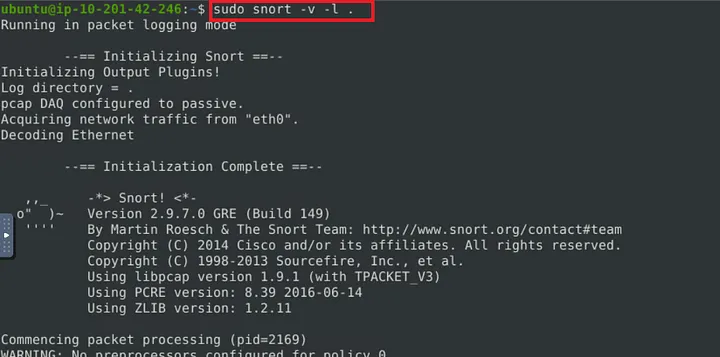
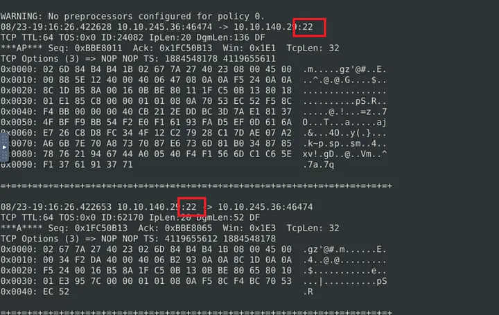
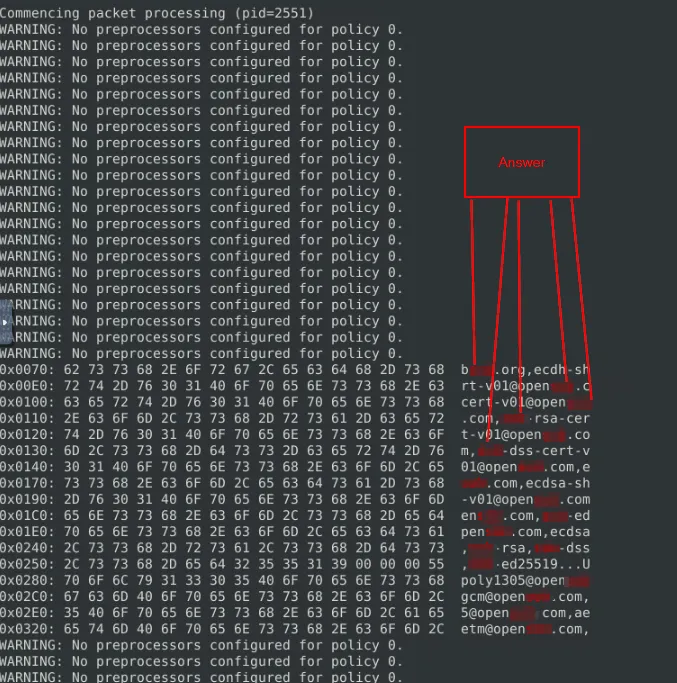
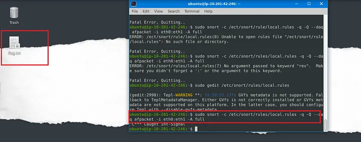
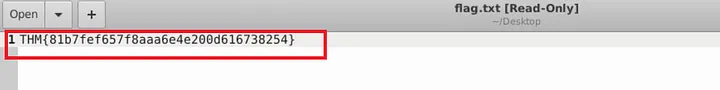
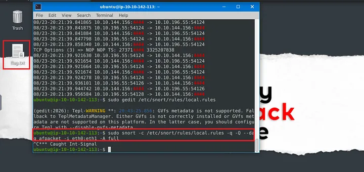
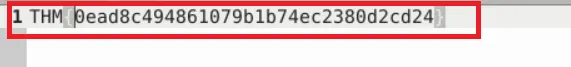

# 📝 Étude de Cas : Snort – Attaques en Temps Réel

## 🔹 Vue d’ensemble
Ce laboratoire était axé sur l’utilisation de **Snort** pour surveiller le trafic en temps réel, détecter des comportements malveillants et bloquer des attaques en écrivant des règles personnalisées.  
Deux scénarios inspirés de situations réelles ont été simulés :  
1. **Attaque par force brute contre SSH**  
2. **Trafic sortant de type reverse shell**

L’objectif était d’observer le trafic réseau, identifier l’anomalie, puis créer et déployer des règles Snort afin de stopper les attaques.

**Compétences démontrées :**
- Exécution de Snort en mode sniffer pour capturer et analyser des paquets  
- Analyse des journaux Snort pour identifier des activités malveillantes  
- Écriture de règles de prévention d’intrusion (`drop rules`)  
- Utilisation de Snort en mode IPS pour bloquer des attaques en temps réel  
- Compréhension des attaques par force brute et des reverse shells dans le trafic réseau  

---

## 🔍 Tâche 1 : Introduction
Ce challenge présentait les capacités de Snort à surveiller le **trafic en temps réel** ainsi qu’à analyser des **logs capturés**.  
L’environnement TryHackMe fournissait une **vue en écran partagé** avec les consignes à gauche et une machine Snort accessible via un terminal à droite.

J’ai ouvert un terminal sur la VM et confirmé que l’environnement était prêt pour exécuter les commandes Snort.

---

## 🚨 Tâche 2 : Scénario 1 – Attaque par Force Brute

### Contexte
J&Y Enterprise, une entreprise fictive de vente de café, subissait une **attaque par force brute** ciblant son service SSH.  
Mon rôle consistait à identifier la source de l’attaque et à la bloquer.

---

### Étape 1 : Lancer Snort en mode Sniffer
J’ai démarré Snort en mode sniffer verbeux pour capturer le trafic en direct :

sudo snort -v -l . 

-v → mode verbeux
-l . → enregistrement des paquets dans le répertoire courant

Après environ 15 secondes, j’ai arrêté la capture avec CTRL+C.

---

### Étape 2 : Analyse des Logs Capturés
Snort génère des fichiers de logs sous la forme snort.log.<timestamp>.
J’ai ouvert le fichier en mode hexadécimal :
sudo snort -r snort.log.1672414629 -X

En parcourant les paquets, j’ai observé de nombreuses occurrences du port 22 dans les champs source et destination.

---

### Step 3: Confirmation de l’Attaque
J’ai filtré le trafic sur le port 22 :
sudo snort -r snort.log.1672414629 -X | grep ":22"

Les résultats étaient nombreux, ce qui est caractéristique d’une attaque par force brute SSH.
J’ai également recherché la chaîne “ssh” :
sudo snort -r snort.log.1672414629 -X | grep "ssh"

Cela a confirmé la présence de multiples connexions SSH.

---

### Step 4: Création de la Règle Snort
J’ai ouvert le fichier des règles locales :
sudo gedit /etc/snort/rules/local.rules

Puis j’ai créé une règle de type drop pour bloquer le trafic TCP sur le port 22 :
drop tcp any 22 <> any any (msg:"SSH Connection attempted"; sid:100001; rev:1;)

- drop → bloque le trafic
- tcp → protocole
- any 22 <> any any → trafic TCP depuis le port 22 vers toute destination
- msg → message descriptif
- sid → identifiant unique Snort
- rev → version de la règle

---

### Step 5: Exécution de Snort en Mode IPS
Pour bloquer le trafic en temps réel, j’ai lancé Snort en mode IPS avec AFPacket :
sudo snort -c /etc/snort/snort.conf -q -Q --daq afpacket -i eth0:eth1 -A full

- -A full → journalisation complète des alertes
- -Q → exécution de Snort en mode inline (IPS)

Après quelques instants, un fichier flag.txt est apparu sur le bureau, confirmant que l’attaque avait été bloquée.

---

### Résultats
- **Flag:** `THM{81b7fef657f8aaa6e4e200d616738254}`  
- **Service attaqué:** `SSH`  
- **Protocole / Port:** `TCP/22`

---

## 🚨 Tâche 3 : Scénario 2 – Reverse Shell

### Contexte
Après avoir bloqué les attaques entrantes, j’ai analysé le trafic sortant.
Une activité persistante sur le port 4444 indiquait une possible connexion de type reverse shell.

---

### Étape 1 : Capture du Trafic
J’ai relancé Snort en mode sniffer :
sudo snort -v -l .

Arrêt après environ 15 secondes avec CTRL+C.

---

### Étape 2 : Inspection des Logs
Ouverture du fichier de log :
sudo snort -r snort.log.1672697486 -X

J’ai remarqué de nombreuses occurrences du port 4444, couramment utilisé pour les reverse shells.

Filtrage du port 4444 :
sudo snort -r snort.log.1672697486 -X | grep ":4444"

Puis limitation à 10 paquets pour une analyse plus lisible :
sudo snort -r snort.log.1672697486 -X -n 10

---

### Étape 3 : Création de la Règle Snort
Modification des règles locales :
sudo gedit /etc/snort/rules/local.rules

Ajout de la règle suivante :
drop tcp any 4444 <> any any (msg:"Reverse Shell Detected"; sid:100002; rev:1;)

---

### Étape 4 : Blocage en Mode IPS
Relance de Snort en mode IPS avec les règles mises à jour :
sudo snort -c /etc/snort/snort.conf -q -Q --daq afpacket -i eth0:eth1 -A full

Après environ une minute, un nouveau flag.txt est apparu, confirmant le blocage du reverse shell.

---

### Résultats
- **Flag:** `THM{0ead8c494861079b1b74ec2380d2cd24}`  
- **Protocole / Port:** `TCP/4444`  
- **Outil associé:** `Metasploit` – since port 4444 is heavily associated with its reverse shell payloads.

---

## ✅ Conclusion
Ce challenge m’a permis de pratiquer à la fois la détection et la prévention de deux types d’attaques majeures :

- **Force brute SSH** – très courante dans les intrusions réelles 
- **Reverse shells** – souvent utilisés après une compromission initiale

J’ai renforcé les compétences suivantes :
- Utilisation de Snort en mode sniffer et en mode IPS 
- Lecture et filtrage des logs Snort avec grep
- Écriture de règles personnalisées pour bloquer du trafic malveillant
- Blocage d’attaques en temps réel et validation via les flags générés

Cette étude de cas m’a donné une solide expérience pratique dans l’utilisation de Snort comme système de détection et de prévention d’intrusions réseau.

---

## 🔗 Navigation
- Retour aux [Network Security Case Studies](../README.md)

