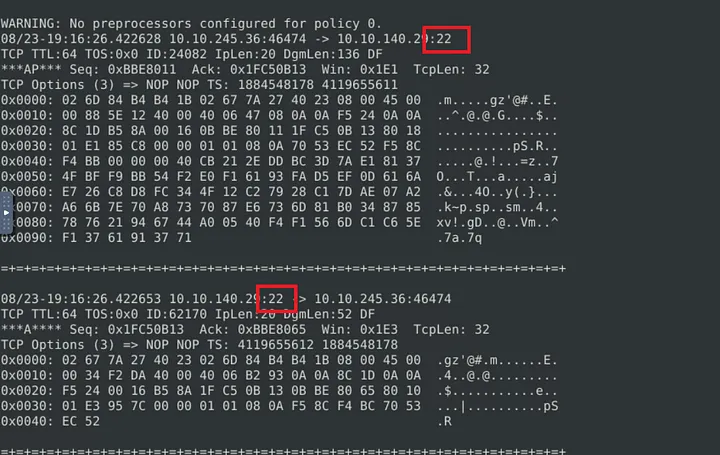

# 📝 Case Study: Snort – Live Attacks

## 🔹 Overview
This lab focused on using **Snort** to monitor live traffic, detect malicious behavior, and block attacks by writing custom rules.  
Two real-world scenarios were simulated:  
1. **Brute-force attack against SSH**  
2. **Reverse shell outbound traffic**  

The goal was to observe network traffic, identify the anomaly, and then create and deploy Snort rules to stop the attacks.  

**Skills demonstrated:**  
- Running Snort in sniffer mode to capture and analyze packets  
- Inspecting Snort logs for malicious activity  
- Writing intrusion prevention rules (`drop` rules)  
- Running Snort in IPS mode to stop live attacks  
- Understanding brute-force attempts and reverse shells in network traffic  

---

## 🔍 Task 1: Introduction
The challenge introduced Snort’s ability to monitor **live traffic** as well as analyze **captured logs**.  
The TryHackMe VM setup provided a **split screen view** with tasks on the left and a terminal-based Snort machine on the right.  

I opened a terminal in the VM and confirmed I was ready to run Snort commands for the scenarios.

---

## 🚨 Task 2: Scenario 1 – Brute-Force Attack

### Story
J&Y Enterprise, a fictional coffee retailer, was under **brute-force attack** targeting their SSH service. My role was to detect the source and stop the attack.

---

### Step 1: Run Snort in Sniffer Mode
I started Snort in verbose sniffer mode to capture live packets:
sudo snort -v -l .

- `-v` → verbose  
- `-l .` → log packets to the current directory  

I let Snort run for ~15 seconds, then stopped with `CTRL+C`.

---

### Step 2: Analyze the Captured Log
Snort creates logs with filenames like `snort.log.<timestamp>`.  
I opened the captured log in hex-dump mode:
sudo snort -r snort.log.1672414629 -X

Scrolling through packets, I noticed **port 22** repeatedly in both **source** and **destination** fields.

---

### Step 3: Confirm the Attack
I filtered for port 22 traffic:
sudo snort -r snort.log.1672414629 -X | grep ":22"

There were many matches — consistent with brute-force SSH attempts.  
I also searched for the string “ssh”:
sudo snort -r snort.log.1672414629 -X | grep "ssh"

This confirmed multiple SSH connections.

---

### Step 4: Write the Snort Rule
I opened the local rules file:
sudo gedit /etc/snort/rules/local.rules

I created a **drop rule** to block TCP traffic on port 22:
drop tcp any 22 <> any any (msg:"SSH Connection attempted"; sid:100001; rev:1;)

- `drop` → block traffic  
- `tcp` → protocol  
- `any 22 <> any any` → source any on port 22 to any destination  
- `msg` → descriptive message  
- `sid` → unique Snort ID  
- `rev` → rule revision 

---

### Step 5: Run Snort in IPS Mode
To block live traffic, I ran Snort in IPS mode with AFPacket:
sudo snort -c /etc/snort/snort.conf -q -Q --daq afpacket -i eth0:eth1 -A full

- `-A full` logs full alerts  
- `-Q` runs Snort inline as an IPS  

After a short wait, a **flag.txt** file appeared on the Desktop, confirming the attack was stopped.

---

### Results
- **Flag:** `THM{81b7fef657f8aaa6e4e200d616738254}`  
- **Service under attack:** `SSH`  
- **Protocol/Port:** `TCP/22`

---

## 🚨 Task 3: Scenario 2 – Reverse Shell

### Story
After stopping inbound brute-force attempts, I checked outbound traffic.  
Persistent traffic on **port 4444** suggested a reverse shell connection.

---

### Step 1: Run Snort in Sniffer Mode
I captured packets again:
sudo snort -v -l .

Stopped after ~15 seconds with `CTRL+C`.

---

### Step 2: Inspect the Log
Opened the log file:
sudo snort -r snort.log.1672697486 -X

I noticed repeated **port 4444** traffic — common for reverse shells.

To confirm, I filtered for port 4444:
sudo snort -r snort.log.1672697486 -X | grep ":4444"

The results showed consistent use of this port.  
I also limited the output to 10 packets for easier inspection:
sudo snort -r snort.log.1672697486 -X -n 10

---

### Step 3: Write the Snort Rule
I edited local rules again:
sudo gedit /etc/snort/rules/local.rules

Then added a new **drop rule**:
drop tcp any 4444 <> any any (msg:"Reverse Shell Detected"; sid:100002; rev:1;)

---

### Step 4: Run Snort in IPS Mode
I ran Snort with the same IPS command but using the updated rules:
sudo snort -c /etc/snort/snort.conf -q -Q --daq afpacket -i eth0:eth1 -A full

After about a minute, a new **flag.txt** appeared on the Desktop, confirming the reverse shell was blocked.

---

### Results
- **Flag:** `THM{0ead8c494861079b1b74ec2380d2cd24}`  
- **Protocol/Port:** `TCP/4444`  
- **Associated tool:** `Metasploit` – since port 4444 is heavily associated with its reverse shell payloads.

---

## ✅ Conclusion
Through this challenge, I practiced **both detection and prevention** of two major attack types:

- **Brute-force (SSH)** – common in real-world intrusions.  
- **Reverse shells** – often used by attackers after initial compromise.  

I reinforced the following skills:  
- Running Snort in sniffer vs. IPS mode  
- Reading and filtering Snort log files with `grep`  
- Writing custom drop rules for malicious traffic  
- Blocking live attacks and confirming via generated flags  

This room gave me hands-on confidence in using Snort as both a detection and prevention system for network security.

---

## 🔗 Navigation
- Back to [Network Security Case Studies](../README.md)

