# Analyse du trafic Wireshark – Étude de cas

## 🔹 Vue d’ensemble
Cette étude de cas couvre plusieurs investigations de sécurité réseau à l’aide de Wireshark, en se concentrant sur les scans Nmap, l’empoisonnement ARP (MITM), l’identification des hôtes et le trafic de tunneling.

## Tâche 1 : Introduction
Dans ce laboratoire, l’objectif était d’utiliser Wireshark pour une analyse approfondie du trafic. Il s’agit de la troisième et dernière salle de la série Wireshark après :
- Wireshark: Les bases  
- Wireshark: Opérations sur les paquets  

Dans ces salles précédentes, je me suis entraîné à capturer le trafic, appliquer des filtres et effectuer des investigations basiques au niveau des paquets.  
Ici, l’objectif a évolué : je devais synthétiser mes connaissances des protocoles et des fonctionnalités de Wireshark afin de détecter des anomalies, des activités malveillantes et des comportements réseau suspects.

## Tâche 2 : Scans Nmap

Nmap est un puissant scanner réseau. La tâche consistait à identifier différents types de scans et leurs signatures dans des captures de paquets.

### 2.1 Quel est le nombre total de scans « TCP Connect » ?

J’ai ouvert le fichier `Desktop/exercise-pcaps/nmap/Exercise.pcapng` dans Wireshark. D’après l’énoncé, un scan TCP Connect repose sur le handshake en trois étapes, et le filtre approprié était :

tcp.flags.syn==1 and tcp.flags.ack==0 and tcp.window_size > 1024

Après avoir appliqué ce filtre, Wireshark a immédiatement affiché un grand nombre de paquets. En vérifiant les détails des paquets, j’ai confirmé qu’il s’agissait bien de paquets SYN sans ACK, avec une grande taille de fenêtre. En bas de Wireshark, le compteur indiquait 1000 paquets, ce qui signifie qu’il y avait 1000 scans TCP Connect au total.

**Réponse :** 1000  
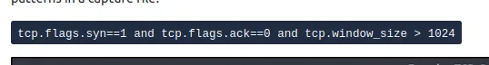  
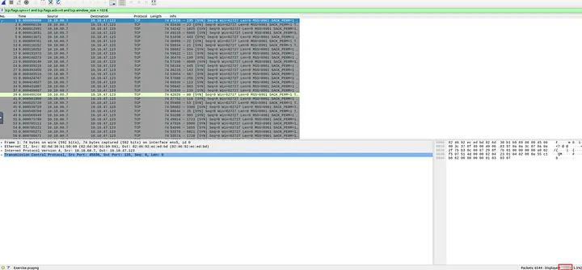

### 2.2 Quel type de scan est utilisé pour scanner le port TCP 80 ?

J’ai créé un filtre pour me concentrer sur le trafic ciblant le port TCP 80 :

tcp.port == 80

En observant les paquets résultants, j’ai remarqué que les connexions suivaient un handshake complet en trois étapes. Cela confirme qu’il s’agit d’un scan TCP Connect, car les scans SYN ne complètent pas le handshake.

**Réponse :** tcp connect  
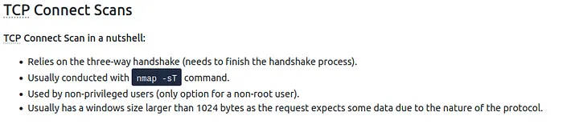

### 2.3 Combien y a-t-il de messages « UDP close port » ?

Pour l’UDP, la tâche expliquait que les ports fermés renvoient des messages ICMP unreachable. Le filtre fourni était:

icmp.type==3 and icmp.code==3

Après avoir appliqué ce filtre, Wireshark n’a affiché que les messages d’erreur ICMP correspondant à des ports UDP fermés. La barre de statut indiquait exactement 1083 résultats.

**Réponse :** 1083  
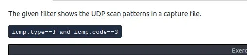  
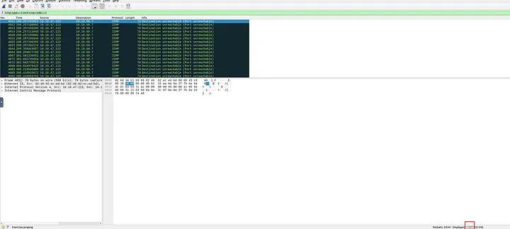

### 2.4 Quel port UDP dans la plage 55–70 est ouvert ?

Pour voir quels ports UDP de cette plage étaient sondés, j’ai appliqué le filtre suivant :

udp.dstport >= 55 and udp.dstport <= 70

Seulement trois ports sont apparus. Deux d’entre eux déclenchaient des messages ICMP port unreachable, ce qui signifie qu’ils étaient fermés. Le dernier ne déclenchait aucune erreur ICMP, indiquant qu’il était ouvert. Après vérification, le port ouvert était UDP 68.

**Réponse :** 68  
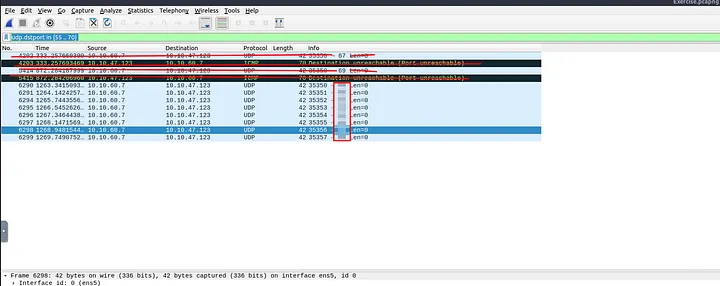

## Tâche 3 : Empoisonnement ARP & Man In The Middle

Cette tâche portait sur la détection de l’usurpation ARP et des attaques MITM dans une capture.

### 3.1 Quel est le nombre de requêtes ARP générées par l’attaquant ?

L’adresse MAC de l’attaquant était fournie : `00:0c:29:e2:18:b4`. Je l’ai combinée avec le filtre de requêtes ARP :

eth.src==00:0c:29:e2:18:b4 and arp.opcode==1

Cela a affiché toutes les requêtes ARP créées par l’attaquant. Le nombre total affiché était 284.

**Réponse :** 284  
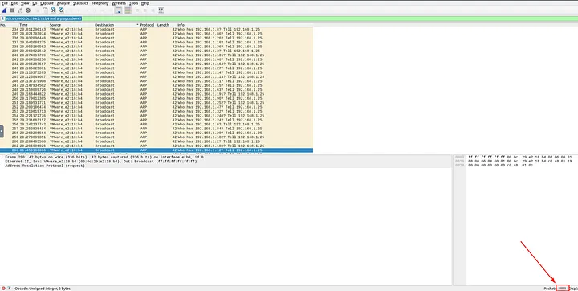

### 3.2 Quel est le nombre de paquets HTTP reçus par l’attaquant ?

Pour cela, j’ai filtré le trafic HTTP ayant l’adresse MAC de l’attaquant comme destination :

eth.dst==00:0c:29:e2:18:b4 and http

Cela a révélé tout le trafic HTTP redirigé vers l’attaquant. Le total était de 90 paquets.

**Réponse :** 90  
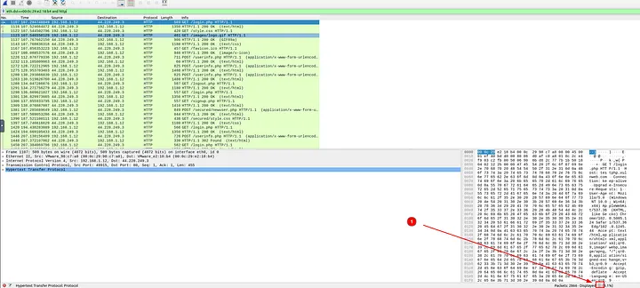

### 3.3 Quel est le nombre d’identifiants (nom d’utilisateur et mot de passe) interceptés ?

J’ai commencé avec le filtre HTTP vers l’attaquant :

eth.dst==00:0c:29:e2:18:b4 and http

J’ai remarqué que les connexions visaient `testphp.vulnweb.com`. J’ai donc affiné le filtre :

http.host==testphp.vulnweb.com and http.request.method==POST

En examinant les données de formulaire, j’ai vu que les noms d’utilisateur étaient envoyés dans le champ `uname`. J’ai ajouté :

http.host==testphp.vulnweb.com and http.request.method==POST and urlencoded-form contains "uname"

Enfin, en limitant à la page `userinfo.php`, j’ai obtenu le compte exact :

http.request.full_uri=="http://testphp.vulnweb.com/userinfo.php" and http.request.method==POST and urlencoded-form contains "uname"

Cela a donné 6 résultats, confirmant 6 identifiants interceptés.

**Réponse :** 6  
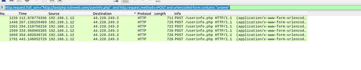

### 3.4 Quel est le mot de passe de « Client986 » ?

En restant sur le même ensemble de paquets filtrés, je me suis rendu au paquet 1668 et j’ai développé la section « HTML Form URL Encoded ». Les identifiants étaient visibles et le mot de passe de Client986 était :

**Réponse :** clientnothere!  
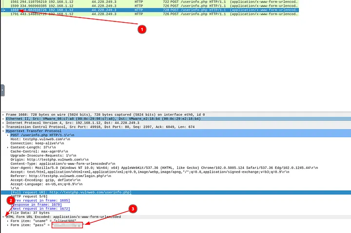

### 3.5 Quel est le commentaire fourni par « Client354 » ?

Je suis revenu au filtre POST précédent :

http.host==testphp.vulnweb.com and http.request.method==POST

En parcourant les résultats, j’ai trouvé une requête vers `comment.php`. En développant le champ « Form item: comment », j’ai vu le commentaire soumis :

**Réponse :** Nice work!  
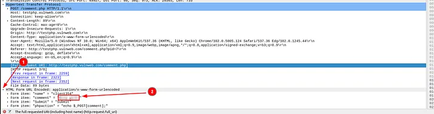

## Tâche 4 : Identification des hôtes (DHCP, NetBIOS, Kerberos)

Cette tâche consistait à identifier des hôtes et des utilisateurs via des protocoles courants.

### 4.1 Quelle est l’adresse MAC de l’hôte « Galaxy A30 » ?

J’ai filtré les noms d’hôtes DHCP contenant « Galaxy » et « A30 » :

dhcp.option.hostname contains "Galaxy" and dhcp.option.hostname contains "A30"

En ouvrant le paquet correspondant et en regardant la couche Ethernet, j’ai trouvé l’adresse MAC :

**Réponse :** 9a:81:41:cb:96:6c  
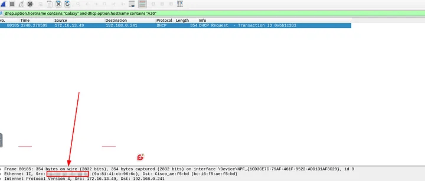

### 4.2 Combien de requêtes d’enregistrement NetBIOS possède la station « LIVALJM » ?

J’ai commencé avec :

nbns.name contains "LIVALJM"

Après analyse, j’ai constaté que les requêtes d’enregistrement avaient les flags `0x2810` ou `0x2910`. J’ai donc affiné :

nbns.name contains "LIVALJM" and nbns.flags in {0x2810 0x2910}

Il restait exactement 16 résultats.

**Réponse :** 16  
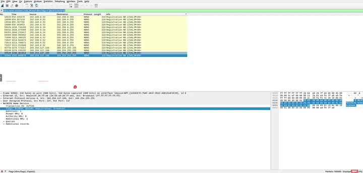

### 4.3 Quel hôte a demandé l’adresse IP « 172.16.13.85 » ?

J’ai appliqué le filtre :

dhcp.option.requested_ip_address==172.16.13.85

Un seul paquet correspondait. Dans le champ « Option: (12) Host Name », j’ai trouvé le nom d’hôte :

**Réponse :** Galaxy-A12  
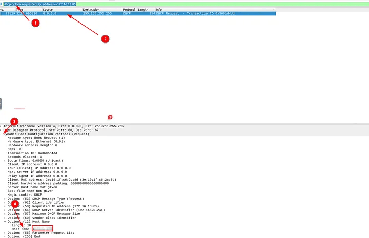

### 4.4 Quelle est l’adresse IP de l’utilisateur « u5 » ? (Format défang)

Dans le fichier `kerberos.pcap`, j’ai filtré :

kerberos.CNameString=="u5"

Le paquet affichait l’adresse IP source. Je l’ai ensuite défangée avec CyberChef :

**Réponse :** 10[.]1[.]12[.]2

### 4.5 Quel est le nom d’hôte disponible dans les paquets Kerberos ?

J’ai recherché les comptes de service Kerberos (se terminant par `$`) :

kerberos.CNameString contains "$"

Un seul résultat est apparu, révélant le nom d’hôte :

**Réponse :** xp1$

## Tâche 5 : Trafic de tunneling (DNS & ICMP)

Cette tâche portait sur la détection de tunneling dans le trafic ICMP et DNS.

### 5.1 Quel protocole est utilisé dans le tunneling ICMP ?

En inspectant les charges utiles des paquets ICMP dans `icmp-tunnel.pcap`, j’ai constaté que le trafic encapsulé était en réalité du SSH.

**Réponse :** SSH  
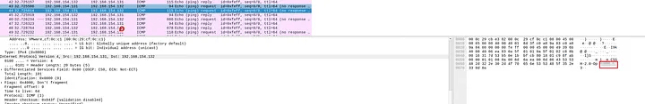

### 5.2 Quelle est l’adresse du domaine principal suspect recevant des requêtes DNS anormales ? (Défang)

Dans `dns.pcap`, un domaine se distinguait par des sous-domaines longs et inhabituels répétés : `dataexfil.com`. Après défang :

**Réponse :** dataexfil[.]com

## Tâche 6 : Analyse des protocoles en clair – FTP

Nous avons analysé le trafic FTP en clair afin d’identifier des attaques par force brute, des transferts de fichiers et le comportement de l’attaquant.

### 6.1 Combien y a-t-il de tentatives de connexion incorrectes ?

Avec le filtre :

ftp.response.code in {430 530}

Wireshark indiquait 737 tentatives échouées.

**Réponse :** 737  
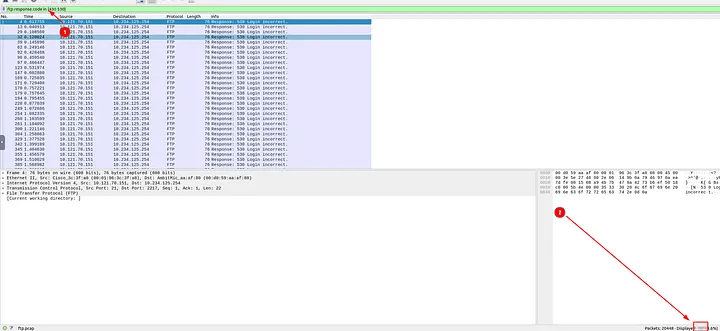

### 6.2 Quelle est la taille du fichier accédé par le compte « ftp » ?

En filtrant :

ftp.response.code == 213

et en suivant le flux TCP, la taille du fichier était clairement indiquée.

**Réponse :** 39424  
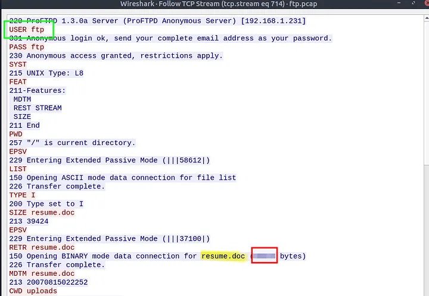

### 6.3 Quel est le nom du fichier téléversé par l’attaquant ?

Dans le même flux TCP, la commande `STOR` indiquait le nom du fichier :

**Réponse :** resume.doc

### 6.4 Quelle commande l’attaquant a-t-il utilisée pour modifier les permissions du fichier ?

Toujours dans le même flux, j’ai observé la commande :

**Réponse :** chmod 777

## Tâche 7 : Analyse des protocoles en clair – HTTP

Nous avons ensuite analysé le trafic HTTP, notamment les User-Agents et une tentative d’exploitation Log4j.

### 7.1 Quel est le nombre de User-Agents anormaux ?

Après avoir ajouté le champ User-Agent comme colonne et trié les valeurs, j’ai identifié 6 User-Agents suspects.

**Réponse :** 6  
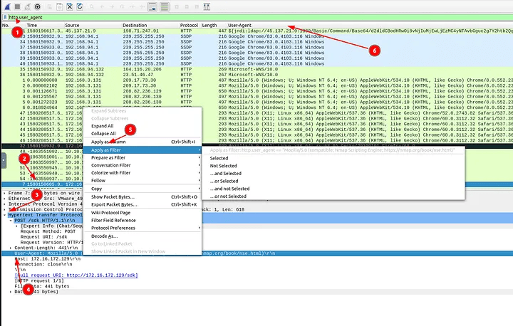

### 7.2 Quel est le numéro du paquet avec une différence d’orthographe subtile dans le User-Agent ?

En examinant attentivement les User-Agents, le paquet concerné était le numéro 52.

**Réponse :** 52  
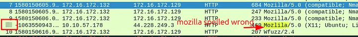

### 7.3 Quel est le numéro du paquet correspondant au début de l’attaque Log4j ?

Avec le filtre fourni, un seul paquet correspondait :

**Réponse :** 444

### 7.4 Quelle est l’adresse IP contactée par l’attaquant après décodage Base64 ? (Défang)

Après décodage du contenu Base64 dans le paquet 444, l’adresse IP obtenue et défangée était :

**Réponse :** 62[.]210[.]130[.]250

## Tâche 8 : Analyse des protocoles chiffrés – Déchiffrement HTTPS

### 8.1 Quel est le numéro de trame du message « Client Hello » vers « accounts.google.com » ?

**Réponse :** 16

### 8.2 Après déchiffrement, combien y a-t-il de paquets HTTP2 ?

Après déchiffrement TLS et filtrage sur `http2`, le total était :

**Réponse :** 115  
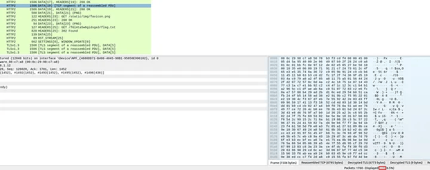

### 8.3 Quelle est la valeur de l’en-tête authority du paquet HTTP2 (trame 322) ? (Défang)

**Réponse :** safebrowsing[.]googleapis[.]com

### 8.4 Quel est le flag trouvé dans les paquets déchiffrés ?

**Réponse :** FLAG{THM-PACKETMASTER}  
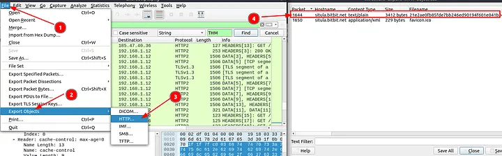

## Tâche 9 : Bonus – Chasse aux identifiants en clair

### 9.1 Quel est le numéro du paquet utilisant l’authentification HTTP Basic ?

**Réponse :** 237

### 9.2 Quel est le numéro du paquet où un mot de passe vide a été soumis ?

**Réponse :** 170

## Tâche 10 : Bonus – Résultats exploitables

### 10.1 Quelle est la règle IPFirewall pour refuser l’adresse IPv4 source ?

**Réponse :** add deny ip from 10.121.70.151 to any in

### 10.2 Quelle est la règle IPFirewall pour autoriser une adresse MAC de destination ?

**Réponse :** add allow MAC 00:d0:59:aa:af:80 any in

## Tâche 11 : Conclusion

J’ai terminé avec succès la salle **Wireshark: The Traffic Analysis**.  
Ces exercices m’ont permis de :
- Analyser le trafic FTP, HTTP et HTTPS pour détecter des identifiants en clair, des anomalies et des exploits  
- Détecter une attaque Log4j et décoder des commandes obfusquées  
- Déchiffrer du trafic TLS/HTTPS et analyser du trafic HTTP2  
- Extraire automatiquement des identifiants avec Wireshark  
- Générer des règles de pare-feu directement à partir de paquets suspects  

Cela renforce l’importance de Wireshark pour l’analyse au niveau paquet, tout en montrant la nécessité de le compléter avec des IDS/IPS et des outils de corrélation pour des opérations SOC complètes.
