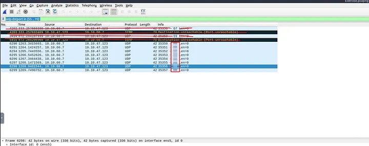
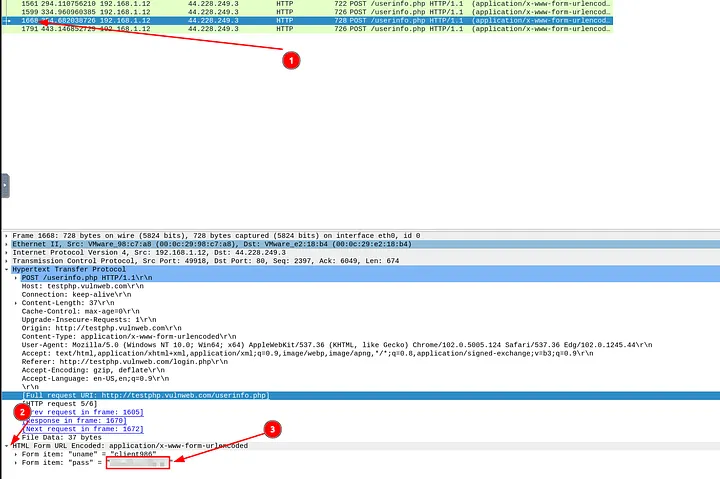

# Wireshark Traffic Analysis – Case Study

## 🔹 Overview
This case study covers multiple network security investigations using Wireshark, focusing on Nmap scans, ARP poisoning (MITM), host identification, and tunneling traffic.

## Task 1: Introduction
In this room, the focus was on using Wireshark for deeper traffic analysis. This is the third and final room in the Wireshark series after:
-Wireshark: The Basics
-Wireshark: Packet Operations
In those earlier rooms, I practiced capturing traffic, filtering, and basic packet-level investigation.
Here, the objective shifted: I needed to synthesize my knowledge of protocols + Wireshark functionality to detect anomalies, malicious activity, and suspicious network behavior.

## Task 2: Nmap Scans

Nmap is a powerful network scanner. The task here was to identify different scan types and their patterns inside packet captures.

### 2.1 What is the total number of the “TCP Connect” scans?

I opened the file Desktop/exercise-pcaps/nmap/Exercise.pcapng in Wireshark. From the task description, I knew that a TCP Connect scan relies on the full three-way handshake, and the right filter to use was:

tcp.flags.syn==1 and tcp.flags.ack==0 and tcp.window_size > 1024

I applied this filter, and Wireshark instantly displayed a large set of packets. I verified by looking at the packet details that these were indeed SYN packets without an ACK, with large window sizes. Then, I checked the total count of displayed packets at the bottom of Wireshark. It showed 1000, which meant there were 1000 TCP Connect scans in total.

Answer: 1000

### 2.2 Which scan type is used to scan the TCP port 80?

I created a filter to zoom in on traffic targeting TCP port 80:

tcp.port == 80

Looking at the resulting packets, I noticed that connections were following a full three-way handshake process. This confirmed it was a TCP Connect scan, because SYN scans do not complete the handshake.

Answer: tcp connect

### 2.3 How many "UDP close port" messages are there?

For UDP, the task explained that closed ports return ICMP unreachable messages. The filter given was:

icmp.type==3 and icmp.code==3

I entered this filter, and Wireshark displayed only ICMP error messages for closed UDP ports. At the bottom status bar, it showed exactly 1083 results.

Answer: 1083

### 2.4 Which UDP port in the 55–70 port range is open?

I wanted to see which UDP ports in the given range were probed, so I applied this filter:

udp.dstport >= 55 and udp.dstport <= 70

Only three ports appeared. Two of them triggered ICMP port unreachable errors, which meant they were closed. The remaining one did not trigger any ICMP error, meaning it was open. Checking carefully, I confirmed that the open port was UDP 68.

Answer: 68

## Task 3: ARP Poisoning & Man In The Middle

This task focused on detecting ARP spoofing and MITM attacks inside a capture.

### 3.1 What is the number of ARP requests crafted by the attacker?

The attacker’s MAC address was given as 00:0c:29:e2:18:b4. I combined that with the ARP request filter:

eth.src==00:0c:29:e2:18:b4 and arp.opcode==1

This displayed all ARP requests created by the attacker. The total count shown was 284.

Answer: 284

### 3.2 What is the number of HTTP packets received by the attacker?

For this, I needed to look at HTTP traffic with the attacker’s MAC address as the destination. I used:

eth.dst==00:0c:29:e2:18:b4 and http

This revealed all HTTP traffic that had been redirected to the attacker. The total count of such packets was 90.

Answer: 90

### 3.3 What is the number of sniffed username & password entries?

This part took some experimentation. I started with my earlier filter for attacker-destined HTTP traffic:

eth.dst==00:0c:29:e2:18:b4 and http

Then, I noticed logins were being sent to testphp.vulnweb.com. I refined the filter:

http.host==testphp.vulnweb.com and http.request.method==POST

From there, I checked the form data and saw usernames submitted with the uname field. So I added that:

http.host==testphp.vulnweb.com and http.request.method==POST and urlencoded-form contains "uname"

This gave me close results but not exact. Finally, by restricting it to the userinfo.php page, I got the precise count:

http.request.full_uri=="http://testphp.vulnweb.com/userinfo.php" and http.request.method==POST and urlencoded-form contains "uname"

This gave 6 results, confirming 6 sniffed username/password entries.

Answer: 6

### 3.4 What is the password of the "Client986"?

I stayed on the same filtered set from the previous question. By going to packet 1668 and expanding the “HTML Form URL Encoded” section, I saw the credentials. The password for Client986 was:

Answer: clientnothere!

### 3.5 What is the comment provided by the "Client354"?

I went back to the earlier POST filter:

http.host==testphp.vulnweb.com and http.request.method==POST

Scrolling through the results, I found a request to comment.php. Opening that packet and expanding the “Form item: comment” field revealed the submitted comment:

Answer: Nice work!

## Task 4: Identifying Hosts (DHCP, NetBIOS, Kerberos)

This task involved identifying hosts and users via common protocols.

### 4.1 What is the MAC address of the host “Galaxy A30”?

I filtered for DHCP hostnames containing “Galaxy” and “A30”:

dhcp.option.hostname contains "Galaxy" and dhcp.option.hostname contains "A30"

Opening the matching packet, I looked into the Ethernet layer and found the MAC address:

Answer: 9a:81:41:cb:96:6c

### 4.2 How many NetBIOS registration requests does the “LIVALJM” workstation have?

I started with:

nbns.name contains "LIVALJM"

This gave many results, but not all were registration requests. After checking a few packets, I saw that registration requests had flags 0x2810 or 0x2910. So I refined the filter:

nbns.name contains "LIVALJM" and nbns.flags in {0x2810 0x2910}

This left me with exactly 16 results, meaning there were 16 registration requests.

Answer: 16

### 4.3 Which host requested the IP address “172.16.13.85”?

I applied the filter:

dhcp.option.requested_ip_address==172.16.13.85

This narrowed it down to one DHCP request packet. Inside the “Option: (12) Host Name” field, I found the hostname:

Answer: Galaxy-A12

### 4.4 What is the IP address of the user "u5"? (Defanged format)

I switched to the kerberos.pcap file and filtered:

kerberos.CNameString=="u5"

The packet showed the source IP address. To present it in defanged format, I ran it through CyberChef with “Defang IP Addresses”.

Answer: 10[.]1[.]12[.]2

### 4.5 What is the hostname of the available host in the Kerberos packets?

To find this, I looked for Kerberos service accounts (with $ at the end). I used:

kerberos.CNameString contains "$"

It gave exactly one result, and expanding the Kerberos tree revealed the hostname:

Answer: xp1$

## Task 5: Tunneling Traffic (DNS & ICMP)

The last task focused on tunneling detection inside ICMP and DNS traffic.

### 5.1 Which protocol is used in ICMP tunneling?

I opened the icmp-tunnel.pcap file and inspected the payloads of the ICMP packets. By following one of the streams and checking the raw data, I noticed it was actually carrying SSH traffic inside ICMP.

Answer: SSH

### 5.2 What is the suspicious main domain address that receives anomalous DNS queries? (Defanged)

I opened the dns.pcap file and applied the filter to see all DNS queries. A lot of results showed up, but one domain stood out because of repeated, long, unusual subdomain queries. The suspicious main domain was dataexfil.com.

To present it safely, I defanged it:

Answer: dataexfil[.]com

## Task 6: Cleartext Protocol Analysis – FTP
We investigated cleartext FTP traffic to identify brute force attempts, file transfers, and adversary behavior.

### 6.1 How many incorrect login attempts are there?

I opened Desktop/exercise-pcaps/ftp/ftp.pcap in Wireshark. Since the task told me error codes for failed logins are 430 and 530, I applied the filter:

ftp.response.code in {430 530}

Wireshark displayed a huge list of failed login packets. I checked the bottom status bar for the total count and saw it was 737 failed attempts.

Answer: 737

### 6.2 What is the size of the file accessed by the "ftp" account?

I knew from the description that FTP status code 213 shows file status and size. So I applied:

ftp.response.code == 213

This gave me 2 results. I right-clicked one, followed the TCP stream, and inside the payload I saw the file size clearly reported as 39424 bytes.

Answer: 39424

### 6.3 The adversary uploaded a document to the FTP server. What is the filename?

While reviewing the same TCP stream, I noticed the STOR command being used to upload a file. Scrolling a bit further showed the filename:

Answer: resume.doc

### 6.4 The adversary tried to assign special flags to change the executing permissions of the uploaded file. What is the command used by the adversary?

Still in the same stream, near the end of the exchange, I spotted the attacker sending a command to modify file permissions:

Answer: chmod 777

## Task 7: Cleartext Protocol Analysis – HTTP

We moved to investigating HTTP traffic for anomalies, specifically looking at user agents and a Log4j exploitation attempt.

### 7.1 Investigate the user agents. What is the number of anomalous “user-agent” types?

I opened Desktop/exercise-pcaps/http/user-agent.cap and applied:

http.user_agent

Then I right-clicked the User-Agent field in one packet, added it as a column, and sorted the column. This let me quickly scan through them and count how many unusual or suspicious ones appeared. I found exactly 6 anomalous user agents.

Answer: 6

### 7.2 What is the packet number with a subtle spelling difference in the user agent field?

Using the same User-Agent column view, I carefully scanned for typos. I spotted one with a subtle spelling difference. Checking the frame number, it was packet 52.

Answer: 52

### 7.3 Locate the "Log4j" attack starting phase. What is the packet number?

Next, I opened Desktop/exercise-pcaps/http/http.pcapng. The task suggested a Log4j detection filter, so I used:

http.request.method=="POST" and ((ip contains "jndi") or (ip contains "Exploit")) and ((frame contains "jndi") or (frame contains "Exploit")) and ((http.user_agent contains "$") or (http.user_agent contains "=="))

This narrowed it to exactly one packet, which was the Log4j exploit attempt.

Answer: 444

### 7.4 Locate the "Log4j" attack starting phase and decode the base64 command. What is the IP address contacted by the adversary? (Defanged)

In packet 444, I expanded the HTTP details and saw a base64 string inside the User-Agent field. I copied that string into CyberChef, used “From Base64” decoding, and saw a command that included wget to download malware from a server. The IP revealed was 62.210.130.250. I then defanged it for reporting:

Answer: 62[.]210[.]130[.]250

## Task 8: Encrypted Protocol Analysis – Decrypting HTTPS

Here I analyzed HTTPS traffic with TLS decryption using a provided key log file.

### 8.1 What is the frame number of the “Client Hello” message sent to “accounts.google.com”?

I filtered for TLS Client Hello messages directed to the target:

tls.handshake.type==1 and tls.handshake.extensions_server_name contains "accounts.google.com"

Wireshark returned exactly one packet, with frame number 16.

Answer: 16

### 8.2 Decrypt the traffic with the “KeysLogFile.txt” file. What is the number of HTTP2 packets?

I went to Edit → Preferences → Protocols → TLS and set the (Pre)-Master-Secret log filename to the provided KeysLogFile.txt. Once applied, I could decrypt TLS into HTTP2.

Then I filtered with:

http2

The count initially included a few TLS handshake packets. Subtracting those gave the correct result: 115 HTTP2 packets.

Answer: 115

### 8.3 Go to Frame 322. What is the authority header of the HTTP2 packet? (Defanged)

I navigated to frame 322, expanded HTTP2 → Stream: Headers → Header: authority, and saw the hostname. I then defanged it:

Answer: safebrowsing[.]googleapis[.]com

### 8.4 Investigate the decrypted packets and find the flag! What is the flag?

I went to File → Export Objects → HTTP, scanned the files, and found one suspicious text file at packet 1644. After exporting and opening it, I found the flag:

Answer: FLAG{THM-PACKETMASTER}

## Task 9: Bonus – Hunt Cleartext Credentials!

Wireshark can extract usernames and passwords directly from supported protocols via Tools → Credentials.

### 9.1 What is the packet number of the credentials using “HTTP Basic Auth”?

I opened Desktop/exercise-pcaps/bonus/Bonus-exercise.pcap and used Tools → Credentials. It listed a single HTTP Basic Auth login at packet 237.

Answer: 237

### 9.2 What is the packet number where "empty password" was submitted?

From the same credentials window, I saw most of the others were FTP logins. I filtered with:

ftp and !ftp.request.arg and ftp.request.command

This showed me exactly one packet with a password field missing. That was packet 170.

Answer: 170

### Task 10: Bonus – Actionable Results!

Here we used Wireshark’s Firewall ACL Rules feature to generate ready-to-apply rules.

### 10.1 Select packet number 99. Create a rule for “IPFirewall (ipfw)”. What is the rule for “denying source IPv4 address”?

I selected packet 99, went to Tools → Firewall ACL Rules → IPFirewall (ipfw), and copied the suggested rule. It denied traffic from the source IP:

Answer: add deny ip from 10.121.70.151 to any in

### 10.2 Select packet number 231. Create “IPFirewall” rules. What is the rule for “allowing destination MAC address”?

This time, I selected packet 231 and generated the rules again. For destination MAC-based allow, the rule was:

Answer: add allow MAC 00:d0:59:aa:af:80 any in

## Task 11: Conclusion

I successfully completed the Wireshark: The Traffic Analysis room.
Throughout these exercises, I:
Investigated FTP, HTTP, and HTTPS traffic for cleartext credentials, anomalies, and exploits.
Practiced Log4j detection and decoded obfuscated commands.
Decrypted TLS/HTTPS traffic using session keys and analyzed HTTP2 traffic.
Learned to extract credentials automatically with Wireshark.
Generated firewall rules directly from suspicious packets.
This reinforced how Wireshark is essential for packet-level analysis, but also why analysts must complement it with IDS/IPS and correlation tools for full SOC operations.
