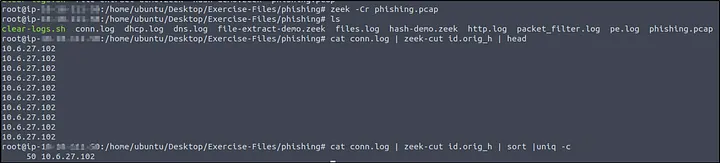

# 📝 Case Study: Zeek

## 🔹 Overview
This case study focuses on analyzing PCAPs with Zeek to investigate suspicious alerts such as DNS tunneling, phishing attempts, and Log4j exploitation.
I used Zeek logs (dns.log, conn.log, http.log, etc.) and custom scripts to extract artifacts, validate alerts, and confirm whether they were true positives.

## 🚨 Task 2: Anomalous DNS

Alert: Anomalous DNS Activity
I was assigned to verify the DNS tunneling alert by analyzing the provided PCAP and Zeek logs.

### Q1: What is the number of DNS records linked to the IPv6 address?

Answer: 320

How I did it:
I processed the PCAP with Zeek, then used zeek-cut to extract record types and count them.

zeek -C -r dns-tunneling.pcap
cat dns.log | zeek-cut qtype_name | sort | uniq -c

The output showed a large number of AAAA records, which are linked to IPv6.

### Q2: What is the longest connection duration?

Answer: 9.420791

How I did it:
I examined conn.log and sorted by duration to find the longest one.

cat conn.log | zeek-cut duration | sort -r | head -n 1

### Q3: What is the number of unique domain queries?

Answer: 6

How I did it:
At first, the DNS queries contained repetitive subdomains (e.g., *.cisco-update.com).
I extracted only the base domains by reversing, cutting, and filtering duplicates:

cat dns.log | zeek-cut query | rev | cut -d '.' -f 1-2 | rev | sort | uniq | wc -l

This gave me the count of unique domains.

### Q4: What is the IP address of the source host?

Answer: 10.20.57.3

How I did it:
I checked the source IPs in conn.log.

cat conn.log | zeek-cut id.orig_h | sort | uniq -c

The result showed one suspicious host repeatedly making DNS queries: 10.20.57.3.

## 🚨 Task 3: Phishing

Alert: Phishing Attempt
I analyzed the phishing PCAP to extract the source IP, malicious domains, and associated files.

### Q1: What is the suspicious source address?

Answer: 10[.]6[.]27[.]102

How I did it:
I ran Zeek on the phishing PCAP and listed the unique origin hosts.

zeek -Cr phishing.pcap
cat conn.log | zeek-cut id.orig_h | sort | uniq -c

Only one IP address appeared: 10.6.27.102.
I defanged it for reporting: 10[.]6[.]27[.]102.

### Q2: Which domain address were the malicious files downloaded from?

Answer: smart-fax[.]com

How I did it:
I looked into http.log and extracted hostnames:

cat http.log | zeek-cut uri host

This revealed the malicious downloads originated from smart-fax.com.

### Q3: What kind of file is associated with the malicious document?

Answer: VBA

How I did it:
I hashed files using the Zeek script hash-demo.zeek:

zeek -Cr phishing.pcap hash-demo.zeek
cat files.log | zeek-cut mime_type md5

I took the MD5 hash, uploaded it to VirusTotal, and confirmed the document contained VBA macros.

### Q4: What is the given file name of the malicious .exe on VirusTotal?

Answer: PleaseWaitWindow.exe

How I did it:
From the same files.log, I grabbed the MD5 hash of the .exe.
Checking VirusTotal showed the filename PleaseWaitWindow.exe.

### Q5: What is the contacted domain name by the malicious .exe?

Answer: hopto[.]org

How I did it:
On VirusTotal under the Behavior tab, I found that the .exe attempted to connect to hopto.org.

### Q6: What is the request name of the downloaded malicious .exe file?

Answer: knr.exe

How I did it:
By reviewing the earlier http.log extraction, I saw the requested file was knr.exe.

## 🚨 Task 4: Log4j Exploitation

Alert: Log4J Exploitation Attempt
I analyzed the provided PCAP with a custom detection script.

### Q1: What is the number of signature hits?

Answer: 3

How I did it:
I ran Zeek with the detection-log4j.zeek script and checked the signature log:

zeek -Cr log4shell.pcapng detection-log4j.zeek
cat signatures.log | zeek-cut sig_id | wc -l

### Q2: Which tool is used for scanning?

Answer: Nmap

How I did it:
I checked http.log for user-agents:

cat http.log | zeek-cut user_agent | sort | uniq -c

It revealed Nmap as the scanner.

### Q3: What is the extension of the exploit file?

Answer: .class

How I did it:
I listed URIs in http.log:

cat http.log | zeek-cut uri | sort | uniq

The exploit file had the .class extension.

### Q4: What is the name of the created file from base64 commands?

Answer: pwned

How I did it:
I extracted base64 values from log4j.log and decoded them:

cat log4j.log | zeek-cut value | grep Base64

After decoding, the commands showed the creation of a file named pwned.

## ✅ Conclusion
In this Zeek case study, I confirmed multiple alerts as true positives:
- DNS tunneling with abnormal AAAA queries and long connections
- Phishing campaign delivering VBA-laced docs and malicious executables
- Log4j exploitation attempts using .class payloads and Nmap scans

I strengthened my ability to:
- Parse Zeek logs efficiently (zeek-cut, sorting, filtering)
- Extract meaningful artifacts for malware analysis
- Use VirusTotal to enrich findings
- Decode obfuscated commands for post-exploitation detection

---

## 🔗 Navigation
- Back to [Network Security Case Studies](../README.md)

