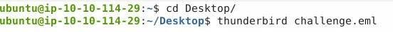
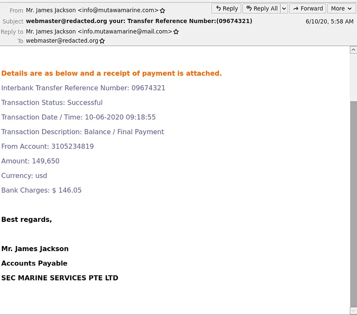
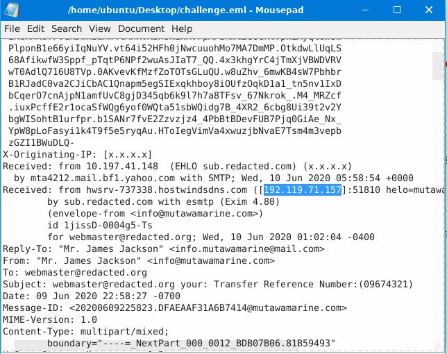
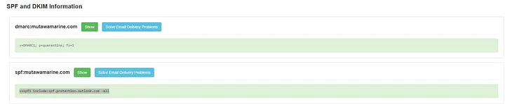
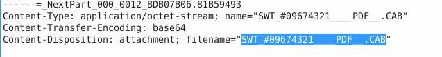
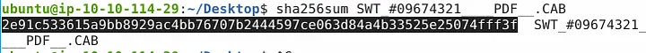
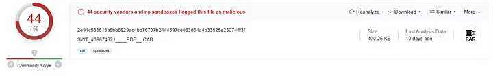
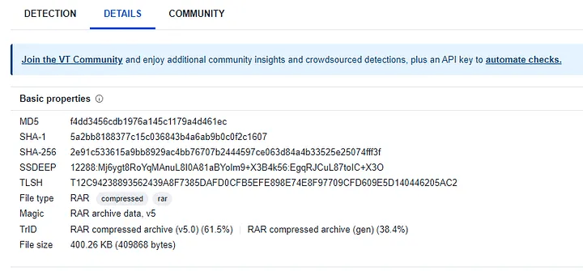

# 📝 Case Study: The Greenholt Phish

## 🔹 Overview
In this case study, I investigated a suspicious email received by a sales executive.  
The executive was not expecting this email, which mentioned a money transfer and contained an unexpected attachment. This scenario simulated a phishing attempt.

**Skills demonstrated:**
- Email header analysis
- Extraction of Indicators of Compromise (IOCs)
- File hash and metadata analysis
- DNS, SPF, and DMARC verification
- Attachment inspection and threat validation

---

## 🔍 Key Activities & Highlights

### 1. Email Timestamp
- Opened the email using Thunderbird:
thunderbird challenge.eml
- Checked the date posted at the top of the email header.

**Findings:**  
- Timestamp: `06/10/2020 05:58`

---

### 2. Email Sender
- Viewed the “From” header in the email.

**Findings:**  
- Name: `Mr. James Jackson`  
- Email address: `info@mutawamarine.com`

---

### 3. Reply-To Address
- Checked the “Reply-To” header in the email.

**Findings:**  
- Reply-To: `info.mutawamarine@mail.com`

---

### 4. Originating IP
- Opened the `.eml` file and examined the headers for the originating IP.

**Findings:**  
- IP: `192.119.71.157`  
- Owner: `HostWinds LLC`

---

### 5. SPF & DMARC Records
- Used MXToolbox to analyze the Return-Path domain.

**Findings:**  
- SPF: `v=spf1 include:spf.protection.outlook.com -all`  
- DMARC: `v=DMARC1; p=quarantine; fo=1`

---

### 6. Attachment Analysis
- Found the attachment in the `.eml` file.  
- Saved the attachment and ran a SHA256 hash check:

sha256sum SWT_#09674321____PDF__.CAB

**Findings:**  
- Name: `SWT_#09674321____PDF__.CAB`

- SHA256: `2e91c533615a9bb8929ac4bb76707b2444597ce063d84a4b33525e25074fff3f`

- File size: `400.26 KB`

- Actual file extension: `RAR`

---

## ✅ Conclusion
- Email originated from a suspicious IP and domain.  
- Header analysis revealed mismatched Return-Path and Reply-To addresses.  
- Attachment was potentially malicious, confirmed by SHA256 hash and file inspection.  
- SPF and DMARC checks helped validate email authentication and origin.

**Lessons Learned:**  
- Always inspect email headers carefully to detect anomalies.  
- Use MXToolbox, Thunderbird, VirusTotal, and other tools to validate suspicious emails and attachments.  
- Extracting IOCs from phishing emails is essential to prevent credential theft or malware infection.  
- Bookmark trusted phishing analysis tools to streamline future investigations.

---

## 🔗 Navigation
- Back to [Phishing Home](../README.md)
