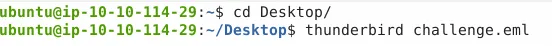
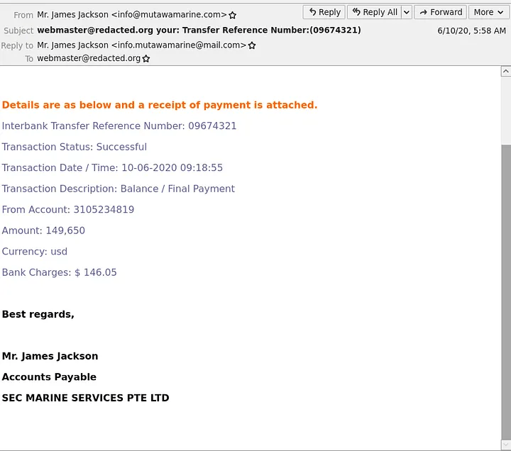
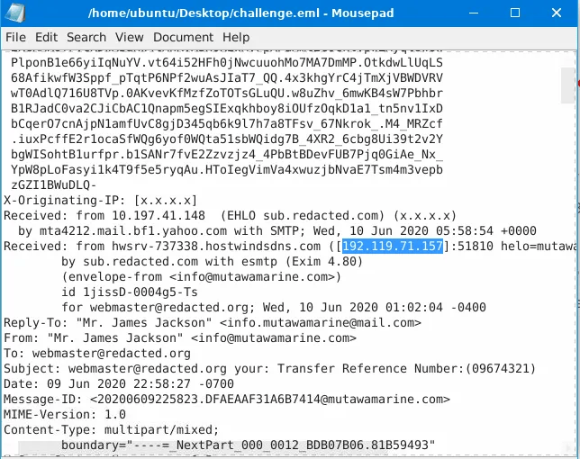
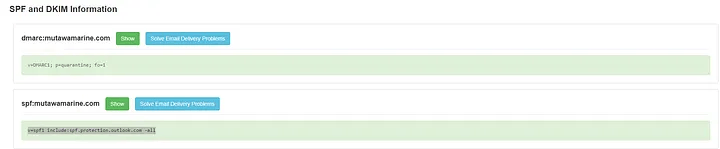
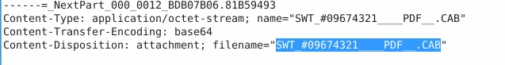
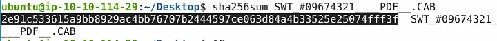
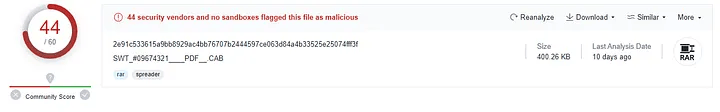
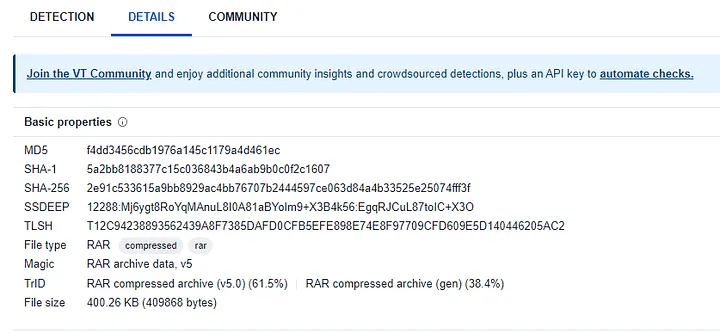

# 📝 Étude de cas : The Greenholt Phish

## 🔹 Aperçu
Dans cette étude de cas, j’ai enquêté sur un email suspect reçu par un cadre commercial.  
Le cadre n’attendait pas cet email, qui mentionnait un transfert d’argent et contenait une pièce jointe inattendue. Ce scénario simulait une tentative de phishing.

**Compétences démontrées :**
- Analyse des en-têtes d’emails  
- Extraction des Indicateurs de Compromission (IOC)  
- Analyse des hachages et métadonnées des fichiers  
- Vérification DNS, SPF et DMARC  
- Inspection des pièces jointes et validation des menaces  

---

## 🔍 Activités clés & points forts

### 1. Horodatage de l’email
- Ouvert l’email avec Thunderbird :  
`thunderbird challenge.eml`  
- Vérifié la date indiquée dans l’en-tête de l’email.

**Résultat :**  
- Timestamp : `06/10/2020 05:58`

---

### 2. Expéditeur de l’email
- Consulté le champ “From” dans l’email.

**Résultat :**  
- Nom : `Mr. James Jackson`  
- Email : `info@mutawamarine.com`

---

### 3. Adresse Reply-To
- Vérifié le champ “Reply-To” dans l’email.

**Résultat :**  
- Reply-To : `info.mutawamarine@mail.com`

---

### 4. IP d’origine
- Ouvert le fichier `.eml` et examiné les en-têtes pour trouver l’IP d’origine.

**Résultat :**  
- IP : `192.119.71.157`  
- Propriétaire : `HostWinds LLC`

---

### 5. Enregistrements SPF & DMARC
- Utilisé MXToolbox pour analyser le domaine Return-Path.

**Résultat :**  
- SPF : `v=spf1 include:spf.protection.outlook.com -all`  
- DMARC : `v=DMARC1; p=quarantine; fo=1`

---

### 6. Analyse de la pièce jointe
- Localisé la pièce jointe dans le fichier `.eml`  
- Enregistré la pièce jointe et vérifié le hachage SHA256 :

sha256sum SWT_#09674321____PDF__.CAB

**Résultats :**  
- Nom : SWT_#09674321____PDF__.CAB

- SHA256 : 2e91c533615a9bb8929ac4bb76707b2444597ce063d84a4b33525e25074fff3f

- Taille du fichier : 400.26 KB

- Extension réelle : RAR

---

## ✅ Conclusion
- L’email provenait d’une IP et d’un domaine suspects.
- L’analyse des en-têtes a révélé des adresses Return-Path et Reply-To incohérentes.
- La pièce jointe était potentiellement malveillante, confirmée par le hachage SHA256 et l’inspection du fichier.
- Les vérifications SPF et DMARC ont permis de valider l’authenticité et l’origine de l’email.

**LLeçons apprises:**  
- Toujours inspecter attentivement les en-têtes des emails pour détecter des anomalies.
- Utiliser MXToolbox, Thunderbird, VirusTotal et d’autres outils pour valider les emails et pièces jointes suspectes.
- L’extraction des IOC des emails de phishing est essentielle pour prévenir le vol de credentials ou l’infection par malware.
- Mettre en favori des outils fiables d’analyse de phishing pour accélérer les enquêtes futures.

---

## 🔗 Navigation
- Retour à [Phishing Home](../README.md)
