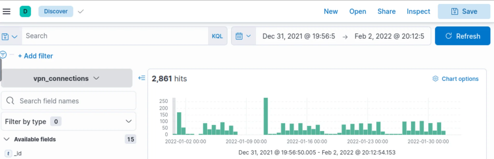
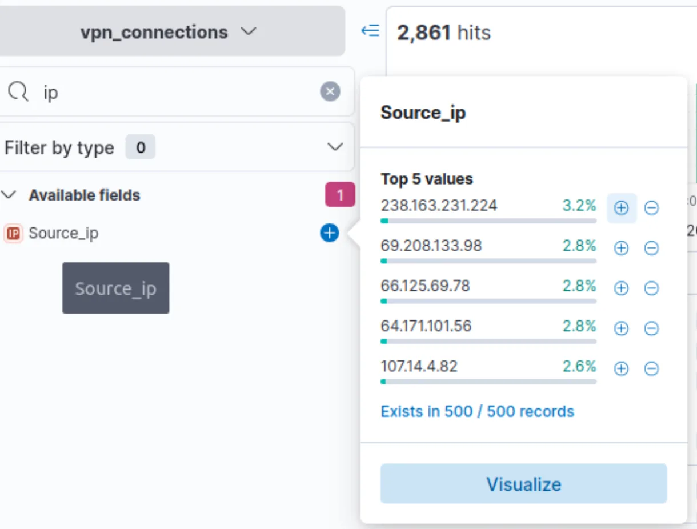
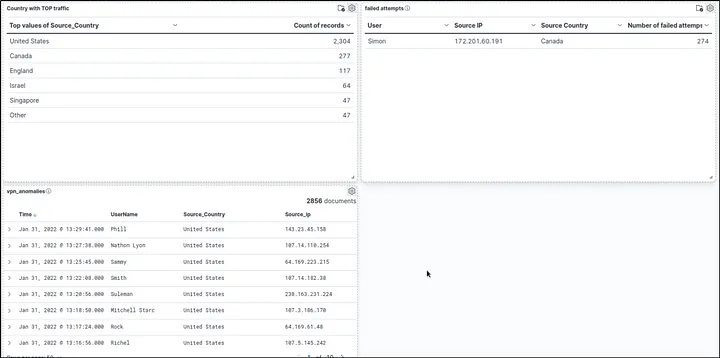

# 📝 Case Study: Investigating with ELK 101

## 🔹 Overview
In this case study, I explored the **Elastic Stack (ELK)** to analyze **VPN logs** for a US-based company. The goal was to identify anomalies, suspicious activity, and unusual user behavior.  

**Skills demonstrated:**
- Log analysis in **Kibana Discover**
- Creating **filters and KQL queries**
- Visualizing data and building **dashboards**
- Investigating network anomalies

---

## 🔍 Key Activities & Highlights

### 1. Exploring VPN Logs
- Filtered logs for **31 Dec 2021 – 2 Feb 2022**
- Found **2861 total events**
- Identified top users and IPs responsible for most traffic

---

### 2. Investigating Suspicious Users
- **Max traffic user:** James  
- **IP with most connections:** 238.163.231.224  
- Applied filters to check spikes and unusual patterns

---

### 3. Handling Specific Queries
- Excluded New York connections from top IP → 48 events remaining
- KQL queries filtered logs by country and specific users → 161 events returned
- Identified **failed VPN attempts** and monitored suspicious activity

---

### 4. Visualizations & Dashboards
- Created tables and charts to summarize activity:
  - Users with most failed attempts (Simon)
  - Daily wrong VPN connection attempts
- Combined all visualizations in a **single dashboard** for monitoring

---

### 5. Conclusion
- Applied SOC techniques to **investigate VPN anomalies**
- Learned to **filter, query, and visualize logs**
- Developed practical experience in **threat hunting and monitoring**
- Built dashboards to **summarize insights effectively**

---

## 🔗 Navigation
- Back to [SIEM Home](../SIEM/README.md)
