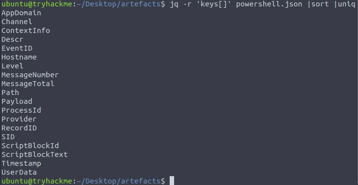

# Case Study — Boogeyman (Boogeyman 1 / 2 / 3)
 
## Overview
This case study consolidates the three Boogeyman TryHackMe rooms (Boogeyman 1, 2 and 3) into a single incident investigation narrative. It describes the steps taken, the artifacts analyzed, key findings, IOCs and recommended detections/mitigations. Use it as a reproducible SOC playbook: email → host logs → memory → network → centralized logging.

---

## Environment & Artifacts
VMs / artifacts used (provided by rooms):

### Boogeyman 1
/home/ubuntu/Desktop/artefacts
dump.eml (phishing email)
Invoice.zip → Invoice_20230103.lnk
powershell.json (PowerShell logs)
capture.pcapng (packet capture)

### Boogeyman 2
/home/ubuntu/Desktop/Artefacts
Resume_WesleyTaylor.doc (malicious DOC) — MD5 52c4384a0b9e248b95804352ebec6c5b
memorydump.raw (memory image)

### Boogeyman 3
ELK (Kibana / Sysmon) instance; time window Aug 29–30, 2023
Sysmon / process / network logs

### Tools used
thunderbird, lnkparse, jq, tshark/wireshark, volatility, olevba, Kibana (Discover), grep/sed/awk, base64.

---

## Investigation 1 — Boogeyman 1 (phishing → PowerShell → DNS exfil)
### Goal
Follow the chain from phishing email to host compromise, discovery of exfiltrated data and extraction of sensitive artifacts.

### Steps & findings
1. Email analysis
- Opened dump.eml (Thunderbird or CLI).
- Sender: agriffin@bpakcaging.xyz
- Victim: julianne.westcott@hotmail.com
- Mail relay / headers show elasticemail.
- The attachment zipped was password-protected; password in email: Invoice2023!.
- Inside: Invoice_20230103.lnk.
- LNK files commonly contain command-line invocations — parse them.

2. LNK parse
- lnkparse Invoice_20230103.lnk → found base64-like payload (UTF-16LE encoded PowerShell IEX command).
- Decoded payload invoked iex to fetch and run remote content (PowerShell one-liner).

3. PowerShell logs (JSON)
- cat powershell.json | jq . and targeted queries for .ScriptBlockText.
- Discovered download/command domains: cdn.bpakcaging.xyz / files.bpakcaging.xyz
- Tools downloaded/used: Seatbelt (enumeration)
- sq3.exe used against Sticky Notes DB: C:\Users\j.westcott\AppData\Local\Packages\Microsoft.MicrosoftStickyNotes_8wekyb3d8bbwe\LocalState\plum.sqlite
- Exfiltrated file name: protected_data.kdbx (KeePass DB)
- Exfiltration encoding: hex
- Exfil tool: nslookup (DNS tunnelling via crafted DNS queries)

4. Network capture
- capture.pcapng examined in Wireshark/tshark; filtered by attacker domains and DNS traffic.
- Hosting software: Python simple HTTP server (serving stage files).
- C2/callbacks performed by HTTP POST and DNS queries (nslookup).
- Extracted hex payloads from DNS queries, reassembled → decoded KeePass DB and retrieved master password.

5. Recovered secrets
KeePass master password: %p9^3!lL^Mz47E2GaT^y
Opened DB → found credit card number: 4024007128269551

### Impact
- Stolen credentials and sensitive personal/payment data.
- DNS exfiltration indicates stealthy/lateral-friendly exfil path.

---

## Investigation 2 — Boogeyman 2 (malicious DOC → memory forensics)
### Goal
Analyse a malicious resume document and extract the stage-2 payloads and post-infection behavior using a memory image.

### Steps & findings
1. Email & document
Open and save the attachment Resume_WesleyTaylor.doc. Compute its hash:
md5sum Resume_WesleyTaylor.doc / MD5 => 52c4384a0b9e248b95804352ebec6c5b
Extract macros with olevba: olevba Resume_WesleyTaylor.doc
Macro observed downloads a stage-2 payload at: https://files.boogeymanisback.lol/aa2a9c53cbb80416d3b47d85538d9971/update.png
The macro launches wscript.exe to execute update.js.

3. Memory analysis (Volatility)
Load the memory dump into Volatility / Volatility3 to find running processes, PIDs, file paths and network artifacts. Example plugins:
vol -f memorydump.raw pslist
vol -f memorydump.raw netscan
vol -f memorydump.raw filescan
Key memory findings:
- Process that executed stage-2 payload: wscript.exe
PID: 4260 / Parent PID: 1124
- Stage 2 JS path (dropped file): C:\ProgramData\update.js
- Stage 2 then downloads update.exe from the same host:
https://files.boogeymanisback.lol/.../update.exe
- updater.exe spawns and establishes C2:
PID used to establish C2: 6216 / Path of malicious process: C:\Windows\Tasks\updater.exe / C2 IP:port: 128.199.95.189:8080 (observed in netscan / network artifacts)
- From filescan results, the malicious document location on disk (as found in memory):
C:\Users\maxine.beck\AppData\Local\Microsoft\Windows\INetCache\Content.Outlook\WQHGZCFI\Resume_WesleyTaylor (002).doc

3. Persistence & scheduled task
Search process memory and command-line artifacts, find scheduled task creation:
- Scheduled task created: Review
- Full command used for persistence (schtasks):
schtasks /Create /F /SC DAILY /ST 09:00 /TN Updater /TR 'C:\Windows\System32\WindowsPowerShell\v1.0\powershell.exe -NonI -W hidden -c "IEX ([Text.Encoding]::UNICODE.GetString([Convert]::FromBase64String((gp HKCU:Software\Microsoft\Windows\CurrentVersion\debug).debug)))"'
This is a classic pattern: a scheduled task invoking a Base64-encoded command from the registry.

### Summary — Boogeyman 2 impact
- Initial vector: macro in resume doc that downloaded JS payload → wscript.exe.
- Dropped stage2 JS and update.exe (malicious binary).
- Persistent scheduled task (Updater) created to execute encoded PowerShell from registry.
- C2 established to 128.199.95.189:8080.
- Memory analysis provided process PIDs, filepaths and the exact persistence command.

---

## Investigation 3 — Boogeyman 3 (ELK / Sysmon timeline: UAC bypass → Mimikatz → lateral movement → DCSync → ransomware)

### Goal
Use ELK (Kibana Discover over Sysmon data) to pivot through a timeline of attacker activity, identify lateral movement and final payload.

### Approach
Log into Kibana (Discover). Set date range to Aug 29–30, 2023. Add relevant fields to the Discover view: process_name, process_command_line, event_id, destination.ip, destination.port, user, host.name, parent_process_name, pid.

1. Initial stage and implant
- PID of process executing initial stage1 payload: 6392
- The stage1 payload moved review.dat from the mounted ISO (D:) into a temp path:
"C:\Windows\System32\xcopy.exe" /s /i /e /h D:\review.dat C:\Users\EVAN~1.HUT\AppData\Local\Temp\review.dat

- The implanted DLL was executed:
"C:\Windows\System32\rundll32.exe" D:\review.dat,DllRegisterServer

2. Persistence
- Malicious script created a Scheduled Task named: Review

3. C2 activity
- Search for network connections from the implanted binary; found HTTP traffic to:
165.232.170.151:80 — C2: 165.232.170.151:80

4. Privilege escalation & tool downloads
- Attacker used a UAC bypass binary: fodhelper.exe to elevate.
- They downloaded credential dumping tool Mimikatz from GitHub:
https://github.com/gentilkiwi/mimikatz/releases/download/2.2.0-20220919/mimikatz_trunk.zip

- https://github.com/gentilkiwi/mimikatz/releases/download/2.2.0-20220919/mimikatz_trunk.zip

5. Credential theft and lateral movement
- After running mimikatz the attacker dumped credentials:
New credential pair (user:hash): itadmin:F84769D250EB95EB2D7D8B4A1C5613F2
- Using these credentials the attacker enumerated file shares, read remote file IT_Automation.ps1, and discovered plaintext credentials:
QUICKLOGISTICS\allan.smith:Tr!ckyP@ssw0rd987
- Attacker moved to target host WKSTN-1327, executed commands with parent process wsmprovhost.exe (parent process name for malicious lateral command).
- On the second host, mimikatz was executed again and a new credential dumped:
administrator:00f80f2538dcb54e7adc715c0e7091ec

6. Domain compromise & DCSync
- Attacker targeted DC01 (Domain Controller). They performed a DCSync-like attack and dumped additional account hashes. Aside from Administrator, they dumped:
backupda (account)
- After dumping hashes/credentials the attacker downloaded ransomware:
http://ff.sillytechninja.io/ransomboogey.exe

### Summary — Boogeyman 3 impact
Steps observed in ELK align with a full kill-chain escalation:
- Initial execution from ISO → DLL registration
- HTTP C2 to 165.232.170.151:80
- UAC bypass via fodhelper.exe
- Download & execution of Mimikatz from GitHub → credential dumping
- Lateral movement via harvested credentials (itadmin, allan.smith, etc.)
- Domain compromise (DCSync-like behavior) and ransomware drop ransomboogey.exe

## What I learned
- Phishing remains the dominant initial access vector; small artifacts (passwords in email bodies, lnk payloads) yield high value.
- Scripted PowerShell and living-off-the-land binaries (LOLBINs) make detection harder; look for encoded commands, odd registry keys and scheduled task creation.
- DNS-based exfiltration is stealthy — inspect query lengths, uncommon subdomains and high cardinality of queries for a domain.
- Memory forensics is essential to discover in-memory-only artifacts (process command lines, dropped files referenced only in RAM).
- ELK/Sysmon timeline analysis is invaluable for cross-host correlation (pivoting, credential reuse, DCSync).
- Combining artifacts across email, logs, memory and network gives a complete picture (detection + attribution + containment).

## Final notes
This three-stage Boogeyman series is a compact example of a multi-year APT-style escalation: from commodity phishing and script-based exfiltration to memory-based credential theft and domain compromise followed by ransomware delivery. The triage flow used here — email → host logs → memory → network → centralized logging — is a repeatable SOC playbook for real incidents.

